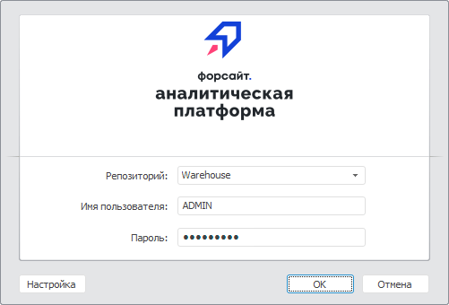
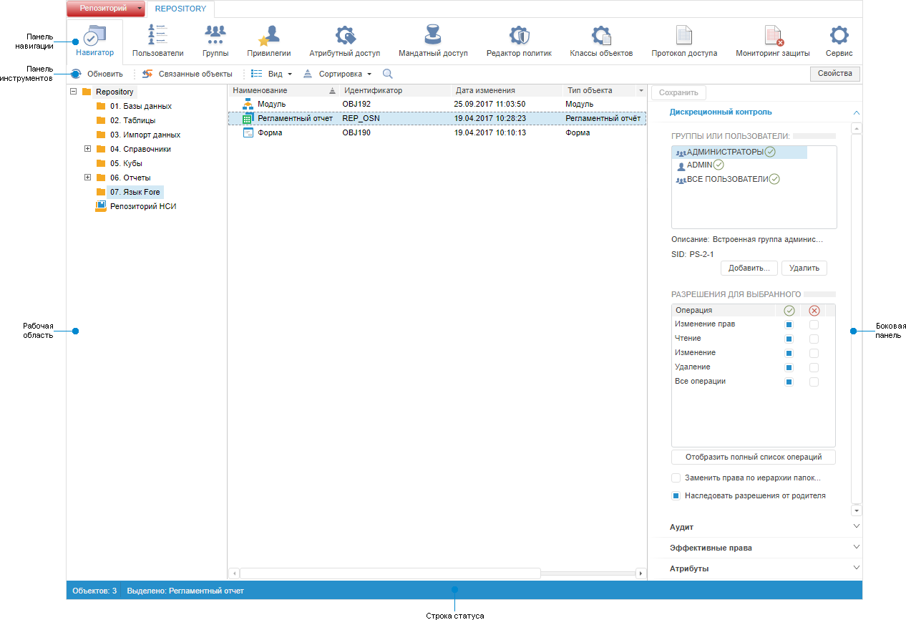
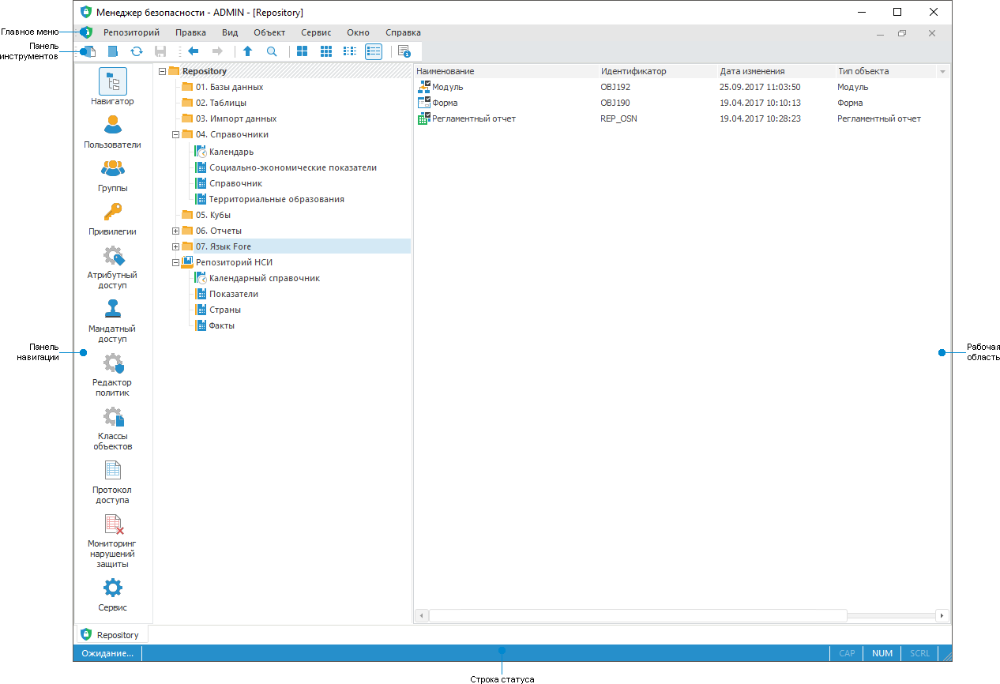
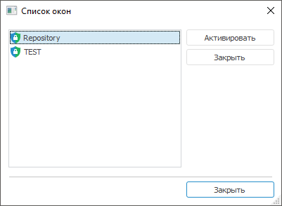

# Начало работы с менеджером безопасности

Начало работы с менеджером безопасности
-

# Начало работы с менеджером безопасности

Для начала работы с инструментом откройте менеджер безопасности в веб-
 или настольном приложении.

[Открытие
 менеджера безопасности в веб-приложении](javascript:TextPopup(this))

	Для открытия менеджера безопасности в веб-приложении выполните команду
	 
	 «Менеджер безопасности» на
	 боковой панели в [навигаторе
	 объектов](GetStarted.chm::/Interface/Interface_Navigator.htm). После выполнения действия будет открыто
	 основное окно менеджера безопасности на новой вкладке браузера.

[Открытие
 менеджера безопасности в настольном приложении](javascript:TextPopup(this))

	Для открытия менеджера безопасности в настольном приложении выполните
	 одно из действий:

		- из [навигатора
		 объектов](GetStarted.chm::/Interface/Interface_Navigator.htm) выполните команду главного меню «Сервис > Менеджер безопасности».
		 После выполнения действия будет открыто основное окно менеджера
		 безопасности;

		- в меню Windows выполните команду «Программы
		 > Форсайт. Аналитическая платформа
		 10.9
		 > Менеджер
		 безопасности (x64)». После выполнения действия будет открыто
		 окно регистрации:

	

	Примечание.
	 Вид окна зависит от [типа
	 аутентификации](Setup.chm::/06_AK_Client_Config/UiNav_RepoConfig_repo1.htm#authentication_type), заданного в настройках указанного
	 репозитория.

	Для начала работы с менеджером безопасности:

			- Выберите репозиторий в списке «Репозиторий».

			- Введите имя пользователя и пароль в соответствующие
			 поля:

				- при парольной аутентификации введите имя пользователя
				 и пароль в соответствующие поля;

				- при интегрированной доменной аутентификации отсутствуют
				 поля «Имя пользователя»
				 и «Пароль». Для
				 подключения к репозиторию используйте доменные имя и пароль,
				 с которыми пользователь подключился к домену;

				- при доменной аутентификации в поле «Домен\Имя
				 пользователя» укажите домен и имя пользователя
				 в формате: «Домен\Имя
				 пользователя». В поле «Пароль»
				 введите доменный пароль пользователя.

	Окно аналогично [окну регистрации](GetStarted.chm::/GetStarted/Get_Started.htm)
	 при входе в «Форсайт. Аналитическая платформа».
	 Если имя пользователя и пароль были указаны верно, то откроется основное
	 окно менеджера безопасности.

В менеджере безопасности возможно подключение и работа в [нескольких
 репозиториях](Admin_Organizational_Starting.htm#connecting) одновременно.

Для настройки политики безопасности
 системы смотрите статью «[Настройка
 политики безопасности системы](Admin_Intro.htm)».

Для отслеживания нарушений защиты
 системы смотрите статью «[Отслеживание
 нарушений защиты системы](../06_MonitoringViolations/Monitoring_system.htm)».

Для резервного копирования. восстановления
 политики безопасности, а также управления режимом обслуживания смотрите
 статью «[Сервисное
 обслуживание репозитория](../04_SecurityPolicy/Admin_Service.htm)».

Для контроля целостности продукта
 и метаданных репозитория смотрите статью «[Контроль целостности
 продукта и метаданных](../04_SecurityPolicy/Integrity_control.htm)».

Основное
 окно инструмента «Менеджер безопасности»:

	Веб-приложение

	 Настольное
	 приложение

		

		

Примечание.
 По умолчанию при открытии менеджера безопасности активным разделом является
 «[Навигатор](../02_ComonFunction/Admin_SecManager_CommonFunction.htm)».

[Элементы
 окна менеджера безопасности](javascript:TextPopup(this))

		- [Главное
		 меню](GetStarted.chm::/Interface/Interface_Description.htm#main_menu).
		 Содержит список команд, предназначенных для выполнения различных
		 операций активного раздела менеджера безопасности.

	Примечание.
	 Главное меню доступно только в настольном приложении.

		- Боковая панель.
		 Содержит настройки прав доступа. Отображение боковой панели зависит
		 от состояния кнопки «Свойства»
		 («Обладатели привилегий»
		 в разделе «[Привилегии](../04_SecurityPolicy/Admin_Priv.htm)»)
		 на панели инструментов.

	Примечание.
	 Боковая панель доступна только в веб-приложении, в настольном приложении
	 настройка прав доступа производится с помощью окон.

		- Панель инструментов.
		 Содержит наиболее часто выполняемые команды. Набор команд сгруппирован
		 на разных панелях, например, при [отображении
		 дискреционных прав](../02_ComonFunction/Admin_Access_Permissions.htm) пользователя на объекты, при [фильтрации
		 протокола доступа](../05_AccessProtocol/Admin_AccessProtocol_Filter_Apply.htm) и т.д. Отображение панелей настраивается
		 с помощью установки/снятия флажка в контекстном меню панели инструментов.

		Настройка панели инструментов аналогична настройке [панели
		 инструментов](GetStarted.chm::/Interface/Interface_Description.htm#toolbars) в других инструментах продукта
		 «Форсайт. Аналитическая платформа».

		- Панель навигации.
		 Содержит разделы менеджера безопасности.

	Примечание.
	 Для репозитория на основе [SQLite](Setup.chm::/03_DB_Server_Config/Config_SQLite.htm)
	 доступны разделы «[Классы
	 объектов](../04_SecurityPolicy/Admin_Object_Classes.htm)», «[Протокол
	 доступа](../05_AccessProtocol/Admin_AccessProtocol.htm)».

		- Рабочая область.
		 Предназначена для работы с активным разделом менеджера безопасности.

		- [Строка
		 статуса](GetStarted.chm::/Interface/Interface_Description.htm#status_line). Содержит индикацию режимов
		 работы, регулируемых с помощью клавиатуры.

[Функциональность
 менеджера безопасности в веб-приложении и настольном приложении](javascript:TextPopup(this))

	Функциональность менеджера безопасности в веб-приложении и настольном
	 приложении отличается особенностями использования. Разница указана
	 в таблице, но функциональность, которая доступна в полном объеме в
	 веб- и настольном приложении, не приводится:

			 Функциональность
			 Веб-приложение
			 Настольное приложение

			 Отображение элементов и перемещение по объектам
			 в разделе «[Навигатор](../02_ComonFunction/Admin_SecManager_CommonFunction.htm)»
			 
			 

			 [Просмотр
			 свойств объекта](../02_ComonFunction/Admin_SecManager_CommonFunction.htm#properties)
			 
			 

			 Настройка [прав
			 доступа на элементы справочников НСИ](../03_Admin/Admin_ElementAccess.htm)
			 
			 

			 [Экспорт
			 настроек политики безопасности и прав доступа](../04_SecurityPolicy/PolicyExport.htm) на объекты
			 
			 

			 [Просмотр
			 прав доступа](../02_ComonFunction/Admin_Access_Permissions.htm) в списке объектов в виде пиктограмм
			 
			 

			 Изменение [прав
			 доступа](../03_Admin/Admin_AdminObjects.htm) для группы выбранных объектов
			 
			 

			 Настройка [прав
			 доступа к данным](../03_Admin/DataAccess/Admin_Data_Access_Right.htm) базы данных временных рядов
			 
			 

			 Настройка [меток
			 безопасности](../03_Admin/Admin_AdminObjects_Marks.htm)
			 
			 

			 [Настройка
			 прав доступа на связанные объекты](../03_Admin/Admin_AdminObjects_DiscretionaryUseObject.htm)
			 
			 

			 [Работа
			 с личными папками пользователей](../03_Admin/Users/Admin_UserFolder.htm)
			 
			 

			 [Доступ
			 к принтерам](../03_Admin/Users/Admin_UserProp_Printer.htm), [предварительный
			 просмотр и печать](../05_AccessProtocol/Admin_AccessProtocolPrint.htm)
			 
			 

			 [Обновление
			 прав группы пользователей](../03_Admin/Groups/Groups_Update.htm)
			 
			 

			 [Смена
			 пароля пользователя](../03_Admin/Users/Admin_User_EditPass.htm)
			 
			 

			 [Проверка
			 субъектов безопасности ](../03_Admin/Admin_UsersGroups.htm)и [расширенный
			 поиск пользователей и групп](../03_Admin/Admin_UsersGroups.htm)
			 
			 

			 [Выбор
			 рабочих станций](../04_SecurityPolicy/Security_chooseWKS.htm)
			 
			 

			 [Прерывание
			 загрузки протокола доступа](../05_AccessProtocol/Admin_AcessProtocol_ViewSaved.htm#interrupting_loading)
			 
			 

			 [Проверка
			 целостности метаданных репозитория](../04_SecurityPolicy/Integrity_control.htm#metadata)
			 
			 

			 [Работа
			 со списком окон](Admin_Organizational_Starting.htm#connecting) в интерфейсе
			 
			 

			 [Настройка
			 отображения списка](../03_Admin/Admin_AdminObjects_AuditTuning.htm) в интерфейсе
			 
			 

			 [Просмотр
			 подключенных пользователей](../03_Admin/Users/Admin_ConnectedUsers.htm)
			 
			 

			 [Управление
			 режимом обслуживания](../04_SecurityPolicy/Admin_Service.htm#maintenancemode)
			 
			 

	Условные обозначения:

	 - функциональность
	 доступна в полном объеме;

	 - функциональность
	 недоступна;

	 - функциональность
	 доступна с особенностями использования.

[Подключение
 нескольких репозиториев](javascript:TextPopup(this))

	Для подключения репозитория:

		- в веб-приложении измените [идентификатор
		 репозитория](Admin_Organizational_Starting.htm#run_web) в адресной строке;

		- в настольном приложении выполните
		 одно из действий:

			- выполните команду «Репозиторий
			 > Подключить» в главном меню;

			- нажмите кнопку  «Подключить
			 репозиторий» на панели инструментов.

	После выполнения одного из действий откроется [окно регистрации](GetStarted.chm::/GetStarted/Get_Started.htm).

	Для отключения репозитория:

		- в веб-приложении закройте окно
		 браузера;

		- в настольном приложении выполните
		 одно из действий:

			- выполните команду «Репозиторий
			 > Отключить» в главном меню;

			- нажмите кнопку  «Отключить
			 репозиторий» на панели инструментов.

	После выполнения одного из действий закроется текущий сеанс подключения
	 к репозиторию.

[Отображение
 списка подключённых репозиториев](javascript:TextPopup(this))

	Для отображения списка подключённых репозиториев выполните команду
	 «Окно > Список окон» в
	 главном меню:

	

	Примечание.
	 Список окон менеджера безопасности доступен только в настольном приложении.

	Для активации или закрытия выбранного репозитория:

		- нажмите кнопку «Активировать»
		 или «Закрыть»;

		- выполните одноименную команду контекстного меню.

	После выполнения действий:

		- активируется выбранный репозиторий и список окон будет закрыт;

		- закроется выбранный репозиторий.

	Совет. В списке
	 окон доступна множественная отметка, которая позволяет одновременно
	 закрыть несколько репозиториев.

См. также:

[Настройка
 политики безопасности системы](Admin_Intro.htm) | [Отслеживание
 нарушений защиты системы](../06_MonitoringViolations/Monitoring_system.htm) | [Сервисное
 обслуживание репозитория](../04_SecurityPolicy/Admin_Service.htm) | [Контроль
 целостности продукта и метаданных](../04_SecurityPolicy/Integrity_control.htm)

		Справочная
		 система на версию 10.9
		 от 18/08/2025,
		 © ООО «ФОРСАЙТ»,
