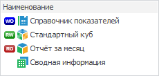
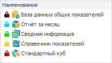

# Просмотр прав доступа

Просмотр прав доступа
-

# Просмотр прав доступа

В разделе «[Навигатор](Admin_SecManager_CommonFunction.htm)»
 доступен просмотр прав доступа объектов в виде пиктограмм.

Примечание.
 Отображение прав доступа объектов в виде пиктограмм доступно только в
 настольном приложении.

Для включения отображения прав доступа в разделе «[Навигатор](Admin_SecManager_CommonFunction.htm)»:

	- Выберите пункт «Вид
	 > Просмотр
	 прав доступа» в главном меню.

	- Выберите в раскрывающемся списке вариант отображения:

		- Не отображать права доступа.
		 Отключает просмотр;

		- Отображать дискреционные
		 права. Отображение прав доступа на объекты для отдельного
		 субъекта;

		- Отображать мандатные права/уровни
		 безопасности. Отображение меток доступа объекта.

При включенном просмотре прав доступа на панели инструментов будет отображено
 поле для выбора субъекта или категории, чьи права будут отображены в навигаторе
 менеджера безопасности.

При использовании просмотра прав доступа отображаются как явно заданные
 права (если права доступа заданы отдельно для субъекта), так и неявно
 заданные права (если права наследуются от группы).

## Отображение дискреционных прав

В режиме отображения дискреционных прав напротив каждого объекта отображается
 пиктограмма, показывающая права на данный объект для выбранного субъекта.

Для выбора субъекта, чьи права доступа будут отображены в виде пиктограмм:

	- Установите флажок «Вид >
	 Просмотр прав доступа > Отображать дискреционные права»
	 в [главном
	 меню](../01_RunSecManager/Admin_Organizational_Starting.htm);

	- Установите флажок «Панель выбора
	 пользователя» в контекстном меню [панели
	 инструментов](../01_RunSecManager/Admin_Organizational_Starting.htm), если панель скрыта.

Выберите субъект на панели выбора пользователя:

[Поиск субъекта](javascript:TextPopup(this))

	Для поиска субъекта:

		- нажмите кнопку  и введите наименование
		 пользователя или группы пользователей в строке поиска;

		- разверните раскрывающийся список.

	После выполнения действий выберите найденного субъекта.

[Фильтрация
 субъектов](javascript:TextPopup(this))

	Для фильтрации субъектов нажмите на кнопку 
	 и в раскрывающемся списке выберите вариант отображения субъектов:

		- Все субъекты безопасности.
		 Список содержит все субъекты безопасности;

		- Субъекты с явно предоставленными
		 правами доступа. Список содержит только субъекты с явно
		 предоставленными правами доступа.

	Примечание.
	 Включение пункта фильтра «Субъекты
	 с явно предоставленными правами доступа» отображает в списке
	 субъекты безопасности, если они не были добавлены как [пользователи](../03_Admin/Users/Admin_Users.htm)
	 или [группы пользователей](../03_Admin/Groups/Admin_Groups.htm).

	После установки фильтрации раскрывающийся список в строке поиска
	 субъектов будет отфильтрован.

После выбора субъекта напротив каждого объекта будут отображаться пиктограммы,
 показывающие какие права доступа к объекту имеет выбранный субъект:

	- 
	 «Write Only». Права только
	 на запись;

	- 
	 «Read/Write». Права на запись
	 и чтение;

	- 
	 «Read Only». Права только
	 на чтение;

	- Без пиктограммы. Нет
	 прав доступа.

## Отображение мандатных прав или уровней безопасности

В режиме отображения мандатных прав или уровней безопасности напротив
 каждого объекта будут отображаться пиктограммы, по которым определяется
 метка критичности объекта.

Для выбора уровня безопасности, чьи метки критичности будут отображены
 в виде пиктограмм:

	- установите флажок «Вид >
	 Просмотр прав доступа > Отображать мандатные права» в [главном
	 меню](../01_RunSecManager/Admin_Organizational_Starting.htm);

	- выполните команду «Панель выбора
	 уровня доступа» в контекстном меню на [панели
	 инструментов](../01_RunSecManager/Admin_Organizational_Starting.htm).

Выберите в раскрывающемся списке уровень безопасности на панели выбора
 уровня доступа:

После выбора уровня безопасности напротив каждого объекта будут отображаться
 пиктограммы, показывающие какие метки критичности установлены объектам.
 При более низких метках критичности пиктограммы имеют более яркий цвет:

См. также:

[Настройка
 прав доступа к объектам](Admin_SecManager_CommonFunction.htm) | [Параметры
 управления доступом](../03_Admin/Admin_AdminObjects.htm) | [Права
 доступа на элементы справочников НСИ](../03_Admin/Admin_ElementAccess.htm)

		Справочная
		 система на версию 10.9
		 от 18/08/2025,
		 © ООО «ФОРСАЙТ»,
