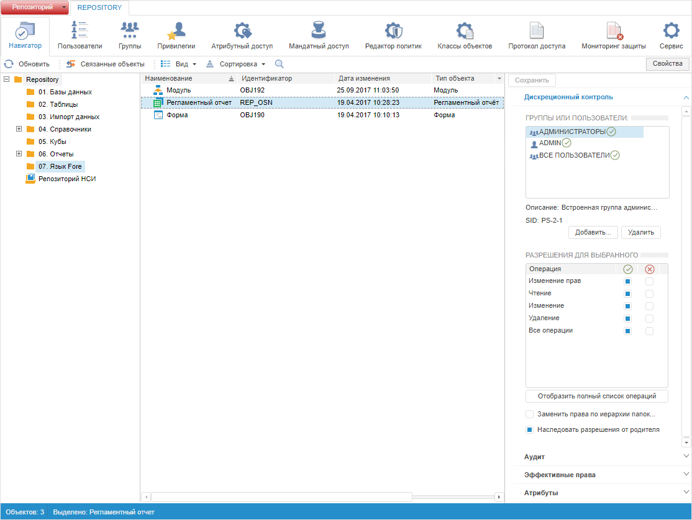
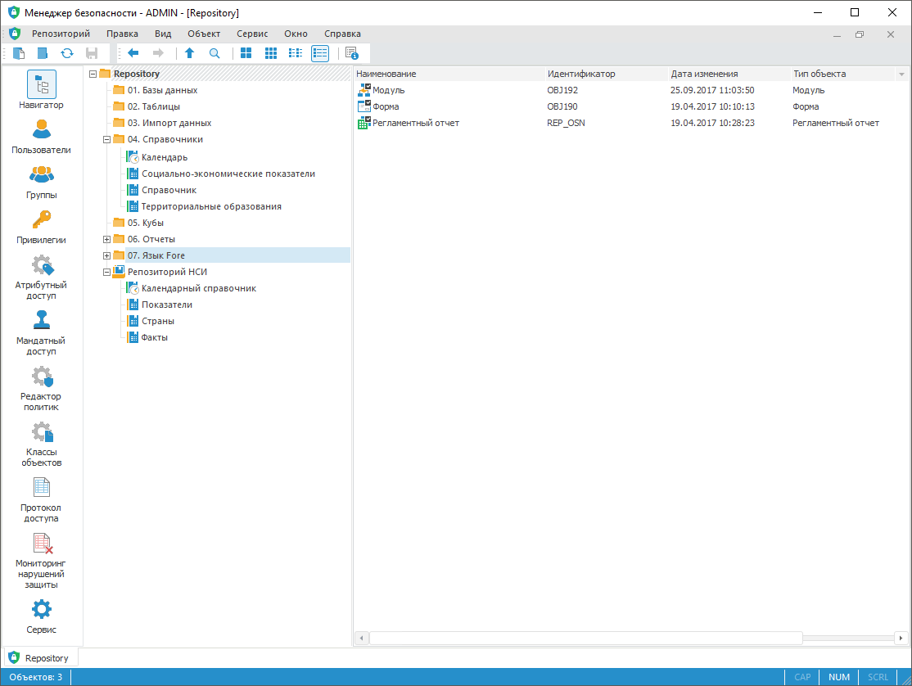

# Настройка прав доступа к объектам

Настройка прав доступа к объектам
-

# Настройка прав доступа к объектам

Для настройки прав доступа к объектам используйте раздел «Навигатор»
 [панели
 навигации](../01_RunSecManager/Admin_Organizational_Starting.htm).

Примечание.
 При [разделении ролей](../04_SecurityPolicy/Editor_of_Politicy/Security_EditorPoliticy_Adm.htm)
 между администратором информационной безопасности и прикладным администратором
 раздел «Навигатор» доступен только
 администратору информационной безопасности.

К объектам [модели
 безопасности](../01_RunSecManager/Admin_Intro.htm#model) продукта «Форсайт. Аналитическая платформа»
 относятся все объекты репозитория: папки, таблицы, запросы, представления,
 измерения, стандартные и виртуальные кубы, формы, отчёты, рабочие пространства
 и т.д. Доступ к объектам регламентируется [методами
 разграничения доступа](../04_SecurityPolicy/Admin_SecPolicy.htm). При использовании [атрибутного
 метода разграничения доступа](../04_SecurityPolicy/Admin_ABAC.htm) настройка прав доступа к объектам осуществляется
 с помощью добавления политик и правил в разделе «[Атрибутный доступ](../04_SecurityPolicy/Admin_AttributeAccess.htm)».

Примечание.
 Для работы в разделе «Навигатор»
 веб-приложения менеджера безопасности доступны следующие типы объектов:
 аналитическая панель, регламентный отчёт, экспресс-отчёт (OLAP), рабочая
 книга, контейнер моделирования, задача моделирования, временные ряды,
 кубы, справочники НСИ, каталоги ADOMD.

Для обеспечения сохранности и целостности данных задаются права доступа
 и/или уровни безопасности для каждого объекта репозитория, а также на
 элементы контейнерных объектов.

Раздел «Навигатор»:

	Веб-приложение
	 Настольное
	 приложение

		

		

Навигатор состоит из дерева объектов для отображения иерархии объектов
 и папок в левой части, и списка объектов для отображения объектов, расположенных
 в выбранной папке, в правой части.

[Отображение
 элементов и перемещение по объектам](javascript:TextPopup(this))

	Для изменения [вида
	 отображения](UiNav.chm::/GUI/View.htm)
	 объектов:

		- в веб-приложении нажмите кнопку
		 «Вид» на [панели
		 инструментов](../01_RunSecManager/Admin_Organizational_Starting.htm) и выберите вид отображения:

			-  - мелкие значки;

			-  - крупные значки;

			-  - таблица;

		- в настольном приложении:

			- переключите вид отображения
			 в [главном
			 меню](../01_RunSecManager/Admin_Organizational_Starting.htm) «Вид»;

			- выберите вид отображения
			 на [панели
			 инструментов](../01_RunSecManager/Admin_Organizational_Starting.htm) с помощью кнопок:

				-  - крупные
				 значки;

				-  - мелкие
				 значки;

				-  - список;

				-  - таблица.

	После выполнения действий будет изменен вид отображения объектов.

	Для перемещения по объектам:

		- нажмите кнопку 
		 «Назад» на панели инструментов
		 или используйте сочетание клавиш ALT+LEFT
		 для перемещения к предыдущему объекту;

		- нажмите кнопку 
		 «Вперед» на панели инструментов
		 или используйте сочетание клавиш ALT+RIGHT для перемещения к следующему
		 объекту;

		- нажмите кнопку 
		 «Перейти на уровень вверх»
		 на панели инструментов для перехода на верхний уровень по иерархии
		 папок раздела.

	Примечание.
	 Перемещение по объектам доступно только в настольном приложении.

[Поиск объектов](javascript:TextPopup(this))

	Для поиска объектов:

		- в веб-приложении:

			- нажмите кнопку  «Поиск»
			 на [панели
			 инструментов](../01_RunSecManager/Admin_Organizational_Starting.htm);

			- используйте сочетание клавиш CTRL+F;

		- в настольном приложении:

			- выполните команду «Правка
			 > Поиск»
			 в [главном
			 меню](../01_RunSecManager/Admin_Organizational_Starting.htm);

			- выполните команду «Поиск»
			 в контекстном меню объекта дерева объектов;

			- нажмите кнопку 
			 «Поиск» на [панели
			 инструментов](../01_RunSecManager/Admin_Organizational_Starting.htm);

			- используйте сочетание клавиш CTRL+F.

	После выполнения одного из действий будет открыт [диалог поиска
	 объектов](UiNav.chm::/02_Navigator/UiNav_FindObject.htm).

[Просмотр
 свойств объекта](javascript:TextPopup(this))

	Для просмотра свойств выбранного объекта:

		- выполните команду «Объект
		 > Свойства»
		 в [главном
		 меню](../01_RunSecManager/Admin_Organizational_Starting.htm);

		- выполните команду «Свойства»
		 в контекстном меню объекта;

		- нажмите кнопку 
		 «Свойства» на [панели
		 инструментов](../01_RunSecManager/Admin_Organizational_Starting.htm).

	Будет открыто окно «[Свойства объектов](UiNav.chm::/03_Objects/UiNav_Obj_BasicProp.htm)».

	Примечание.
	 Просмотр свойств объекта доступен только в настольном приложении.

[Настройка
 прав доступа к объекту](javascript:TextPopup(this))

	Для настройки прав доступа выбранного объекта откройте боковую панель
	 «[Свойства](../03_Admin/Admin_AdminObjects.htm)»
	 в веб-приложении и окно «[Параметры
	 управления доступом](../03_Admin/Admin_AdminObjects.htm)» в настольном приложении:

		- в веб-приложении выберите объект;

		- в настольном приложении выполните
		 одно из действий:

			- выполните команду «Права
			 доступа» в контекстном меню объекта;

			- выполните команду «Объект
			 > Права доступа» в [главном
			 меню](../01_RunSecManager/Admin_Organizational_Starting.htm);

			- нажмите клавишу ENTER;

			- дважды щёлкните по наименованию объекта.

	После выполнения действий задайте необходимые параметры управления
	 доступом на боковой панели «[Свойства](../03_Admin/Admin_AdminObjects.htm)»
	 в веб-приложении и в окне «[Параметры
	 управления доступом](../03_Admin/Admin_AdminObjects.htm)» в настольном приложении.

[Настройка
 прав на элементы справочников НСИ](javascript:TextPopup(this))

	Настройка прав доступа на элементы справочников НСИ возможна только
	 в настольном приложении при установленном флажке «[Элементы
	 имеют права доступа](UiNavObj.chm::/reference_book/Master_RDS_reference_book/base_settings.htm)» в справочнике НСИ.

	Для получения подробной информации обратитесь к разделу «[Права
	 доступа на элементы справочников НСИ](../03_Admin/Admin_ElementAccess.htm)».

[Экспорт прав
 доступа на объекты](javascript:TextPopup(this))

	Для экспорта прав доступа на объекты в файл:

		- Выполните команду «Сервис
		 > Экспортировать
		 права доступа» в [главном
		 меню](../01_RunSecManager/Admin_Organizational_Starting.htm).

		- В раскрывающемся списке выберите вариант экспорта:

			- По типу объектов.
			 Права доступа в файле будут представлены по типу объектов;

			- По папкам; по типу
			 объектов. Права доступа в файле будут представлены
			 в соответствии с имеющейся иерархией объектов в репозитории.

	Будет открыт стандартный диалог сохранения файлов, в котором необходимо
	 указать имя и месторасположение.

	Для получения подробной информации обратитесь к разделу «[Экспорт политики безопасности и прав
	 доступа](../04_SecurityPolicy/PolicyExport.htm)».

	Примечание. Экспорт
	 прав доступа на объекты доступен только в настольном приложении.

[Отображения
 прав доступа в виде пиктограмм](javascript:TextPopup(this))

	Для включения отображения прав доступа в виде пиктограмм:

		- Выполните команду «Вид
		 > Просмотр
		 прав доступа» в [главном
		 меню](../01_RunSecManager/Admin_Organizational_Starting.htm).

		- В раскрывающемся списке выберите вариант отображения:

			- Не отображать права
			 доступа. Отключение отображения прав доступа;

			- Отображать дискреционные
			 права. Отображение прав доступа на объекты для отдельного
			 субъекта;

			- Отображать мандатные
			 права/уровни безопасности. Отображение меток доступа
			 объекта.

	После включения одного из режимов в навигаторе будут отображаться
	 права доступа на объекты в виде пиктограмм.

	Совет. Для отображения
	 субъектов с явно предоставленными правами включите соответствующий
	 параметр фильтра в раскрывающемся меню кнопки 
	 на [панели
	 инструментов](../01_RunSecManager/Admin_Organizational_Starting.htm).

	Примечание.
	 Отображение прав доступа в виде пиктограмм возможно только в настольном
	 приложении.

	Для получения подробной информации обратитесь к разделу «[Просмотр
	 прав доступа](Admin_Access_Permissions.htm)».

Для применения заданных настроек прав доступа к объектам:

	- в веб-приложении нажмите кнопку  «Сохранить»
	 на [панели
	 инструментов](../01_RunSecManager/Admin_Organizational_Starting.htm) или на [боковой
	 панели](../01_RunSecManager/Admin_Organizational_Starting.htm);

	- в настольном приложении выполните
	 одно из действий:

		- выполните команду «Репозиторий
		 > Применить политику безопасности» в [главном
		 меню](../01_RunSecManager/Admin_Organizational_Starting.htm);

		- нажмите кнопку 
		 «Применить политику безопасности»
		 на [панели
		 инструментов](../01_RunSecManager/Admin_Organizational_Starting.htm).

Примечание.
 Если параметры раздела были изменены, то при попытке перехода на другой
 раздел или при закрытии менеджера безопасности будет выдан запрос о применении
 измененных настроек.

См. также:

[Настройка
 политики безопасности системы](../01_RunSecManager/Admin_Intro.htm) | [Параметры
 управления доступом](../03_Admin/Admin_AdminObjects.htm) | [Просмотр
 прав доступа](Admin_Access_Permissions.htm) | [Права
 доступа на элементы справочников НСИ](../03_Admin/Admin_ElementAccess.htm)

		Справочная
		 система на версию 10.9
		 от 18/08/2025,
		 © ООО «ФОРСАЙТ»,
