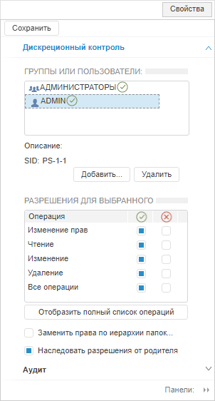
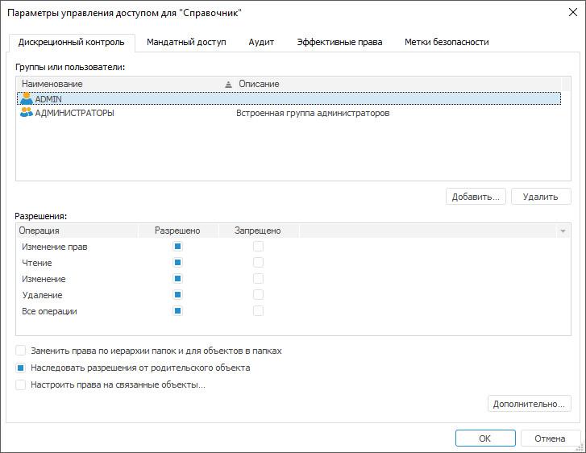

# Параметры управления доступом

Параметры управления доступом
-

# Параметры управления доступом

Параметры управления доступом позволяют настроить права определенного
 объекта и типа объектов.

[Настройка
 прав объекта](javascript:TextPopup(this))

	Для настройки прав объекта из раздела «[Навигатор](../02_ComonFunction/Admin_SecManager_CommonFunction.htm)»:

		- в веб-приложении отобразится боковая панель «Свойства»
		 для настроек прав доступа;

		- в настольном приложении выполните одно из действий:

			- выполните команду «Права доступа» в контекстном
			 меню объекта;

			- выполните команду «Объект > Права доступа»
			 в [главном
			 меню](../01_RunSecManager/Admin_Organizational_Starting.htm);

			- выделите объект и нажмите
			 клавишу ENTER;

			- дважды щелкните основной
			 кнопкой мыши по наименованию объекта.

	После выполнения одного из действий будет
	 открыто окно «Параметры управления
	 доступом».

[Настройка
 прав типа объектов](javascript:TextPopup(this))

	Для настройки прав типа объектов из раздела «[Классы объектов](../04_SecurityPolicy/Admin_Object_Classes.htm)»:

		- в веб-приложении отобразится боковая панель «Свойства»
		 для настроек прав доступа;

		- в настольном приложении выполните одно из действий:

			- выполните команду «Права доступа» в контекстном
			 меню типа объектов;

			- выполните команду «Классы объектов > Права доступа»
			 в [главном
			 меню](../01_RunSecManager/Admin_Organizational_Starting.htm);

			- дважды щелкните основной
			 кнопкой мыши по наименованию объекта.

	После выполнения одного из действий будет
	 открыто окно «Параметры управления
	 доступом».

Боковая панель «Свойства»
 в веб-приложении и окно «Параметры управления
 доступом» в настольном приложении:

	Веб-приложение
	 Настольное
	 приложение

		

		

В настольном приложении в заголовке диалога отображается наименование
 объекта/типа объектов, для которого производится настройка прав.

Ключевые возможности:

	- [настройка
	 параметров при дискреционном контроле](Admin_AdminObjects_Discretionary.htm);

	- [настройка
	 параметров при мандатном доступе](Admin_AdminObjects_Mandate.htm);

	- [настройка
	 параметров уровней безопасности](Admin_AdminObjects_Discretionary_seclevels.htm);

	- [настройка
	 аудита](Admin_AdminObjects_Audit.htm);

	- [просмотр
	 эффективных прав](Admin_AdminObjects_Effective.htm);

	- [настройка
	 меток безопасности](Admin_AdminObjects_Marks.htm).

	- просмотр атрибутов объекта.

Примечание.
 Просмотр атрибутов объекта доступен только в веб-приложении на боковой
 панели «Свойства». В настольном
 приложении добавление и редактирование атрибутов объекта осуществляется
 в [свойствах
 объекта](UiNav.chm::/03_Objects/UiNav_Obj_BasicProp.htm)
 [навигатора](GetStarted.chm::/Interface/Interface_Navigator.htm).

Параметры управления доступом определенного
 объекта и типа объектов отличаются:

	- для объекта доступна [настройка
	 прав доступа на связанные объекты](Admin_AdminObjects_DiscretionaryUseObject.htm);

	- для типа объектов доступно [создание
	 и редактирование атрибутов](../04_SecurityPolicy/Admin_PermSep_Attributes.htm).

См. также:

[Настройка
 прав доступа к объектам](../02_ComonFunction/Admin_SecManager_CommonFunction.htm) | [Просмотр
 прав доступа](../02_ComonFunction/Admin_Access_Permissions.htm) | [Права доступа
 на элементы справочников НСИ](Admin_ElementAccess.htm)

		Справочная
		 система на версию 10.9
		 от 18/08/2025,
		 © ООО «ФОРСАЙТ»,
