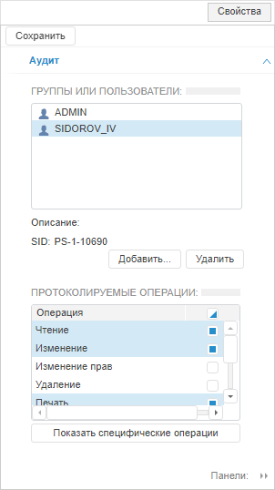
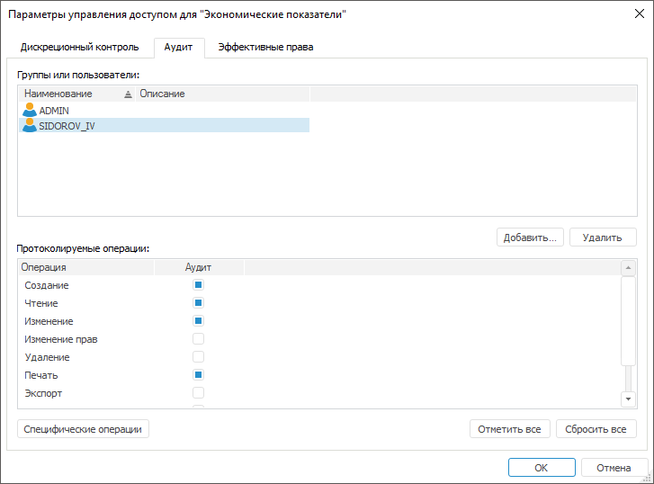
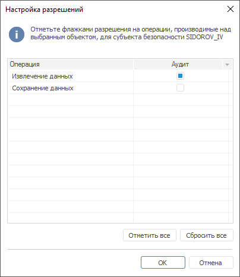

# Настройка аудита

Настройка аудита
-

# Настройка аудита

Для настройки аудита используйте вкладку «Аудит»
 на боковой панели «[Свойства](Admin_AdminObjects.htm)»
 в веб-приложении и в окне «[Параметры
 управления доступом](Admin_AdminObjects.htm)» в настольном приложении.

Примечание.
 Настройка аудита возможна только для одного выбранного объекта.

	Веб-приложение
	 Настольное приложение

		

		

Настройка аудита предназначена для разрешения или запрета действий пользователя
 или группы пользователей над выбранным объектом.

Добавьте пользователя или группу пользователей с помощью кнопки «Добавить», при нажатии на которую
 появится окно «[Выбор
 групп и пользователей](Admin_UsersGroups.htm)». Выберите пользователя или группу пользователей
 для настройки аудита.

Для конкретного добавленного пользователя или группы пользователей задайте
 протоколируемые операции с помощью соответствующих флажков в списке «Протоколируемые операции». Отмеченные
 операции будут записываться в [протокол
 доступа](../05_AccessProtocol/Admin_AccessProtocol.htm).

Для протоколирования выбранных операций и настройки
 аудита по [специфическим
 операциям](../05_AccessProtocol/Admin_AccessProtocol_EvetsType.htm) установите флажки:

	- в веб-приложении нажмите кнопку «Показать специфические операции»
	 для отображения списка специфических операций в списке «Протоколируемые
	 операции»;

	- в настольном приложении нажмите кнопку
	 «Специфические операции» для
	 открытия окна «Настройка разрешений»:

Отметьте флажками разрешения на операции,
 производимые над выбранным объектом, для пользователя или группы пользователей
 с помощью множественной отметки или кнопками/пунктами контекстного меню:

		- Отметить все. Устанавливает
		 флажки для всех операций;

		- Сбросить все. Снимает
		 все установленные флажки.

После отметки операций нажмите кнопку «ОК». В списке «Протоколируемые
 операции» на вкладке «Аудит»
 будет обновлено состояние флажка напротив специфических операций.

Примечание.
 Настройка аудита по [специфическим
 операциям](../05_AccessProtocol/Admin_AccessProtocol_EvetsType.htm) доступна типам объектов, для которых предусмотрены [специфические
 операции](../05_AccessProtocol/Admin_AccessProtocol_EvetsType.htm). Для разных типов объектов список [специфических
 операций](../05_AccessProtocol/Admin_AccessProtocol_EvetsType.htm) отличается.

См. также:

[Параметры
 управления доступом](Admin_AdminObjects.htm) | [Просмотр
 эффективных прав](Admin_AdminObjects_Effective.htm)

		Справочная
		 система на версию 10.9
		 от 18/08/2025,
		 © ООО «ФОРСАЙТ»,
