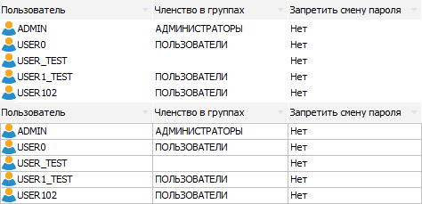
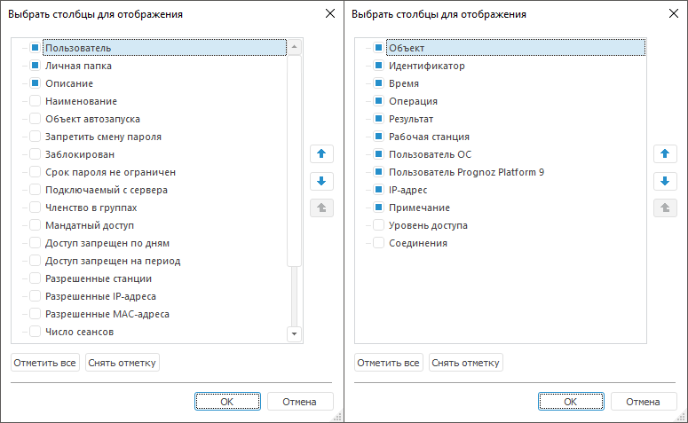
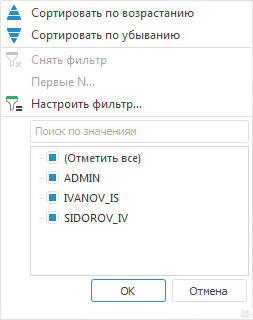
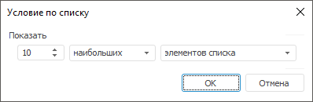
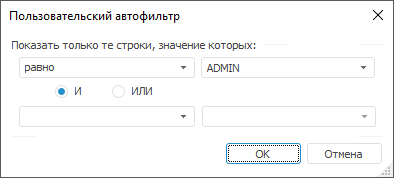

# Настройка отображения списка

Настройка отображения списка
-

# Настройка отображения списка

Некоторая информация отображается в виде списка. Ниже приведены возможные
 настройки отображения списка.

[Отображение
 сетки](javascript:TextPopup(this))

	Настройка доступна только в разделе «[Пользователи](Users/Admin_Users.htm)» настольного
	 приложения менеджера безопасности.

	Для включения/отключения отображения сетки установите/снимите флажок
	 «Отображать сетку» в главном
	 меню «Вид». По умолчанию список
	 пользователей отображается без сетки. Ниже приведен пример отображения
	 без сетки и с сеткой:

	

[Изменение размеров
 строк/столбцов](javascript:TextPopup(this))

	В настольном и веб-приложении изменяется размер заголовка столбца
	 при наведении стрелки мыши на границу между столбцами . Изменение размера заголовка
	 столбца доступно в разделах: «[Навигатор](../02_ComonFunction/Admin_SecManager_CommonFunction.htm)», «[Пользователи](Users/Admin_Users.htm)»,
	 «[Группы](Groups/Admin_Groups.htm)»,
	 «[Привилегии](../04_SecurityPolicy/Admin_Priv.htm)», «[Мандатный
	 доступ](../04_SecurityPolicy/Admin_MandatAccess.htm)», «[Уровни
	 безопасности](../04_SecurityPolicy/Security_levels_section.htm)», «[Классы объектов](../04_SecurityPolicy/Admin_Object_Classes.htm)»,
	 «[Протокол
	 доступа](../05_AccessProtocol/Admin_AccessProtocol.htm)», «[Мониторинг
	 нарушений защиты](../06_MonitoringViolations/Admin_MonitoringViolations.htm)».

	Для разрешения/запрета изменения размеров строк установите/снимите
	 флажок в главном меню напротив «Вид
	 > Разрешить изменение размеров строк». Доступно только для
	 разделов «[Пользователи](Users/Admin_Users.htm)»,
	 «[Группы](Groups/Admin_Groups.htm)»
	 настольного приложения.

[Отображение/скрытие
 столбцов](javascript:TextPopup(this))

	Настройка отображения столбцов возможна для разделов:

		- в веб-приложении: «[Навигатор](../02_ComonFunction/Admin_SecManager_CommonFunction.htm)», «[Пользователи](Users/Admin_Users.htm)»,
		 «[Группы](Groups/Admin_Groups.htm)»,
		 «[Привилегии](../04_SecurityPolicy/Admin_Priv.htm)», «[Мандатный
		 доступ](../04_SecurityPolicy/Admin_MandatAccess.htm)/[Уровни
		 безопасности](../04_SecurityPolicy/Security_levels_section.htm)», «[Классы объектов](../04_SecurityPolicy/Admin_Object_Classes.htm)»,
		 «[Протокол
		 доступа](../05_AccessProtocol/Admin_AccessProtocol.htm)», «[Мониторинг
		 защиты](../06_MonitoringViolations/Admin_MonitoringViolations.htm)»;

		- в настольном приложении: «[Навигатор](../02_ComonFunction/Admin_SecManager_CommonFunction.htm)», «[Пользователи](Users/Admin_Users.htm)»,
		 «[Группы](Groups/Admin_Groups.htm)», «[Классы
		 объектов](../04_SecurityPolicy/Admin_Object_Classes.htm)», «[Протокол
		 доступа](../05_AccessProtocol/Admin_AccessProtocol.htm)» и «[Мониторинг
		 нарушений защиты](../06_MonitoringViolations/Admin_MonitoringViolations.htm)».

	Для настройки отображения столбцов:

		- в веб-приложении нажмите кнопку
		 ,
		 расположенную в конце строки с заголовками столбцов, и установите/снимите
		 флажок напротив него;

		- в настольном приложении:

			- вызовите диалог «Выбрать
			 столбцы для отображения»:

				- с помощью команды главного меню «Вид
				 > Выбрать столбцы» (доступно для разделов «[Протокол
				 доступа](../05_AccessProtocol/Admin_AccessProtocol.htm)» и «[Мониторинг
				 нарушений защиты](../06_MonitoringViolations/Admin_MonitoringViolations.htm)»);

				- с помощью команды контекстного меню «Выбрать
				 столбцы» для заголовка столбца (доступно для разделов «[Пользователи](Users/Admin_Users.htm)»,
				 «[Группы](Groups/Admin_Groups.htm)»,
				 «[Протокол
				 доступа](../05_AccessProtocol/Admin_AccessProtocol.htm)» и «[Мониторинг
				 нарушений защиты](../06_MonitoringViolations/Admin_MonitoringViolations.htm)»);

		-

			- вызовите контекстное меню для заголовка столбца. Для
			 включения/отключения отображения столбца с соответствующей
			 информацией установите/снимите флажок напротив него (доступно
			 для разделов «[Пользователи](Users/Admin_Users.htm)»,
			 «[Группы](Groups/Admin_Groups.htm)»,
			 «[Протокол
			 доступа](../05_AccessProtocol/Admin_AccessProtocol.htm)» и «[Мониторинг
			 нарушений защиты](../06_MonitoringViolations/Admin_MonitoringViolations.htm)»);

			- нажмите кнопку ,
			 расположенную в конце строки с заголовками столбцов (доступно
			 для разделов «[Навигатор](../02_ComonFunction/Admin_SecManager_CommonFunction.htm)»
			 и «[Классы
			 объектов](../04_SecurityPolicy/Admin_Object_Classes.htm)»).

	Примечание.
	 При [разделении
	 ролей](../04_SecurityPolicy/Editor_of_Politicy/Security_EditorPoliticy_Adm.htm) между администратором информационной безопасности и прикладным
	 администратором список доступных столбцов будет неполным для прикладного
	 администратора. Наличие пунктов будет соответствовать свойствам пользователя,
	 отображаемым на вкладке «[Общие
	 свойства](Users/Admin_UserProp_Common.htm)».

	Отображение столбцов может меняться в зависимости от выбранного
	 раздела и задаваемых в менеджере безопасности настроек.

	При выборе пункта «Выбрать столбцы»
	 в настольном приложении будет открыт диалог «Выбрать
	 столбцы для отображения» (слева – для раздела «[Пользователи](Users/Admin_Users.htm)», справа – для
	 раздела «[Протокол
	 доступа](../05_AccessProtocol/Admin_AccessProtocol.htm)»):

	

	Для включения/отключения столбца с соответствующей информацией установите
	 /снимите флажок напротив него. Для отметки/снятия всех установленных
	 флажков используйте кнопку «Отметить
	 все»/«Снять отметку».
	 Для задания порядка столбцов в списке используйте кнопки  и .

	Примечание.
	 Настройки отображения столбцов сбрасываются для администраторов при
	 переключении режима разделения ролей между администратором информационной
	 безопасности и прикладным администратором. В этом случае будут применены
	 настройки по умолчанию.

[Фильтрация](javascript:TextPopup(this))

	Фильтрация применяется для сокращения списка и исключения из рассмотрения
	 ненужной информации.

	Примечание.
	 Настройка фильтрации доступна только в настольном приложении.

	Для разрешения/запрета фильтрации:

		- установите флажок в главном меню «Вид
		 > Автофильтр» в разделах «[Пользователи](Users/Admin_Users.htm)», «[Группы](Groups/Admin_Groups.htm)»,
		 «[Протокол
		 доступа](../05_AccessProtocol/Admin_AccessProtocol.htm)» и «[Мониторинг
		 нарушений защиты](../06_MonitoringViolations/Admin_MonitoringViolations.htm)»;

		- установите флажок «Автофильтр»
		 в контекстном меню в разделах «[Протокол
		 доступа](../05_AccessProtocol/Admin_AccessProtocol.htm)» и «[Мониторинг
		 нарушений защиты](../06_MonitoringViolations/Admin_MonitoringViolations.htm)».

	Для фильтрации столбца нажмите на кнопку , расположенную
	 около правой границы столбца, после чего будет открыт список:

	

	В списке будут отображаться все элементы, отмеченные в списке, сформированном
	 из всех значений фильтруемых строк.

	Примечание.
	 В разделах «[Группы](Groups/Admin_Groups.htm)»
	 доступен только пункт «Настроить
	 фильтр».

	Первые две строки содержат способы сортировки: «Сортировать
	 по возрастанию» и «Сортировать
	 по убыванию». При установленной сортировке направление сортировки
	 отображается в заголовке соответствующего столбца.

	Следующие три строки содержат стандартные операции автофильтра:

		- Снять фильтр. Операция
		 предназначена для отображения всех строк;

		- Первые N. Операция
		 предназначена для вывода указанного количества элементов списка.
		 Количество элементов задается либо явно, либо в процентах от общего
		 количества фильтруемых элементов:

	

	В данном окне можно установить
	 следующие параметры:

			- Количество строк.
			 Поле ввода, с помощью которого можно определить количество
			 отображаемых строк;

			- Признак. Определяет
			 какие элементы будут отображаться - наибольшие или наименьшие;

			- Условие выбора.
			 Определяет каким образом задается количество элементов - явно
			 или в процентах от количества элементов.

	Примечание.
	 Данный фильтр доступен, если в фильтруемых строках присутствуют числовые
	 значения.

		- Настроить фильтр.
		 Операция, предназначенная для определения условий фильтрации в
		 окне «Пользовательский
		 автофильтр»:

	

	В данном окне можно установить
	 следующие параметры:

			- Условие выбора.
			 Раскрывающийся список, определяющий условие для отображения
			 элементов (равно, не равно...);

			- Значение. Раскрывающийся
			 список, определяющий значение условия для отображения элементов.
			 Данный список элементов содержит все значения диапазона автофильтра,
			 отсортированные без учета регистра. Регистр учитывается только
			 при совпадении значений;

			- Условия фильтрации.
			 Переключатель, определяющий порядок использования двух условий
			 одновременно.

	Предусмотрено два варианта использования
	 сочетаний условий:

			- при установке переключателя «И»
			 будут отображаться строки, удовлетворяющие обоим условиям;

			- при установке переключателя «ИЛИ»
			 будут отображаться строки, удовлетворяющие хотя бы одному
			 из двух условий.

[Сортировка](javascript:TextPopup(this))

	Сортировка используется для наглядного представления списка. По
	 умолчанию сортировка не производится.

	Для установки/изменения сортировки выполните щелкните по заголовку
	 столбца. В заголовке столбца будет отображена стрелка, показывающая
	 направление сортировки:

		- . По возрастанию или в алфавитном порядке
		 в зависимости от типа данных, содержащихся в столбце;

		- . По убыванию или в обратном алфавитном
		 порядке в зависимости от типа данных, содержащихся в столбце;

		- Нет стрелки. Сортировка
		 не используется.

	При первом щелчке данные столбца будут отсортированы в алфавитном
	 порядке/по возрастанию. При последующих щелчках по заголовку меняется
	 вид сортировки.

	В настольном приложении в разделе «[Навигатор](../02_ComonFunction/Admin_SecManager_CommonFunction.htm)»
	 дополнительно можно установить/изменить сортировку с помощью пункта
	 «Упорядочить» в раскрывающемся
	 меню «Вид» главного меню.
	 Для сортировки по нескольким столбцам зажмите клавишу CTRL и последовательно
	 щелкните по заголовкам необходимых столбцов. Порядок сортировки будет
	 определяться следующим образом: столбец, по заголовку которого был
	 осуществлен последний щелчок, будет отсортирован в последнюю очередь.

	В веб-приложении в разделе «[Навигатор](../02_ComonFunction/Admin_SecManager_CommonFunction.htm)»
	 дополнительно можно установить/изменить сортировку с помощью кнопки
	 «Сортировка» на панели инструментов:

		- по наименованию;

		- по идентификатору;

		- по дате изменения;

		- по типу объекта;

		- по примечанию;

		- без сортировки.

	Также возможно задать направление сортировки:

		- по возрастанию;

		- по убыванию.

[Экспорт
 списка](javascript:TextPopup(this))

	В настольном приложении экспорт списка доступен в разделах «[Навигатор](../02_ComonFunction/Admin_SecManager_CommonFunction.htm)»,
	 «[Пользователи](Users/Admin_Users.htm)»,
	 «[Редактор
	 политик](../04_SecurityPolicy/Editor_of_Politicy/Security_EditorPoliticy_General.htm)», «[Протокол
	 доступа](../05_AccessProtocol/Admin_AccessProtocol.htm)», «[Мониторинг
	 нарушений защиты](../06_MonitoringViolations/Admin_MonitoringViolations.htm)».

	Для экспорта:

		- в разделе «[Навигатор](../02_ComonFunction/Admin_SecManager_CommonFunction.htm)»
		 выполните команду главного меню «Сервис
		 > [Экспортировать
		 права доступа](../04_SecurityPolicy/PolicyExport.htm) > По типу объектов/По папкам; по типу объектов»;

		- в разделе «[Пользователи](Users/Admin_Users.htm)»
		 выполните команду главного меню «Сервис
		 > Экспортировать список пользователей»;

		- в разделе «[Редактор
		 политик](../04_SecurityPolicy/Editor_of_Politicy/Security_EditorPoliticy_General.htm)» выполните команду главного меню «Сервис
		 > [Экспортировать
		 настройки политики безопасности](../04_SecurityPolicy/PolicyExport.htm)»;

		- в разделе «[Протокол
		 доступа](../05_AccessProtocol/Admin_AccessProtocol.htm)» выполните команду главного меню «Протокол
		 доступа > Сохранить в файл > Полный протокол/Текущее представление»;

		- в разделе «[Мониторинг
		 нарушений защиты](../06_MonitoringViolations/Admin_MonitoringViolations.htm)» выполните команду главного меню «Сервис >
		 Экспортировать».

	После чего будет открыт стандартный диалог, в котором необходимо
	 указать имя и месторасположение файла.

	При экспорте по умолчанию в качестве имени файла будет предложено: «<Название раздела экспорта> <имя
	 репозитория> на <дата>».

	В файл формата CSV(*.csv) сохраняется только отображаемая в списке
	 информация, поэтому следует учитывать [настроенное
	 отображение столбцов](Admin_AdminObjects_AuditTuning.htm) и используемую фильтрацию.

	Примечание.
	 Полная версия протокола доступа сохраняется в файл формата PPLOG(*.pplog).

	По окончании экспорта пользователям будет предложено открыть сформированный
	 файл.

	В веб-приложении экспорт списка доступен в разделах «[Пользователи](Users/Admin_Users.htm)», «[Протокол доступа](../05_AccessProtocol/Admin_AccessProtocol.htm)»
	 и «[Мониторинг
	 защиты](../06_MonitoringViolations/Admin_MonitoringViolations.htm)».

	Для экспорта нажмите кнопку 
	 «Экспорт»\«Экспортировать»
	 на панели инструментов. После чего вся информация о выбранном разделе
	 будет сохранена в файл формата CSV(*.csv).

	При экспорте файл сохраняется с именем: «<Название
	 раздела экспорта> <имя репозитория> на <дата>».

См. также:

[Начало
 работы с менеджером безопасности](../01_RunSecManager/Admin_Organizational_Starting.htm)

		Справочная
		 система на версию 10.9
		 от 18/08/2025,
		 © ООО «ФОРСАЙТ»,
