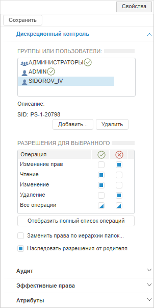
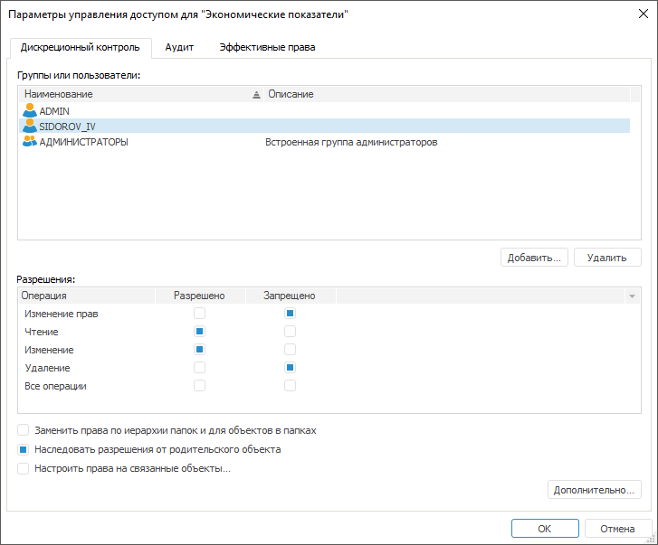
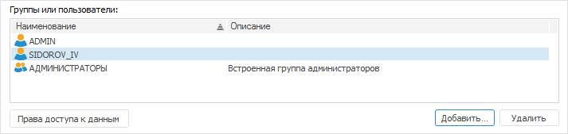

# Настройка параметров при дискреционном контроле

Настройка параметров при дискреционном контроле
-

# Настройка параметров при дискреционном
 контроле

Для настройки параметров при дискреционном контроле используйте вкладку
 «Дискреционный контроль» на боковой
 панели «[Свойства](Admin_AdminObjects.htm)»
 в веб-приложении и в окне «[Параметры
 управления доступом](Admin_AdminObjects.htm)» в настольном приложении.

Примечание.
 Настройка доступна только при выборе [дискреционного
 метода разграничения доступа](../04_SecurityPolicy/Admin_SecPolicy.htm).

	Веб-приложение
	 Настольное
	 приложение

		

		

Настройка параметров при дискреционном контроле позволяет определить
 набор действий пользователя или группы пользователей для работы с объектом.

В поле «Группы или пользователи»
 отображается список субъектов безопасности, которые имеют право производить
 какие-либо действия над объектами. При выборе субъекта в настольном приложении
 в области «Разрешения» или
 «Разрешения для выбранного» в
 веб-приложении будет отражен список прав доступа по общим операциям (изменение
 прав, чтение, изменение, удаление), которые могут быть изменены для каждого
 субъекта безопасности в отдельности.

Примечание.
 Доступна множественная отметка [классов
 объектов](../04_SecurityPolicy/Admin_Object_Classes.htm) для настройки параметров при вызове окна «[Параметры управления доступом](Admin_AdminObjects.htm)»
 в настольном приложении или боковой панели «[Права доступа](Admin_AdminObjects.htm)» в веб-приложении.
 После определения прав, права доступа будут установлены для каждого выбранного
 объекта класса.

Настройте параметры управления доступом:

[Добавление субъекта
 безопасности](javascript:TextPopup(this))

	Для добавления в список субъектов безопасности нажмите кнопку
	 «Добавить». В открывшемся
	 диалоге «[Выбор
	 групп и пользователей](Admin_UsersGroups.htm)»/«[Поиск пользователей и групп](Admin_UsersGroups.htm)»
	 выберите пользователей и/или группы.

	После добавления субъекта безопасности определите его права в области
	 «Разрешения» или «Разрешения
	 для выбранного», расставив флажки напротив выбранных операций.
	 Возможна установка флажков в столбцах «Разрешено»/«» и «Запрещено»/«».
	 Операция запрета имеет более высокий приоритет.

[Удаление субъекта
 безопасности](javascript:TextPopup(this))

	Для удаления субъекта безопасности нажмите кнопку «Удалить».

Примечание.
 Если пользователю запрещена операция чтения объекта, то данный объект
 не будет отображен в навигаторе объектов для данного пользователя и на
 вкладках настольного приложения «[Состоит
 из»/«Входит в](UiNav.chm::/03_Objects/UiNav_Obj_BasicProp.htm)»
 для тех объектов, которые используют объект, либо используются им. Если
 пользователю запрещены некоторые операции над объектами, то в навигаторе
 объектов для данного пользователя будут отсутствовать соответствующие
 пункты меню. Например, если у пользователя нет прав на «Удаление»/«Запись» объекта, то у него будут
 отсутствовать пункты меню «Редактировать»/«Удалить»/«Вырезать».

[Задание
 прав не из списка «Разрешения»](javascript:TextPopup(this))

	Для задания прав по операциям, которые не отображены в списке «Разрешения»/«Разрешения
	 для выбранного», нажмите кнопку «Дополнительно»/«Отобразить полный список операций».

	Для каждого выбранного субъекта безопасности задайте права:

		- в веб-приложении выберите субъект безопасности в поле «Группы и пользователи», задайте
		 права по операциям, которые необходимо разрешить/запретить в списке
		 «Разрешения для выбранного»;

		- в настольном приложении отобразится окно «[Дополнительные параметры безопасности](Admin_AdminObjects_Extra.htm)».

[Распространение
 установленных прав на дочерние папки и объекты](javascript:TextPopup(this))

	Для распространения прав объекта на дочерние папки и объекты:

		- Установите флажок «Заменить
		 права по иерархии папок и для объектов в папках».

		- Нажмите кнопку «OK».

	После предупреждения в диалоге просмотра прав для дочерних объектов
	 отобразятся заданные права.

[Включение
 режима наследования прав от родительского объекта](javascript:TextPopup(this))

	Флажок «Наследовать разрешения
	 от родительского объекта»/«Наследовать
	 разрешения от родителя» включает режим наследования прав объекта
	 от родительского объекта, в результате права объекта становятся идентичными
	 правам родительского объекта. Под родительским объектом понимается
	 папка или объект-контейнер (например, контейнер моделирования, репозиторий
	 НСИ и пр.), в котором находится объект.

	Примечание.
	 При установленном флажке права родителя, отличающиеся от прав дочернего
	 объекта, в диалоге прав для дочернего объекта отображены не будут.
	 Для просмотра наследуемых прав перейдите на вкладку «[Эффективные права](Admin_AdminObjects_Effective.htm)».

[Настройка прав
 на связанные объекты](javascript:TextPopup(this))

	Настройка прав на связанные объекты позволяет настроить права на
	 все объекты, которые используются данным объектом или используют данный
	 объект.

	Для настройки прав на связанные объекты:

		- в веб-приложении нажмите кнопку
		  «Связанные
		 объекты» на панели инструментов и [настройте
		 права](Admin_AdminObjects_DiscretionaryUseObject.htm);

		- в настольном приложении:

			- Установите флажок «Настроить
			 права на связанные объекты».

			- Нажмите кнопку «ОK».

	После выполненных действий откроется
	 окно «[Настройка
	 прав доступа на связанные объекты](Admin_AdminObjects_DiscretionaryUseObject.htm)».

	Примечание.
	 Настройка прав на связанные объекты доступна только для выбранного
	 объекта, от которого зависят другие объекты.

Если диалог настольного приложения
 «Параметры управления доступом»
 вызван для базы данных временных рядов, то под списком субъектов безопасности
 будет отображена кнопка «Права доступа
 к данным»:

Для настройки [прав
 доступа к данным](DataAccess/Admin_Data_Access_Right.htm) базы данных временных рядов нажмите на кнопку «Права доступа к данным» для выбранного
 субъекта безопасности.

Примечание.
 Настройка прав доступа к данным базы данных временных рядов доступна только
 в настольном приложении.

См. также:

[Параметры
 управления доступом](Admin_AdminObjects.htm) | [Настройка
 параметров при мандатном доступе](Admin_AdminObjects_Mandate.htm)

		Справочная
		 система на версию 10.9
		 от 18/08/2025,
		 © ООО «ФОРСАЙТ»,
