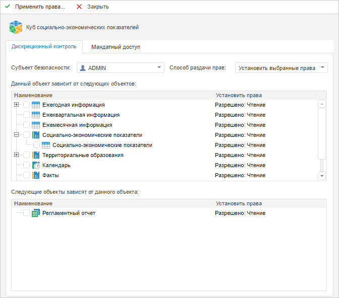
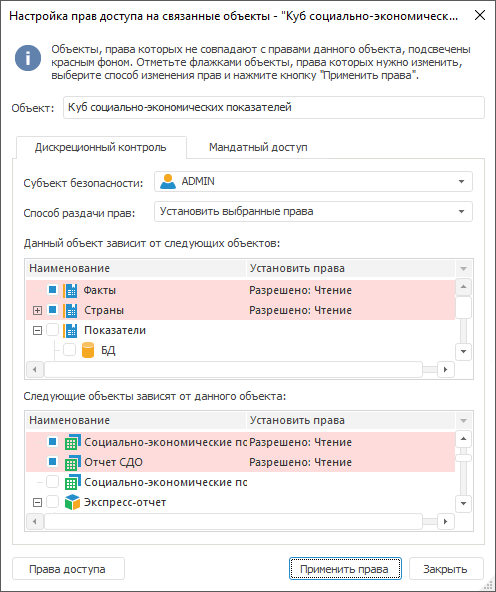
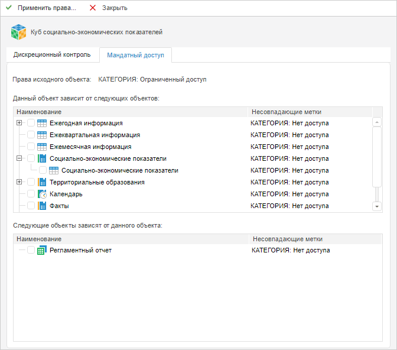
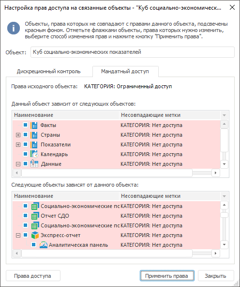

# Настройка прав доступа на связанные объекты

Настройка прав доступа на связанные объекты
-

# Настройка прав доступа на связанные объекты

Настройка прав на связанные объекты позволяет настроить права на все
 объекты, которые используются данным объектом или используют данный объект.

Для настройки прав доступа на связанные объекты:

	- в веб-приложении:

		- Выберите объект.

		- Нажмите кнопку  «Связанные
		 объекты» на [панели
		 инструментов](../01_RunSecManager/Admin_Organizational_Starting.htm).

После выполнения действий отобразятся вкладки
 «Дискреционный контроль» и «Мандатный доступ» для выбранного
 объекта.

	- в настольном приложении:

		- Выберите объект.

		- Установите флажок «Настроить
		 права на связанные объекты» на вкладке [«Дискреционный контроль»](Admin_AdminObjects_Discretionary.htm)
		 или [«Мандатный
		 доступ»](Admin_AdminObjects_Mandate.htm) в диалоге «[Параметры управления доступом](Admin_AdminObjects.htm)».

		- Нажмите кнопку «ОК».

После выполнения действий откроется диалог
 «Настройка прав доступа на связанные
 объекты».

Примечание.
 Отображение вкладки «Мандатный доступ»
 в настольном приложении и возможность установки прав [мандатного
 доступа](Admin_AdminObjects_Mandate.htm) в веб-приложении зависят от настроенной [политики
 безопасности](../04_SecurityPolicy/Admin_SecPolicy.htm).

## Дискреционный контроль

Вкладка «Дискреционный
 контроль» при настройке прав на связанные объекты доступна в веб-приложении
 и в окне настольного приложения «Настройка
 прав доступа на связанные объекты»:

	Веб-приложение
	 Настольное
	 приложение

		

		

Настройка прав доступа содержит:

	- Объект. В поле отображается
	 имя исходного объекта, для которого рассматриваются связанные объекты;

	- Субъект безопасности.
	 В раскрывающемся списке выберите субъект безопасности, для которого
	 необходимо установить права доступа на связанные объекты;

	- Способ раздачи прав.
	 В раскрывающемся списке выберите способ применения прав доступа на
	 связанные объекты:

		- Установить выбранные права.
		 Права отмеченных объектов будут заменены на права исходного объекта;

		- Добавить выбранные права.
		 Права исходного объекта будут добавлены к правам отмеченных объектов;

	- Данный объект зависит от следующих
	 объектов. В списке отображаются все зависимые объекты (по иерархии
	 вниз);

	- Следующие объекты зависят от
	 данного объекта. В списке отображаются все зависящие объекты
	 (по иерархии вверх);

	- Установить права. В
	 столбце отображаются права объекта, несовпадающие с правами исходного
	 объекта.

Установите флажки на те объекты, права которых должны быть изменены.

Примечание.
 Красным цветом подсвечиваются объекты, чьи права не совпадают с правами
 исходного объекта. Для таких объектов флажки устанавливаются автоматически.

## Мандатный доступ

Вкладка «Мандатный
 доступ» при настройке прав на связанные объекты доступна в веб-приложении
 и в окне настольного приложения «Настройка
 прав доступа на связанные объекты»:

	Веб-приложение
	 Настольное
	 приложение

		

		

Настройка прав доступа содержит:

	- Права исходного объекта.
	 В поле через точку с запятой отображаются метки всех категорий безопасности
	 для исходного объекта. При наведении курсора мыши на данное поле отображается
	 всплывающая подсказка на случай, когда все категории не входят в отведенное
	 для них пространство;

	- Данный объект зависит от следующих
	 объектов. В списке отображаются все зависимые объекты (по иерархии
	 вниз);

	- Следующие объекты зависят от
	 данного объекта. В
	 списке отображаются все зависящие объекты (по иерархии вверх);

	- Несовпадающие метки.
	 В столбце выводятся метки безопасности объекта, несовпадающие с метками
	 исходного объекта, в формате «<наименование
	 категории>: <наименование
	 уровня>».

Установите флажки на те объекты, метки которых должны совпадать с метками
 исходного объекта.

Примечание.
 Красным цветом подсвечиваются объекты, чьи права не совпадают с правами
 исходного объекта. Для таких объектов флажки устанавливаются автоматически.

## Применение прав

Для просмотра и изменения прав доступа выбранного объекта:

	- в веб-приложении используйте вкладку «[Дискреционный контроль](Admin_AdminObjects_Discretionary.htm)»/«[Мандатный
	 доступ](Admin_AdminObjects_Mandate.htm)» на боковой панели «Свойства»;

	- в настольном приложении нажмите кнопку «Права
	 доступа» в окне «Настройка
	 прав доступа на связанные объекты». После чего будет открыто
	 окно «[Параметры
	 управления доступом](Admin_AdminObjects.htm)».

Для применения прав отмеченных объектов нажмите кнопку «Применить
 права». После чего будет выдан диалог подтверждения выполняемого
 действия. При положительном ответе права объектов будут изменены с учётом
 способа раздачи прав исходного объекта при дискреционном контроле/мандатном
 доступе.

При закрытии окна «Настройка прав доступа
 на связанные объекты» в настольном приложении или при переходе
 на другой раздел в веб-приложении выдаётся запрос на применение прав для
 отмеченных объектов.

См. также:

[Дискреционный контроль](Admin_AdminObjects_Discretionary.htm)
 | [Объекты
 администрирования](Admin_AdminObjects.htm)

		Справочная
		 система на версию 10.9
		 от 18/08/2025,
		 © ООО «ФОРСАЙТ»,
