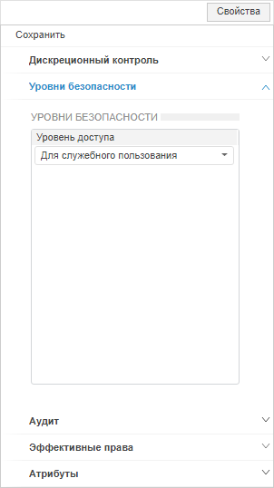
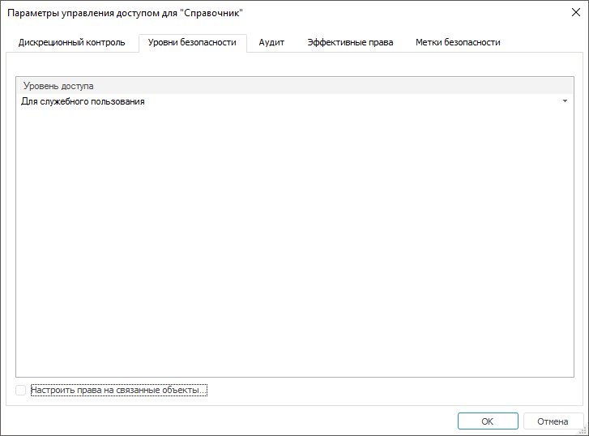

# Настройка параметров уровней безопасности

Настройка параметров уровней безопасности
-

# Настройка параметров уровней безопасности

Для настройки параметров уровней безопасности используйте вкладку «Уровни безопасности» на боковой
 панели «[Свойства](Admin_AdminObjects.htm)»
 в веб-приложении и в окне «[Параметры
 управления доступом](Admin_AdminObjects.htm)» в настольном приложении.

Примечание.
 Настройка доступна только при выборе [метода
 разграничения доступа по уровням](../04_SecurityPolicy/Security_levels.htm).

	Веб-приложение
	 Настольное
	 приложение

		

		

Настройка параметров уровней безопасности позволяет присваивать объектам
 уровни доступа к хранящейся в них информации.

Примечание.
 Доступна множественная отметка [классов
 объектов](../04_SecurityPolicy/Admin_Object_Classes.htm) для настройки параметров при вызове окна «[Параметры
 управления доступом](Admin_AdminObjects.htm)» в настольном
 приложении или боковой панели «[Права
 доступа](Admin_AdminObjects.htm)» в веб-приложении. После
 определения прав, права доступа будут установлены для каждого выбранного
 объекта класса.

Выберите значение уровня доступа, которое ограничивает возможность работы
 пользователя или группы пользователей с объектом, в раскрывающемся списке
 поля «Уровень доступа».

См. также:

[Параметры
 управления доступом](Admin_AdminObjects.htm) | [Настройка
 аудита](Admin_AdminObjects_Audit.htm)

		Справочная
		 система на версию 10.9
		 от 18/08/2025,
		 © ООО «ФОРСАЙТ»,
