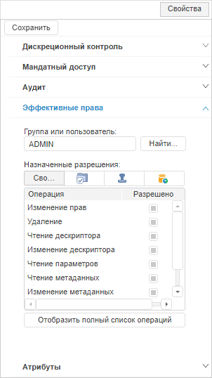
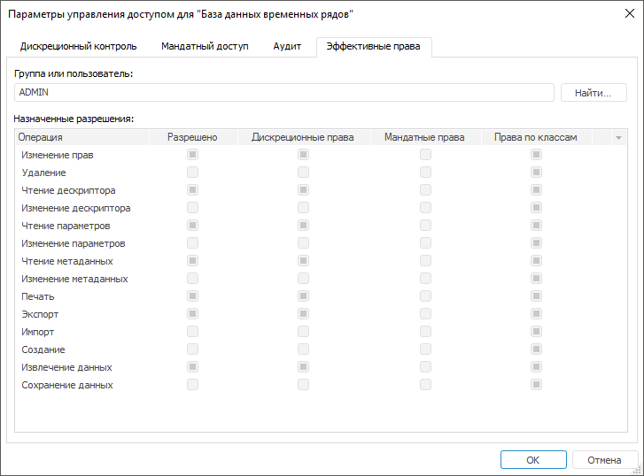

# Просмотр эффективных прав

Просмотр эффективных прав
-

# Просмотр эффективных прав

Для просмотра эффективных прав в виде сводной таблицы по методам разграничения
 доступа используйте вкладку «Эффективные
 права» на боковой панели «[Свойства](Admin_AdminObjects.htm)»
 в веб-приложении и в окне «[Параметры
 управления доступом](Admin_AdminObjects.htm)» в настольном приложении.

Примечание.
 Просмотр эффективных прав доступен только для одного выбранного объекта,
 если используется хотя бы один [метод
 разграничения доступа](../04_SecurityPolicy/Admin_SecPolicy.htm).

	Веб-приложение
	 Настольное
	 приложение

		

		

В поле «Группа или пользователь»
 укажите группу или конкретного пользователя, для которого требуется посмотреть
 права. Наименование пользователя/группы пользователей введите вручную
 или с помощью диалога «[Выбор
 групп и пользователей](Admin_UsersGroups.htm)» при нажатии на кнопку «Найти».

В таблице «Назначенные разрешения»
 отображаются имеющиеся права у пользователя или группы пользователей на
 выполнение определенных действий над выбранным объектом:

	- Операция.
	 Список возможных операций над объектом, напротив которых установлены
	 флажки, если по правам доступа операция разрешена для пользователя
	 или группы пользователей;

	- Разрешено/Сводка.
	 Операции, которые разрешены во всех выбранных методах разграничения
	 прав доступа;

	- [Дискреционные права](Admin_AdminObjects_Discretionary.htm).
	 Разрешенные операции при использовании [дискреционного
	 контроля доступа](../04_SecurityPolicy/Admin_PermSep_D.htm).

	- [Мандатные права](Admin_AdminObjects_Mandate.htm).
	 Разрешенные операции при использовании [мандатного
	 доступа](../04_SecurityPolicy/Admin_PermSep_M.htm).

	- [Уровни безопасности](Admin_AdminObjects_Discretionary_seclevels.htm).
	 Разрешенные операции при использовании [уровней
	 безопасности](../04_SecurityPolicy/Security_levels.htm).

	- [Права по ABAC](../04_SecurityPolicy/Admin_AttributeAccess.htm).
	 Разрешенные операции при использовании [атрибутного
	 доступа](../04_SecurityPolicy/Admin_ABAC.htm).

	- [Права по классам](Admin_AdminObjects.htm#obj_classes).
	 Разрешенные операции для конкретного типа объектов при использовании
	 [дискреционного
	 контроля доступа](../04_SecurityPolicy/Admin_PermSep_D.htm).

Примечание.
 Столбцы отображаются в зависимости от выбранных [методов
 разграничения доступа](../04_SecurityPolicy/Admin_SecPolicy.htm).

## Особенности отображения прав при использовании
 атрибутного доступа

Если [атрибутный доступ](../04_SecurityPolicy/Admin_ABAC.htm)
 используется одновременно с [дискреционным
 контролем](../04_SecurityPolicy/Admin_PermSep_D.htm), то разрешение операции в столбце «Разрешено/Сводка»
 зависит от выбранного [алгоритма
 комбинации прав](../04_SecurityPolicy/Admin_SecPolicy.htm#access_control):

	- AND. Операция разрешена,
	 если одновременно настроено разрешение операции по двум методам разграничения
	 доступа. Если по одному из методов разграничения доступа операция
	 запрещена или права доступа не определены, то результатом будет запрет
	 операции;

	- OR. Операция разрешена,
	 если настроено разрешение операции хотя бы по одному из методов разграничения
	 доступа, а по другому права доступа не определены. Если по одному
	 из методов разграничения доступа операция запрещена, то результатом
	 будет запрет операции.

См. также:

[Параметры
 управления доступом](Admin_AdminObjects.htm) | [Настройка
 меток безопасности](Admin_AdminObjects_Marks.htm)

		Справочная
		 система на версию 10.9
		 от 18/08/2025,
		 © ООО «ФОРСАЙТ»,
