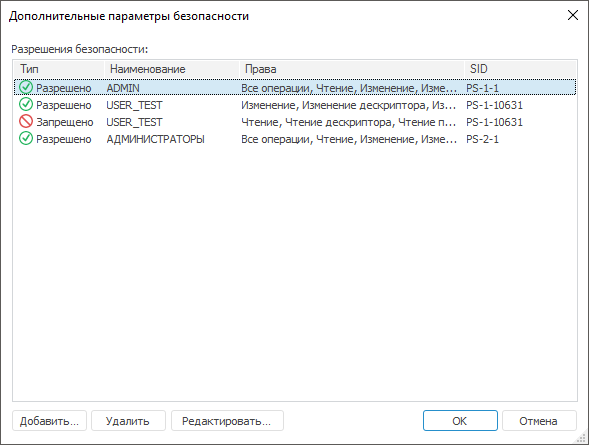
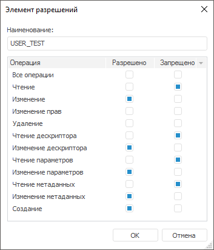

# Дополнительные параметры безопасности

Дополнительные параметры безопасности
-

# Дополнительные параметры безопасности

Для определения детализированных прав доступа:

	- в веб-приложении:

		- Выберите субъект безопасности в поле «Группы
		 и пользователи».

		- Нажмите кнопку «Отобразить
		 полный список операций» для отображения дополнительных
		 операций.

		- Задайте права по операциям, которые необходимо разрешить/запретить
		 в списке «[Разрешения
		 для выбранного](Admin_AdminObjects_Discretionary.htm)».

	- в настольном приложении нажмите кнопку «Дополнительно»
	 на вкладке «[Дискреционный
	 контроль](Admin_AdminObjects_Discretionary.htm)». После чего будет открыто окно «Дополнительные
	 параметры безопасности».

Окно «Дополнительные параметры безопасности»
 в настольном приложении:

Для элемента списка отображаются параметры:

	- Тип. Определяется, какой
	 тип безопасности используется: «Разрешено»
	 или «Запрещено»;

	- Наименование. Наименование
	 субъекта безопасности, которому устанавливаются права на доступ к
	 объектам;

	- Права. Перечисляется
	 набор прав, установленных для данного субъекта безопасности;

	- SID. Уникальный идентификатор
	 субъекта безопасности.

Добавьте, удалите или отредактируйте набор прав доступа к объектам.

[Добавление
 набора прав доступа](javascript:TextPopup(this))

	Для добавления набора прав доступа к объектам:

		- Нажмите кнопку «Добавить».
		 После выполнения действия будет открыто окно «[Выбор пользователей и групп](Admin_UsersGroups.htm)».

		- Выберите пользователя или группу пользователей. После выбора
		 субъекта безопасности будет открыто окно «Элемент
		 разрешений»:

	

	В данном окне отображается наименование
	 выбранного субъекта безопасности и список детализированных прав для
	 данного объекта или типа объектов.

		- Установите соответствующие флажки напротив выбранных операций
		 для разрешения или запрета выполнения определенных [операций](Admin_AdminObjects_Extra.htm#access_rights)
		 над объектом.

	Важно.
	 Операция запрета имеет более высокий приоритет.

		- Нажмите кнопку «ОК».

	После выполнения действий будет добавлена новая строка с разрешением
	 или запретом выполнения определенных операций над объектом в окне
	 «Дополнительные параметры безопасности».

[Редактирование
 набора прав доступа](javascript:TextPopup(this))

	Для редактирования набора прав доступа:

		- Выберите строку с соответствующими правами.

		- Выполните одно из действий:

			- нажмите кнопку «Редактировать»;

			- дважды щелкните по выбранной строке.

	После выполнения действий будет открыто окно «[Элемент разрешений](Admin_AdminObjects_Extra.htm#alloperations)»
	 для изменения набора прав доступа.

[Удаление
 набора прав доступа](javascript:TextPopup(this))

	Для удаления набора прав доступа выберите строку с соответствующими
	 правами и нажмите кнопку «Удалить».

## Описание набора прав доступа

В таблице содержится описание операций над типами объектов:

		 Операция
		 Описание операции
		 Типы объектов

		 Чтение

		 Операция позволяет открывать объекты на просмотр и используется
		 в качестве объединения нижеперечисленных операций.

		При установке флажка для разрешения или запрета операции автоматически
		 устанавливаются флажки напротив операций:

			- чтение дескриптора;

			- чтение параметров;

			- чтение метаданных;

			- печать;

			- экспорт;

			- выполнение;

			- извлечение данных;

			- чтение элементов справочника;

			- чтение обновления;

			- применение обновления;

			- применение SQL-оператора;

			- открытие соединения;

			- чтение формул.

		 Все

		 Изменение

		 Операция позволяет открывать объекты на редактирование и
		 используется в качестве объединения нижеперечисленных операций.

		При установке флажка для разрешения или запрета операции автоматически
		 устанавливаются флажки напротив операций:

			- изменение дескриптора;

			- изменение параметров;

			- изменение метаданных;

			- импорт;

			- создание;

			- сохранение данных;

			- изменение элементов справочника;

			- добавление элементов в
			 справочник;

			- удаление элементов из справочника;

			- запись данных на сценарий;

			- вставка данных;

			- изменение данных;

			- удаление данных;

			- изменение структуры таблицы;

			- изменение текста;

			- запись обновления;

			- сохранение формул.

		 Все

		 Изменение прав

		 Операция позволяет изменять [параметры
		 управления доступом](Admin_AdminObjects.htm) объектов и используется в качестве объединения
		 нижеперечисленных операций.

		При установке флажка для разрешения или запрета операции автоматически
		 устанавливаются флажки напротив операций:

			- изменение прав на элементы;

			- передача прав на данные;

			- передача прав.

		 Все

		 Удаление

		 Операция позволяет удалять объекты из репозитория.

		 Все

		 Чтение дескриптора

		 Операция позволяет получать внутреннюю структуру объектов
		 и открывать объекты на просмотр. При запрете операции объекты
		 в репозитории не отображаются.

		Флажок напротив операции можно установить вручную или автоматически
		 при установке флажка напротив операции чтения.

		Примечание.
		 Если флажок установлен вручную, то для разрешения открытия объектов
		 на просмотр дополнительно установите флажки напротив операции
		 чтения параметров и чтения метаданных.

		 Все

		 Изменение дескриптора

		 Операция позволяет изменять внутреннюю структуру объектов
		 и открывать объекты на редактирование, если они доступны для чтения.

		Флажок напротив операции можно установить вручную или автоматически
		 при установке флажка напротив операции изменения.

		Примечание.
		 Если флажок установлен вручную, то для разрешения открытия объектов
		 на редактирование дополнительно установите флажки напротив операции
		 изменения параметров и изменения метаданных.

		 Все

		 Чтение параметров

		 Операция позволяет получать параметры объектов, заданные
		 при создании, и открывать объекты на просмотр.

		Флажок напротив операции можно установить вручную или автоматически
		 при установке флажка напротив операции чтения.

		Примечание.
		 Если флажок установлен вручную, то для разрешения открытия объектов
		 на просмотр дополнительно установите флажки напротив операции
		 чтения дескриптора и чтения метаданных.

		 Все

		 Изменение параметров

		 Операция позволяет изменять параметры объектов, заданные
		 при создании, и открывать объекты на редактирование, если они
		 доступны для чтения.

		Флажок напротив операции можно установить вручную или автоматически
		 при установке флажка напротив операции изменения.

		Примечание.
		 Если флажок установлен вручную, то для разрешения открытия объектов
		 на редактирование дополнительно установите флажки напротив операции
		 изменения дескриптора и изменения метаданных.

		 Все

		 Чтение метаданных

		 Операция позволяет получать метаданные объектов и открывать
		 объекты на просмотр. К метаданным объекта относятся [свойства
		 объекта](UiNav.chm::/03_Objects/UiNav_Obj_BasicProp.htm).

		Флажок напротив операции можно установить вручную или автоматически
		 при установке флажка напротив операции чтения.

		Примечание.
		 Если флажок установлен вручную, то для разрешения открытия объектов
		 на просмотр дополнительно установите флажки напротив операции
		 чтения дескриптора и чтения параметров.

		 Все

		 Изменение метаданных

		 Операция позволяет изменять метаданные объектов и открывать
		 объекты на редактирование, если они доступны для чтения. К метаданным
		 объекта относятся [свойства
		 объекта](UiNav.chm::/03_Objects/UiNav_Obj_BasicProp.htm).

		Флажок напротив операции можно установить вручную или автоматически
		 при установке флажка напротив операции изменения.

		Примечание.
		 Если флажок установлен вручную, то для разрешения открытия объектов
		 на редактирование дополнительно установите флажки напротив операции
		 изменения дескриптора и изменения параметров.

		 Все

		 Печать

		 Операция позволяет выводить на печать содержимое объектов,
		 если они доступны для чтения.

		Флажок напротив операции можно установить вручную или автоматически
		 при установке флажка напротив операции чтения.

		 Аналитическая панель

		Регламентный отчет

		Экспресс-отчет

		Рабочая книга

		Сценарий моделирования

		Задача моделирования

		Контейнер моделирования

		Метамодель

		Модель

		Переменная моделирования

		Объект кеша

		Контейнер сегментов куба

		Стандартный куб

		Представление-куб

		Виртуальный куб

		Вычисляемый куб

		Автоматический куб

		База данных временных рядов

		Куб ADOMD

		Загрузчик в куб

		Измерение атрибутов

		 Группа элементов справочника

		Схема отметки элементов справочника

		Справочник сценариев

		Метасправочник

		Справочник ADOMD

		Справочник правил валидации

		Каталог ADOMD

		Многомерный расчет на сервере БД

		Источник данных ODBC

		Модуль

		Форма

		Дополнение системных классов

		Документ

		Рабочее пространство

		 Экспорт

		 Операция позволяет выполнять экспорт содержимого объектов,
		 если они доступны для чтения.

		Флажок напротив операции можно установить вручную или автоматически
		 при установке флажка напротив операции чтения.

		 Аналитическая панель

		Регламентный отчет

		Экспресс-отчет

		Рабочая книга

		Сценарий моделирования

		Задача моделирования

		Контейнер моделирования

		Метамодель

		Модель

		Переменная моделирования

		Объект кеша

		Контейнер сегментов куба

		Стандартный куб

		Представление-куб

		Виртуальный куб

		Вычисляемый куб

		Автоматический куб

		База данных временных рядов

		Куб ADOMD

		Загрузчик в куб

		Измерение атрибутов

		Справочник НСИ

		Составной справочник НСИ

		Группа элементов справочника

		Схема отметки элементов справочника

		Справочник сценариев

		 Метасправочник

		Справочник ADOMD

		Справочник правил валидации

		Репозиторий НСИ

		Каталог ADOMD

		Многомерный расчет на сервере БД

		Запрос

		Источник данных ODBC

		Представление

		Присоединенная таблица

		Таблица

		Журнал

		Модуль

		Форма

		Дополнение системных классов

		Документ

		Ресурсы

		Таблица стилей

		Рабочее пространство

		 Импорт

		 Операция позволяет выполнять импорт данных для объектов,
		 если они доступны для изменения.

		Флажок напротив операции можно установить вручную или автоматически
		 при установке флажка напротив операции изменения.

		 Аналитическая панель

		Регламентный отчет

		Экспресс-отчет

		Рабочая книга

		Объект кеша

		Контейнер сегментов куба

		Стандартный куб

		Представление-куб

		Виртуальный куб

		Вычисляемый куб

		Автоматический куб

		База данных временных рядов

		Куб ADOMD

		Загрузчик в куб

		Измерение атрибутов

		Справочник НСИ

		Составной справочник НСИ

		Группа элементов справочника

		Схема отметки элементов справочника

		Справочник сценариев

		Метасправочник

		 Справочник ADOMD

		Справочник правил валидации

		Репозиторий НСИ

		Каталог ADOMD

		Многомерный расчет на сервере БД

		Источник данных ODBC

		Представление

		Присоединенная таблица

		Таблица

		Журнал

		Модуль

		Форма

		Дополнение системных классов

		Документ

		Ресурсы

		Таблица стилей

		Рабочее пространство

		Связь с репозиторием

		 Создание

		 Операция позволяет создавать объекты в [навигаторе
		 объектов](GetStarted.chm::/Interface/Interface_Navigator.htm).

		Флажок напротив операции можно установить вручную или автоматически
		 при установке флажка напротив операции изменения.

		 Все

		 Выполнение

		 Операция позволяет выполнять объекты и расчёты объектов,
		 если они доступны для чтения.

		Флажок напротив операции можно установить вручную или автоматически
		 при установке флажка напротив операции чтения.

		 Группа правил валидации

		Задача моделирования

		Правило валидации

		Загрузчик в куб

		Многомерный расчет на сервере БД

		Процедура

		Задача ETL

		Обновление кеша справочника

		Обновление поискового индекса

		 Обновление кеша объекта

		Выполнение задачи ETL

		Выполнение модуля

		Вычисление регламентного отчета

		Расчёт вычисляемого куба

		Расчёт задачи моделирования

		 Извлечение данных

		 Операция позволяет извлекать и использовать данные другими
		 объектами, если объекты данных доступны для чтения.

		Флажок напротив операции можно установить вручную или автоматически
		 при установке флажка напротив операции чтения.

		 Сегмент куба

		Стандартный куб

		Представление-куб

		Виртуальный куб

		Вычисляемый куб

		Автоматический куб

		База данных временных рядов

		 Куб ADOMD

		Представление

		Присоединенная таблица

		Таблица

		Журнал

		 Сохранение данных

		 Операция позволяет сохранять данные, используемые другими
		 объектами, если объекты данных доступны для изменения.

		Флажок напротив операции можно установить вручную или автоматически
		 при установке флажка напротив операции изменения.

		 Сегмент куба

		Стандартный куб

		Представление-куб

		Виртуальный куб

		Вычисляемый куб

		Автоматический куб

		 База данных временных рядов

		Куб ADOMD

		 Чтение элементов справочника

		 Операция позволяет просматривать элементы справочника, если
		 объект доступен для чтения.

		Флажок напротив операции можно установить вручную или автоматически
		 при установке флажка напротив операции чтения.

		 Справочник НСИ

		Составной справочник НСИ

		 Изменение элементов справочника

		 Операция позволяет редактировать значения элементов справочника,
		 если объект доступен для чтения и изменения.

		Флажок напротив операции можно установить вручную или автоматически
		 при установке флажка напротив операции изменения.

		 Справочник НСИ

		Составной справочник НСИ

		 Добавление элементов в справочник

		 Операция позволяет [добавлять
		 элементы](UiNavObj.chm::/reference_book/Work/Work_Elements.htm#addelement) в справочники, если объект доступен
		 для чтения и изменения.

		Флажок напротив операции можно установить вручную или автоматически
		 при установке флажка напротив операции изменения.

		 Справочник НСИ

		Составной справочник НСИ

		 Удаление элементов из справочника

		 Операция позволяет [удалять
		 элементы](UiNavObj.chm::/reference_book/Work/Work_Elements.htm#del_element) из справочника, если объект доступен
		 для чтения и изменения.

		Флажок напротив операции можно установить вручную или автоматически
		 при установке флажка напротив операции изменения.

		 Справочник НСИ

		Составной справочник НСИ

		 Изменение прав на элементы

		 Операция позволяет изменять [права
		 доступа на элементы справочника](UiNavObj.chm::/reference_book/Master_RDS_reference_book/base_settings.htm), если объект
		 доступен для чтения и изменения.

		Флажок напротив операции можно установить вручную или автоматически
		 при установке флажка напротив операции изменения прав.

		 Справочник НСИ

		Составной справочник НСИ

		 Запись данных на сценарий

		 Операция позволяет записывать данные при управлении [сценариями
		 моделирования](UiModelling.chm::/2_Container_of_Modeling/2_3_Work_object/2_3_4_Problem/uimodelling_problem_3.htm), если объект доступен для чтения
		 и изменения.

		Флажок напротив операции можно установить вручную или автоматически
		 при установке флажка напротив операции изменения.

		 Справочник сценариев

		 Вставка данных

		 Операция позволяет добавлять данные, если объект доступен
		 для чтения и изменения.

		Флажок напротив операции можно установить вручную или автоматически
		 при установке флажка напротив операции изменения.

		 Представление

		Присоединенная таблица

		Таблица

		Журнал

		 Изменение данных

		 Операция позволяет изменять данные, если объект доступен
		 для чтения и изменения.

		Флажок напротив операции можно установить вручную или автоматически
		 при установке флажка напротив операции изменения.

		 Представление

		Присоединенная таблица

		Таблица

		Журнал

		 Удаление данных

		 Операция позволяет удалять данные, если объект доступен
		 для чтения и изменения.

		Флажок напротив операции можно установить вручную или автоматически
		 при установке флажка напротив операции изменения.

		 Представление

		Присоединенная таблица

		Таблица

		Журнал

		 Передача прав на данные

		 Операция позволяет раздавать права на данные, если доступна
		 операция изменения прав объекта.

		Флажок напротив операции можно установить вручную или автоматически
		 при установке флажка напротив операции изменения прав.

		 Представление

		Присоединенная таблица

		Таблица

		Журнал

		 Изменение структуры таблицы

		 Операция позволяет изменять структуру таблицы, если объект
		 доступен для чтения и изменения.

		Флажок напротив операции можно установить вручную или автоматически
		 при установке флажка напротив операции изменения.

		 Представление

		Присоединенная таблица

		Таблица

		Журнал

		 Открытие соединения

		 Операция позволяет получать соединение с базой данных, если
		 объект доступен для чтения.

		Флажок напротив операции можно установить вручную или автоматически
		 при установке флажка напротив операции чтения.

		 База данных

		 Чтение формул

		 Операция позволяет просматривать формулы, заданные для расчёта,
		 если объект доступен для чтения.

		Флажок напротив операции можно установить вручную или автоматически
		 при установке флажка напротив операции чтения.

		 Вычисляемый куб

		Многомерный расчет на сервере БД

		 Сохранение формул

		 Операция позволяет сохранять формулы, заданные для расчёта,
		 если объект доступен для чтения и изменения.

		Флажок напротив операции можно установить вручную или автоматически
		 при установке флажка напротив операции изменения.

		 Вычисляемый куб

		Многомерный расчет на сервере БД

		 Изменение текста

		 Операция позволяет изменять [скрипт
		 процедуры/функции](UiNavObj.chm::/procedure/UiDb_relational_procedure_master_procedure.htm), если объект доступен для
		 чтения и изменения.

		Флажок напротив операции можно установить вручную или автоматически
		 при установке флажка напротив операции изменения.

		 Процедура

		 Передача прав

		 Операция позволяет раздавать права на данные, если доступна
		 операция изменения прав объекта.

		Флажок напротив операции можно установить вручную или автоматически
		 при установке флажка напротив операции изменения прав.

		 Процедура

		 Чтение обновления

		 Операция позволяет [открывать
		 обновление](UpdManager.chm::/Admin_UpMBObj_RunManager.htm#open_update) на просмотр.

		Флажок напротив операции можно установить вручную или автоматически
		 при установке флажка напротив операции чтения.

		 Обновление

		 Запись обновления

		 Операция позволяет [создавать
		 обновление](UpdManager.chm::/CreateUpdate/Admin_CreateUpdate.htm).

		Флажок напротив операции можно установить вручную или автоматически
		 при установке флажка напротив операции изменения.

		 Обновление

		 Применение обновления

		 Операция позволяет [устанавливать
		 обновление](UpdManager.chm::/Admin_UpMBObj_DoUpdate.htm).

		Флажок напротив операции можно установить вручную или автоматически
		 при установке флажка напротив операции чтения.

		 Обновление

		 Применение SQL-оператора

		 Операция позволяет применять SQL-оператор при обновлении.

		Флажок напротив операции можно установить вручную или автоматически
		 при установке флажка напротив операции чтения.

		 Обновление

См. также:

[Параметры
 управления доступом](Admin_AdminObjects.htm) | [Настройка
 параметров при дискреционном контроле](Admin_AdminObjects_Discretionary.htm) | [Права
 доступа к данным базы данных временных рядов](DataAccess/Admin_Data_Access_Right.htm)

		Справочная
		 система на версию 10.9
		 от 18/08/2025,
		 © ООО «ФОРСАЙТ»,
