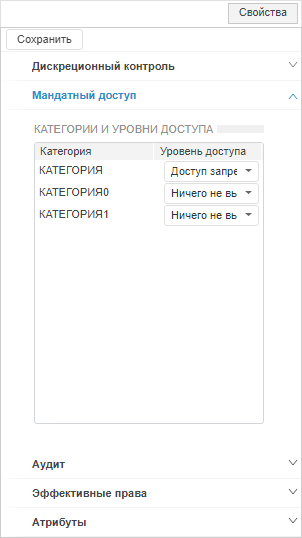
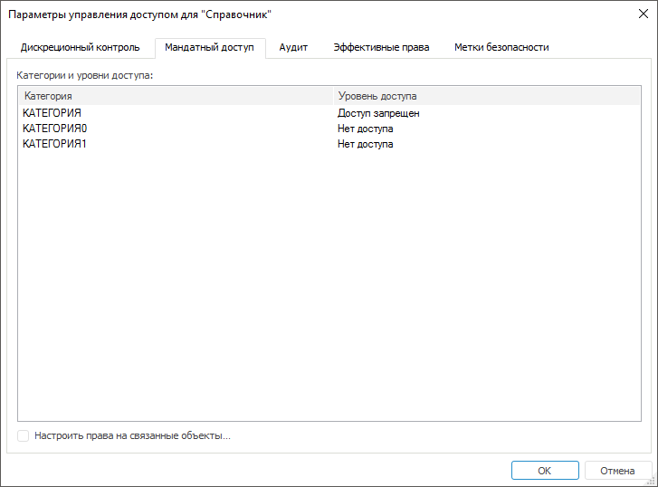

# Настройка параметров при мандатном доступе

Настройка параметров при мандатном доступе
-

# Настройка параметров при мандатном доступе

Для настройки параметров при мандатном доступе используйте вкладку «Мандатный доступ» на боковой панели
 «[Свойства](Admin_AdminObjects.htm)»
 в веб-приложении и в окне «[Параметры
 управления доступом](Admin_AdminObjects.htm)» в настольном приложении.

Примечание.
 Настройка доступна только при выборе [мандатного
 метода разграничения доступа](../04_SecurityPolicy/Admin_PermSep_M.htm).

	Веб-приложение
	 Настольное
	 приложение

		

		

Настройка параметров при мандатном доступе позволяет присваивать объектам
 уровни доступа к хранящейся в них информации.

Примечание.
 Доступна множественная отметка [классов
 объектов](../04_SecurityPolicy/Admin_Object_Classes.htm) для настройки параметров при вызове окна «[Параметры управления доступом](Admin_AdminObjects.htm)»
 в настольном приложении или боковой панели «[Права доступа](Admin_AdminObjects.htm)» в веб-приложении.
 После определения прав, права доступа будут установлены для каждого выбранного
 объекта класса.

Определите уровень доступа, который ограничивает возможность работы
 пользователя или группы пользователей с объектом.

В списке «Категория» отображены
 все категории доступа, добавленные в разделе «[Мандатный доступ](../04_SecurityPolicy/Admin_MandatAccess.htm)».

В столбце «Уровень доступа»
 для каждой категории выберите в раскрывающемся списке значение уровня доступа
 для объекта.

Настройка прав доступа на связанные объекты:

	- в веб-приложении осуществляется после нажатия на кнопку  «Связанные объекты»
	 на [панели
	 инструментов](../01_RunSecManager/Admin_Organizational_Starting.htm);

	- в настольном приложении осуществляется после установки флажка
	 «[Настроить
	 права на связанные объекты](Admin_AdminObjects_DiscretionaryUseObject.htm)».

Примечание.
 [Настройка прав
 на связанные объекты](Admin_AdminObjects_DiscretionaryUseObject.htm) доступна только для выбранного объекта, от которого
 зависят другие объекты.

См. также:

[Параметры
 управления доступом](Admin_AdminObjects.htm) | [Настройка
 параметров уровней безопасности](Admin_AdminObjects_Discretionary_seclevels.htm)

		Справочная
		 система на версию 10.9
		 от 18/08/2025,
		 © ООО «ФОРСАЙТ»,
