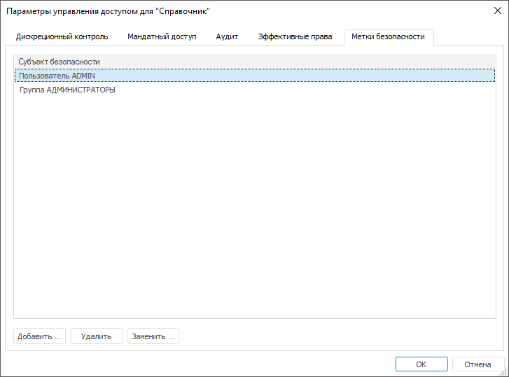

# Настройка меток безопасности

Настройка меток безопасности
-

# Настройка меток безопасности

Для настройки меток безопасности используйте вкладку «Метки
 безопасности» в окне «[Параметры
 управления доступом](Admin_AdminObjects.htm)»:

Примечание.
 Настройка меток безопасности доступна для объектов: табличный справочник,
 вычисляемый справочник, справочник НСИ, составной справочник НСИ только
 в настольном приложении.

[Добавление субъекта
 безопасности](javascript:TextPopup(this))

	Для добавления субъекта безопасности нажмите кнопку «Добавить»,
	 после чего появится диалог «[Выбор
	 групп и пользователей](Admin_UsersGroups.htm)». Выберите пользователей или группы
	 пользователей и нажмите кнопку «ОК».

	Примечание.
	 Максимальное количество субъектов доступа в справочниках равно 2048
	 субъектам.

[Удаление субъекта
 безопасности](javascript:TextPopup(this))

	Для удаления выбранного субъекта из списка нажмите кнопку «Удалить».

	Примечание.
	 При удалении субъекта безопасности номера битов у оставшихся субъектов
	 не изменяются. Рекомендуется не удалять субъекты, а заменять их.

[Замена субъекта
 безопасности](javascript:TextPopup(this))

	Для замены субъекта безопасности на другой нажмите кнопку «Заменить», после чего будет открыто
	 окно «[Выбор
	 групп и пользователей](Admin_UsersGroups.htm)». Выберите пользователей или группы
	 пользователей и нажмите кнопку «ОК».

С помощью меток безопасности формируется битовая маска безопасности,
 в соответствии с которой будут разрешены или запрещены определенные действия
 над элементами справочника.

Каждому субъекту безопасности ставится номер бита, который соответствует
 порядку следования субъектов в списке, если нумерация начинается с нуля.

Примечание.
 Для справочника НСИ и составного справочника НСИ битовая маска безопасности
 формируется автоматически при работе с элементами справочника. Для табличного
 и вычисляемого справочников маску необходимо формировать вручную, подробнее
 в разделе «[Атрибуты
 справочника](UiNavObj.chm::/reference_book/Master_Table_reference_book/UiMd_reference_book_Master_Table_page1.htm)».

См. также:

[Параметры
 управления доступом](Admin_AdminObjects.htm) | [Настройка
 прав доступа на связанные объекты](Admin_AdminObjects_DiscretionaryUseObject.htm)

		Справочная
		 система на версию 10.9
		 от 18/08/2025,
		 © ООО «ФОРСАЙТ»,
