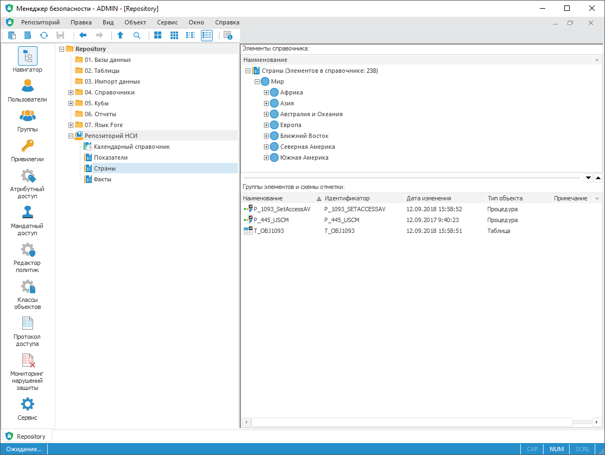

# Права доступа на элементы справочников НСИ

Права доступа на элементы справочников НСИ
-

# Права доступа на элементы справочников НСИ

	Настройка прав доступа для элементов справочника НСИ зависит от
	 [выбранных методов](../04_SecurityPolicy/Admin_SecPolicy.htm)
	 разграничения доступа.

	Примечание.
	 Дополнительно к методам разграничения доступа можно задать ограничение
	 доступа к элементам справочников НСИ с помощью [диапазонов
	 ключей](#keys), на основании которых пользователям присваиваются роли:
	 вендор, партнёр, заказчик. Роль позволяет добавлять и редактировать
	 элементы в справочнике НСИ в своём диапазоне ключей и в следующих
	 диапазонах ключей, расположенных по возрастанию. Элементы с ключами
	 из диапазона ключей, расположенных по убыванию, будут недоступны для
	 изменений.

	Если для элементов справочника НСИ настроена возможность использовать
	 дискреционные или мандатные права доступа, то при выборе справочника
	 НСИ в менеджере безопасности в настольном приложении в разделе «[Навигатор](../02_ComonFunction/Admin_SecManager_CommonFunction.htm)»
	 в правой части будут отображены элементы справочника, группы элементов
	 и схемы отметки:

	

	[Отметка
	 элементов справочника](javascript:TextPopup(this))

		Для отметки элементов справочника используйте контекстное меню:

			- отметить уровень;

			- отметить подчиненные по уровню;

			- отметить все;

			- развернуть всю иерархию;

			- свернуть всю иерархию.

		Для множественной отметки элементов справочника используйте
		 клавиши SHIFT и CTRL.

		Для выделения всех элементов справочника используйте сочетание
		 клавиш CTRL+A.

## Дискреционный метод

	При выборе дискреционного метода разграничения доступа выполните
	 шаги:

		- Убедитесь, что установлен флажок «[Использовать
		 дискреционный контроль](../04_SecurityPolicy/Admin_SecPolicy.htm#access_control)» в разделе «Редактор
		 политик» менеджера безопасности;

		- Настройте параметры доступа конкретного пользователя для:

			- требуемого справочника НСИ;

			- базы данных, в которой хранятся данные справочника.

	Параметры доступа настраиваются на вкладке
	 «[Дискреционный
	 контроль](Admin_AdminObjects_Discretionary.htm)» в окне «Параметры
	 управления доступом». Для вызова окна выполните команду «Права доступа» в контекстном меню
	 справочника НСИ. Справочник НСИ можно выбрать в [навигаторе
	 объектов](../02_ComonFunction/Admin_SecManager_CommonFunction.htm) менеджера безопасности в настольном приложении, на боковой
	 панели «Свойства» в веб-приложении
	 и в [навигаторе
	 объектов](GetStarted.chm::/Interface/Interface_Navigator.htm) в настольном приложении.

	Установите флажки напротив общих операций
	 для их запрета или разрешения. Для одновременной настройки доступа
	 к справочнику и базе данных установите флажок «[Настроить права
	 на связанные объекты](Admin_AdminObjects_DiscretionaryUseObject.htm)», нажмите кнопку «ОК»
	 и установите флажки на те объекты, права которых должны быть изменены.

		- Установите флажок «[Элементы имеют дискреционные права
		 доступа](UiNavObj.chm::/reference_book/Master_RDS_reference_book/base_settings.htm#discretion_access_permissions)» на вкладке «[Описание](UiNavObj.chm::/reference_book/Master_RDS_reference_book/base_settings.htm)»
		 справочника НСИ в навигаторе объектов в настольном приложении.

	После установки флажка при выборе справочника
	 НСИ в навигаторе менеджера безопасности в настольном приложении в
	 правой части будут отображены элементы справочника, группы элементов
	 и схемы отметки.

	В контекстном меню справочника появится
	 флажок «Дискреционный контроль»:

	

	Флажок влияет на отображение элементов
	 справочника в навигаторе менеджера безопасности.

	При попытке снятия данного флажка будет
	 выдано сообщение о том, что включить данную опцию сможет только администратор
	 или прикладной администратор, если используется [разделение
	 ролей](../04_SecurityPolicy/Editor_of_Politicy/Security_EditorPoliticy_Adm.htm). При положительном ответе флажок будет снят и справочник
	 скрыт из дерева, если он не имеет группы элементов или схемы отметки.

	Примечание.
	 Если используется [разделение
	 ролей](../04_SecurityPolicy/Editor_of_Politicy/Security_EditorPoliticy_Adm.htm) между администратором информационной безопасности и прикладным
	 администратором, то настраивать права доступа и отключить данную опцию
	 по умолчанию может только администратор информационной безопасности.
	 Включить данную опцию [при
	 редактировании справочника НСИ](UiNavObj.chm::/reference_book/Work/Work_Dictionary.htm#edit) может прикладной
	 администратор или пользователь, имеющий соответствующую [привилегию](../04_SecurityPolicy/Admin_Priv.htm).

		- Настройте права доступа выбранного
		 элемента справочника:

			- выполните команду «Права
			 доступа» в контекстном меню элемента справочника. Команда
			 доступна для элемента справочника выбранного:

				- в навигаторе объектов менеджера безопасности;

				- на вкладке «[Элементы
				 справочника](UiNavObj.chm::/reference_book/Work/Work_Dictionary.htm#rds)»
				 в справочнике НСИ открытом на [редактирование](UiNavObj.chm::/reference_book/Work/Work_Dictionary.htm#edit)
				 в навигаторе объектов;

			- выполните команду «Объект
			 > Права доступа» в [главном
			 меню](../01_RunSecManager/Admin_Organizational_Starting.htm);

			- нажмите клавишу ENTER;

			- дважды щёлкните по наименованию элемента справочника.

	После выполнения одного из действий:

			- будет открыто окно «[Права доступа](UiNavObj.chm::/reference_book/Work/Access_Elements.htm)»
			 для настройки прав доступа элемента справочника;

			- будет открыто окно «[Параметры управления доступом](Admin_AdminObjects.htm)»
			 для настройки прав доступа объекта «Группы
			 элементов и схемы отметки».

	Если окно вызвано для нескольких элементов
	 или объектов, то будут отображены настройки прав доступа элемента
	 или объекта, который находится в фокусе. При установке прав доступа
	 эти же права будут установлены для всех выбранных элементов или объектов.

	В открывшемся окне установите флажки
	 напротив операций, которые будут разрешены или запрещены пользователю
	 при работе с элементами или объектами. Явно запретите операции с элементами,
	 к которым у пользователя не должно быть доступа.

### Отключение дискреционного доступа к элементам

	Для отключения дискреционного доступа к элементам справочника
	 НСИ:

		- Убедитесь, что у элементов на [атрибутах](UiNavObj.chm::/reference_book/Master_RDS_reference_book/Attributes.htm)
		 ответственных за дискреционные права не добавлены [параметры](UiNavObj.chm::/reference_book/Master_RDS_reference_book/Parameters.htm),
		 не добавлены [ключи](UiNavObj.chm::/reference_book/Master_RDS_reference_book/Unique_Keys.htm),
		 снят флажок «[Альтернативная иерархия](UiNavObj.chm::/reference_book/Master_RDS_reference_book/Attributes/Attribute.htm)»
		 в свойствах.

		- Снимите флажок «[Элементы имеют дискреционные права
		 доступа](UiNavObj.chm::/reference_book/Master_RDS_reference_book/base_settings.htm#discretion_access_permissions)» на вкладке «[Описание](UiNavObj.chm::/reference_book/Master_RDS_reference_book/base_settings.htm)»
		 справочника НСИ в навигаторе объектов в настольном приложении.

	В результате отключения дискреционного доступа к элементам справочника
	 НСИ пользователь будет иметь полный доступ к элементам справочника.

## Мандатный метод

	При выборе мандатного метода разграничения доступа выполните шаги:

		- Убедитесь, что установлен флажок «[Использовать
		 мандатный доступ](../04_SecurityPolicy/Admin_SecPolicy.htm#access_control)» в разделе «Редактор
		 политик» менеджера безопасности.

		- Добавьте категорию и уровни в разделе «[Мандатный доступ](../04_SecurityPolicy/Admin_PermSep_M.htm)» в
		 менеджере безопасности.

		- Задайте максимальный уровень безопасности для конкретного
		 [пользователя](Users/Admin_UserProp_MC.htm).

		- Задайте максимальный уровень безопасности для объектов:

			- папок, в которых находится требуемый справочник НСИ;

			- требуемого справочника НСИ;

			- внутренней таблицы справочника НСИ;

			- базы данных, в которой хранятся данные справочника.

	Примечание.
	 Задать права объектам может только администратор или пользователь,
	 имеющий права на изменение прав.

	Параметры доступа настраиваются на вкладке
	 «[Мандатный
	 доступ](Admin_AdminObjects_Mandate.htm)» в окне «Параметры
	 управления доступом» в настольном приложении и на боковой панели
	 «Свойства» в веб-приложении.

	Для одновременной настройки доступа к
	 справочнику и базе данных установите флажок «[Настроить права
	 на связанные объекты](Admin_AdminObjects_DiscretionaryUseObject.htm)», нажмите кнопку «ОК»
	 и установите флажки на те объекты, права которых должны быть изменены.

		- Установите флажок «[Элементы имеют мандатные права доступа](UiNavObj.chm::/reference_book/Master_RDS_reference_book/base_settings.htm#mandatory_access_permissions)»
		 на вкладке «[Описание](UiNavObj.chm::/reference_book/Master_RDS_reference_book/base_settings.htm)»
		 справочника НСИ в навигаторе объектов в настольном приложении.

	После установки флажка при выборе справочника
	 НСИ в [навигаторе
	 объектов](../02_ComonFunction/Admin_SecManager_CommonFunction.htm) менеджера безопасности в настольном приложении в правой
	 части будут отображены элементы справочника, группы элементов и схемы
	 отметки. В контекстном меню справочника появится флажок «Мандатный
	 доступ»:

	

	Флажок влияет на отображение элементов
	 справочника в навигаторе менеджера безопасности.

	При попытке снятия данного флажка будет
	 выдано сообщение о том, что включить данную опцию сможет только администратор
	 или прикладной администратор, если используется [разделение
	 ролей](../04_SecurityPolicy/Editor_of_Politicy/Security_EditorPoliticy_Adm.htm). При положительном ответе флажок будет снят и справочник
	 скрыт из дерева, если он не имеет группы элементов или схемы отметки.

	Примечание.
	 Если используется [разделение
	 ролей](../04_SecurityPolicy/Editor_of_Politicy/Security_EditorPoliticy_Adm.htm) между администратором информационной безопасности и прикладным
	 администратором, то настраивать права доступа и отключить данную опцию
	 по умолчанию может только администратор информационной безопасности.
	 Включить данную опцию [при
	 редактировании справочника НСИ](UiNavObj.chm::/reference_book/Work/Work_Dictionary.htm#edit) может прикладной
	 администратор или пользователь, имеющий соответствующую [привилегию](../04_SecurityPolicy/Admin_Priv.htm).

		- Настройте права доступа выбранного
		 элемента справочника:

			- выполните команду «Права
			 доступа» в контекстном меню элемента справочника. Команда
			 доступна для элемента справочника выбранного:

				- в навигаторе объектов менеджера безопасности;

				- на вкладке «[Элементы
				 справочника](UiNavObj.chm::/reference_book/Work/Work_Dictionary.htm#rds)»
				 в справочнике НСИ открытом на [редактирование](UiNavObj.chm::/reference_book/Work/Work_Dictionary.htm#edit)
				 в навигаторе объектов;

			- выполните команду «Объект
			 > Права доступа» в [главном
			 меню](../01_RunSecManager/Admin_Organizational_Starting.htm);

			- нажмите клавишу ENTER;

			- дважды щёлкните по наименованию элемента справочника.

	После выполнения одного из действий:

				- будет открыто окно «[Права доступа](UiNavObj.chm::/reference_book/Work/Access_Elements.htm)»
				 для настройки прав доступа элемента справочника;

				- будет открыто окно «[Параметры управления доступом](Admin_AdminObjects.htm)»
				 для настройки прав доступа объекта «Группы
				 элементов и схемы отметки».

	Если окно вызвано для нескольких элементов
	 или объектов, то будут отображены настройки прав доступа элемента
	 или объекта, который находится в фокусе. При установке прав доступа
	 эти же права будут установлены для всех выбранных элементов или объектов.

### Отключение мандатного доступа к элементам

	Для отключения мандатного доступа к элементам справочника НСИ:

		- Убедитесь, что у элементов на [атрибутах](UiNavObj.chm::/reference_book/Master_RDS_reference_book/Attributes.htm)
		 ответственных за дискреционные права не добавлены [параметры](UiNavObj.chm::/reference_book/Master_RDS_reference_book/Parameters.htm),
		 не добавлены [ключи](UiNavObj.chm::/reference_book/Master_RDS_reference_book/Unique_Keys.htm),
		 снят флажок «[Альтернативная иерархия](UiNavObj.chm::/reference_book/Master_RDS_reference_book/Attributes/Attribute.htm)»
		 в свойствах.

		- Снимите флажок «[Элементы имеют мандатные права доступа](UiNavObj.chm::/reference_book/Master_RDS_reference_book/base_settings.htm#mandatory_access_permissions)»
		 на вкладке «[Описание](UiNavObj.chm::/reference_book/Master_RDS_reference_book/base_settings.htm)»
		 справочника НСИ в навигаторе объектов в настольном приложении.

	В результате отключения мандатного доступа к элементам справочника
	 НСИ пользователь будет иметь полный доступ к элементам справочника.

## Атрибутный метод

	Разграничение прав доступа на элементы справочников НСИ выполняется:

		- при одновременном использовании [атрибутного](../04_SecurityPolicy/Admin_ABAC.htm)
		 и [дискреционного](../04_SecurityPolicy/Admin_PermSep_D.htm)
		 методов;

		- при использовании только [атрибутного
		 метода](../04_SecurityPolicy/Admin_ABAC.htm).

	Выбор методов разграничения доступа осуществляется в разделе «[Редактор
	 политик](../04_SecurityPolicy/Admin_SecPolicy.htm#access_control)» менеджера безопасности.

		Атрибутный
		 и дискреционный методы Атрибутный метод

			При выборе атрибутного и дискреционного методов разграничения
			 доступа выполните шаги:

				- Убедитесь, что установлены флажки «Использовать
				 атрибутный доступ» и «Использовать
				 дискреционный контроль» в разделе «[Редактор
				 политик](../04_SecurityPolicy/Admin_SecPolicy.htm#access_control)» менеджера безопасности и выбран
				 алгоритм комбинации прав доступа «OR».

				- Убедитесь, что в параметрах управления дискреционным
				 контролем доступа для конкретного пользователя разрешены
				 все операции над объектами:

					- папка, в которой содержится справочник НСИ.
					 Если справочник НСИ расположен не в корне репозитория,
					 а в отдельной папке или иерархии папок, то для каждой
					 папки не должно быть запрещенных операций;

					- база данных, в которой хранятся данные справочника
					 НСИ;

					- внутренняя таблица справочника НСИ.

			Дискреционные права доступа настраиваются
			 отдельно для каждого объекта на вкладке «[Дискреционный
			 контроль](Admin_AdminObjects_Discretionary.htm)» в окне «Параметры
			 управления доступом».

				- Создайте структуру атрибутного доступа, которая
				 определит права доступа конкретного пользователя на элементы
				 справочника НСИ, в разделе «[Атрибутный
				 доступ](../04_SecurityPolicy/Admin_AttributeAccess.htm)»:

					- набор политик определяет пользователя, для которого
					 настраивается доступ к элементам справочника НСИ.
					 Например:

						- Цель: SUBJECT.NAME
						 = <наименование
						 пользователя>;

						- Алгоритм комбинации
						 правил: Переопределение разрешением;

					- политика определяет доступ к справочнику НСИ
					 по ключу или идентификатору. Например:

						- Цель: OBJECT.KEY
						 = <ключ справочника
						 НСИ> или OBJECT.ID = <идентификатор
						 справочника НСИ>;

						- Алгоритм комбинации
						 правил: Переопределение разрешением;

					- правила определяют доступ к элементам справочника
					 НСИ. Например:

						- Цель: OPERATION = <[значение специфической
						 операции](KeSom.chm::/Enums/DictionarySpecificRights.htm)>.

			Для правил задается [дополнительное
			 условие](../04_SecurityPolicy/Creating_conditions.htm), в котором указывается сравнение [атрибута
			 элемента](../04_SecurityPolicy/Creating_conditions.htm#attr_element) со значением, соответствующим типу данных [идентификатора
			 атрибута](UiNavObj.chm::/reference_book/Master_RDS_reference_book/Attributes.htm), и эффект, определяющий разрешение
			 или запрет доступа по результату выполнения правила.

			Примечание.
			 При составлении дополнительного условия учитывайте [особенности
			 использования атрибута элемента справочника НСИ](../04_SecurityPolicy/Creating_conditions.htm#attr_element).

			Примеры правил для разграничения
			 доступа к элементам справочника НСИ приведены в разделе «[Пример](#example)».

				- Откройте справочник НСИ
				 на [редактирование](UiNavObj.chm::/reference_book/Work/Work_Dictionary.htm#edit)
				 в навигаторе объектов.

				- Установите флажок «[Элементы
				 имеют атрибутные права доступа](UiNavObj.chm::/reference_book/Master_RDS_reference_book/base_settings.htm#abac)»
				 на вкладке «[Описание](UiNavObj.chm::/reference_book/Master_RDS_reference_book/base_settings.htm)».

			После выполнения действий будут
			 работать правила атрибутного метода разграничения доступа
			 для элементов справочника НСИ. При одновременном использовании
			 [атрибутного](../04_SecurityPolicy/Admin_ABAC.htm)
			 и [дискреционного](../04_SecurityPolicy/Admin_PermSep_D.htm)
			 методов также доступно разграничение прав доступа на элементы
			 справочников НСИ с помощью дискреционного контроля доступа.
			 Для получения подробной информации обратитесь к разделу «[Дискреционный метод](#discr)».

			При выборе только атрибутного
			 метода разграничения доступа должна использоваться [встроенная
			 авторизация](Access_control_settings.htm#buildin). Разграничение прав доступа на элементы справочников
			 НСИ настраивается для пользователей, не входящих во встроенную
			 [группу администраторов](Groups/Admin_Groups.htm).
			 Для этого выполните шаги:

				- Убедитесь, что установлен флажок «Использовать
				 атрибутный доступ» в разделе «[Редактор
				 политик](../04_SecurityPolicy/Admin_SecPolicy.htm#access_control)» менеджера безопасности.

				- Создайте структуру атрибутного доступа, которая
				 определит права доступа конкретного пользователя на элементы
				 справочника НСИ, в разделе «[Атрибутный
				 доступ](../04_SecurityPolicy/Admin_AttributeAccess.htm)». В структуре атрибутного доступа должны
				 содержаться:

					- разрешения доступа к справочнику НСИ и следующим
					 объектам:

						- папка, в которой содержится справочник НСИ.
						 Если справочник НСИ расположен не в корне репозитория,
						 а в отдельной папке или иерархии папок, то для
						 каждой папки не должно быть запрещенных операций;

						- база данных, в которой хранятся данные справочника
						 НСИ;

						- внутренняя таблица справочника НСИ;

					- запреты доступа к элементам справочника НСИ.

				- Откройте справочник НСИ
				 на [редактирование](UiNavObj.chm::/reference_book/Work/Work_Dictionary.htm#edit)
				 в навигаторе объектов.

				- Установите флажок «[Элементы
				 имеют атрибутные права доступа](UiNavObj.chm::/reference_book/Master_RDS_reference_book/base_settings.htm#abac)»
				 на вкладке «[Описание](UiNavObj.chm::/reference_book/Master_RDS_reference_book/base_settings.htm)».

			После выполнения действий будут
			 работать правила атрибутного метода разграничения доступа
			 для элементов справочника НСИ.

	Настройка прав доступа для элементов справочника
	 НСИ доступна в среде разработки с помощью сборки [ABAC](KeABAC.chm::/Intro/KeABAC_TitlePage.htm).
	 Пример запрета доступа пользователю на чтение элемента справочника
	 НСИ приведен в разделе «[Права доступа
	 на элементы справочника НСИ](KeABAC.chm::/Examples/AttrAccess_Dictionary.htm)».

### Пример

	Пример структуры атрибутного доступа при
	 использовании только атрибутного метода разграничения доступа. Структура
	 содержит два набора политик, ограничивающих доступ конкретного пользователя
	 к элементам справочника НСИ:

		- первый набор политик содержит политику и правило, которые
		 определяют полный доступ конкретного пользователя ко всем объектам
		 репозитория:

			- параметры набора политик:

				- Цель: SUBJECT.NAME = <наименование
				 пользователя>;

				- Алгоритм комбинации правил: Переопределение разрешением;

			- параметры политики:

				- Цель: OBJECT.KEY >= 0;

				- Алгоритм комбинации правил: Переопределение разрешением;

			- параметры правила:

				- Цель: OPERATION IN 1;

				- Эффект: Разрешить.

				- Алгоритм комбинации правил: Переопределение разрешением;

		- второй набор политик определяет класс объектов, для которого
		 настраивается доступ, политика определяет доступ к конкретному
		 справочнику НСИ по ключу или идентификатору, правила определяют
		 доступ к элементам справочника НСИ:

			- параметры набора политик:

				- Цель: OBJECT.CLASS = <класс
				 объектов: справочник НСИ>;

				- Алгоритм комбинации правил: Переопределение разрешением;

			- параметры политики:

				- Цель: OBJECT.KEY = <ключ
				 справочника НСИ> или OBJECT.ID = <идентификатор
				 справочника НСИ>;

				- Алгоритм комбинации правил: Переопределение разрешением;

			- параметры правила:

				- Цель: OPERATION = <[значение
				 специфической операции](KeSom.chm::/Enums/DictionarySpecificRights.htm)>.

	Для правил задается [дополнительное
	 условие](../04_SecurityPolicy/Creating_conditions.htm), в котором указывается сравнение [атрибута
	 элемента](../04_SecurityPolicy/Creating_conditions.htm#attr_element) со значением, соответствующим типу данных [идентификатора
	 атрибута](UiNavObj.chm::/reference_book/Master_RDS_reference_book/Attributes.htm), и эффект, определяющий разрешение или
	 запрет доступа по результату выполнения правила.

	Параметры правил для разграничения доступа
	 к элементам справочника НСИ, например:

			- запрет на чтение элементов одноуровневого справочника
			 НСИ с ключами 1 и 2:

				- Цель: OPERATION = 1048576;

				- Условие: (OBJECT.ELEMENT.KEY >= 0) And (OBJECT.ELEMENT.KEY
				 <= 2);

				- Эффект: Запретить;

			- запрет на редактирование элемента справочника НСИ с
			 ключом 3:

				- Цель: OPERATION = 2097152;

				- Условие: OBJECT.ELEMENT.KEY = 3;

				- Эффект: Запретить.

### Отключение атрибутного доступа к элементам

	Для отключения атрибутного доступа к элементам справочника
	 НСИ снимите флажок «[Элементы
	 имеют атрибутные права доступа](UiNavObj.chm::/reference_book/Master_RDS_reference_book/base_settings.htm#abac)» на вкладке
	 «[Описание](UiNavObj.chm::/reference_book/Master_RDS_reference_book/base_settings.htm)» справочника
	 НСИ в навигаторе объектов в настольном приложении.

## Ограничение доступа к элементам с помощью диапазона
	 ключей

	В настольном приложении дополнительно к [методам
	 разграничения доступа](../04_SecurityPolicy/Admin_SecPolicy.htm) можно задать ограничение доступа к элементам
	 справочников НСИ с помощью диапазонов ключей, на основании которых
	 пользователям присваиваются роли: вендор, партнёр, заказчик. Роль
	 позволяет добавлять и редактировать элементы в справочнике НСИ в своём
	 диапазоне ключей и в следующих диапазонах ключей, расположенных по
	 возрастанию. Элементы с ключами из диапазона ключей, расположенных
	 по убыванию, будут недоступны для изменений.

	Например, если используется роль пользователя «партнёр», то в справочнике
	 НСИ будут доступны элементы с ключами из соответствующего диапазона
	 ключей, а также из диапазона ключей заказчика. Элементы с ключами
	 из диапазона ключей вендора будут недоступны для изменений.

	Для определения диапазона ключей создайте параметр PlatformUserType
	 типа REG_DWORD и задайте ему значение в разделе реестра [HKEY_LOCAL_MACHINE\SOFTWARE\Foresight\Foresight Analytics Platform\10.0] на локальных компьютерах
	 всех пользователей.

	Допустимые значения параметра:

		- 0. Доступны все
		 элементы. Роль не присваивается;

		- 1. Доступный диапазон
		 ключей элементов от 0 до 1 млрд. Роль пользователя - вендор;

		- 2. Доступный диапазон
		 ключей элементов от 1 млрд до 1,5 млрд. Роль пользователя - партнёр;

		- 3. Доступный диапазон
		 ключей элементов от 1,5 млрд до 2 млрд. Роль пользователя - заказчик.

	Для получения подробной информации о настройках в системном реестре
	 обратитесь к разделу «[Настройки
	 в системном реестре](Setup.chm::/UiWebSetup/03_Setup_Web/BI_Server_Registry_Key.htm)».

См. также:

[Настройка
 прав доступа к объектам](../02_ComonFunction/Admin_SecManager_CommonFunction.htm) | [Параметры
 управления доступом](Admin_AdminObjects.htm)

		Справочная
		 система на версию 10.9
		 от 18/08/2025,
		 © ООО «ФОРСАЙТ»,
