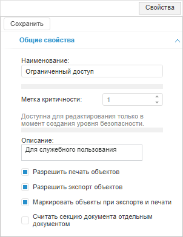
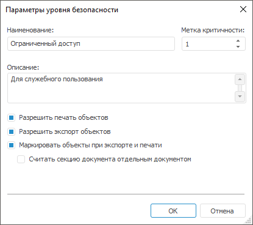
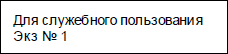
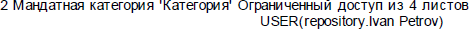

# Настройка параметров уровня безопасности

Настройка параметров уровня безопасности
-

# Настройка параметров уровня безопасности

Настройка параметров уровня безопасности предназначена для добавления
 или редактирования уровня безопасности.

Примечание.
 Параметры уровня безопасности доступны только при выборе [мандатного
 метода](../04_SecurityPolicy/Admin_PermSep_M.htm) или [метода
 разграничения доступа по уровням](../04_SecurityPolicy/Security_levels.htm).

Для настройки параметров уровня безопасности [добавьте](../04_SecurityPolicy/Admin_MandatAccess.htm#level)
 или [отредактируйте](../04_SecurityPolicy/Admin_MandatAccess.htm#edit)
 существующий уровень безопасности.

Будет открыта вкладка «Общие
 свойства» на боковой панели «Свойства»
 в веб-приложении и окно «Параметры уровня
 безопасности» в настольном приложении:

	Веб-приложение
	 Настольное
	 приложение

		

		

Настройте параметры уровня безопасности:

	- Наименование. Название
	 создаваемого уровня безопасности. Определяется администратором, исходя
	 из назначения данного уровня;

	- Метка критичности. Числовое
	 значение, которое должно быть уникальным в пределах списка уровней
	 безопасности;

	- Описание. Описание,
	 которое будет использовано в тексте метки в правом верхнем углу 1-го
	 листа при маркировке объектов при экспорте и печати. Если описание
	 пусто, то при маркировке будет использовано наименование уровня;

	- Разрешить печать объектов.
	 Данный флажок по умолчанию установлен и разрешает печать объектов,
	 соответствующих данному уровню безопасности. При снятии флажка данная
	 возможность будет заблокирована;

	- Разрешить экспорт объектов.
	 Данный флажок по умолчанию установлен и разрешает экспорт объектов,
	 соответствующих данному уровню безопасности. При снятии флажка данная
	 возможность будет заблокирована;

	- Маркировать
	 объекты при экспорте и печати. Маркировка выводимых на печать
	 (или экспортируемых) объектов штампом № 1 в соответствии с Инструкцией
	 № 0126-87, которая используется при сертификации продукции Федеральной
	 службой по техническому и экспортному контролю России. При маркировке
	 документ будет иметь следующие метки:

		- в правом верхнем углу 1-го листа
		 указывается информация, заданная в поле «Описание»
		 и номер экземпляра. Если описание пусто, то будет использовано
		 наименование уровня. Например:

		- в нижнем левом углу каждого
		 листа указывается информация: <номер листа> <наименование
		 уровня > из <количество> листов <пользователь, производящий
		 печать/экспорт>. Например:

		- в нижнем правом углу на последнем
		 листе указывается штамп: Отпечатано:, ФИО и тел.:, Подразделение,
		 тип, уч., Экземпляров: <количество>, Листов в экземпляре:
		 <количество страниц>, Дата. Например:

Примечание.
 Настройка [штампа
 маркировки](../04_SecurityPolicy/Editor_of_Politicy/Admin_MandatAccess_Marking.htm) может производиться опционально в зависимости от требований,
 используемых при формировании документов.

	- Считать
	 секцию документа отдельным документом. Установка флажка позволяет
	 при маркировке документа считать секции объекта отдельными документами:

	-

		- для регламентного отчёта под секцией понимается каждый отдельный
		 лист;

		- экспресс-отчёт всегда содержит одну секцию;

		- рабочее пространство всегда содержит одну секцию.

Каждая секция разбивается на отдельные страницы
 при печати и экспорте.

Особенности при маркировке по секциям:

	-

		- метка в верхнем правом углу будет выводиться на каждой первой
		 печатаемой странице секции объекта;

		- нижняя левая метка будет выводиться на всех печатных страницах,
		 количество листов будет указано для текущей секции объекта;

		- в нижний правый угол последней страницы каждой секции будет
		 выводиться информация по текущей секции.

См. также:

[Настройка
 мандатного метода](../04_SecurityPolicy/Admin_PermSep_M.htm) | [Настройка
 метода разграничения доступа по уровням](../04_SecurityPolicy/Security_levels.htm) | [Добавление
 штампа маркировки](../04_SecurityPolicy/Editor_of_Politicy/Admin_MandatAccess_Marking.htm)

		Справочная
		 система на версию 10.9
		 от 18/08/2025,
		 © ООО «ФОРСАЙТ»,
