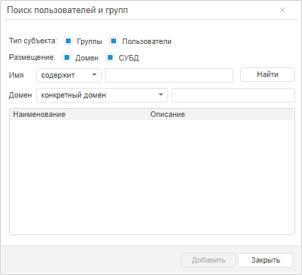
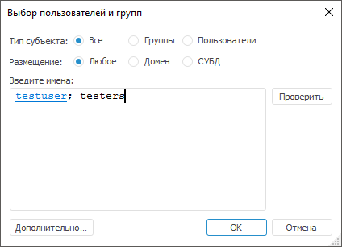
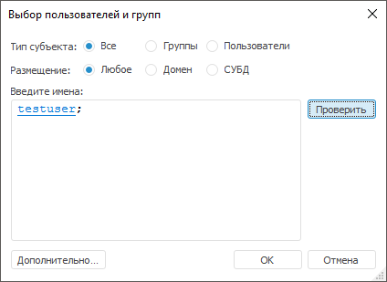
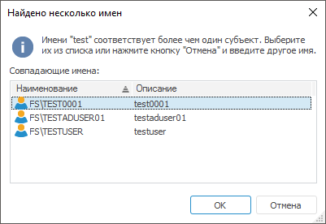
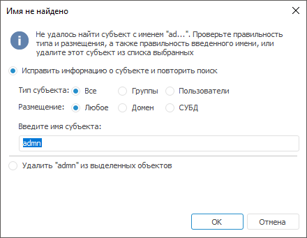
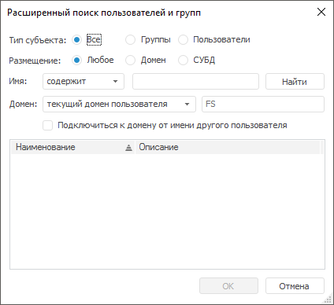
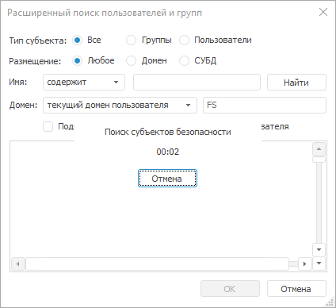

# Выбор пользователей и групп

Выбор пользователей и групп
-

# Выбор пользователей и групп

Для выбора пользователей и групп при [добавлении
 пользователей в группы](Groups/Group_Members.htm), при [добавлении
 обладателей привилегий](../04_SecurityPolicy/Admin_Priv.htm) используйте окно «Поиск
 пользователей и групп» в веб-приложении и окно «Выбор
 пользователей и групп» в настольном приложении.

	Веб-приложение
	  Настольное
	 приложение

		

		

Примечание.
 Работа с диалогами «Выбор пользователей»
 и «Выбор групп» при добавлении
 [доменного пользователя](Users/Admin_UserCreate_Domain.htm)
 или [доменной группы](Groups/Admin_GroupsCreateDomain.htm)
 выполняется аналогично работе с диалогом «Выбор
 пользователей и групп».

Выберите тип субъекта, размещение и введите имена пользователей или
 групп для проверки субъектов.

[Выбор типа субъекта
 и размещения](javascript:TextPopup(this))

	Для поиска субъекта безопасности предусмотрены две группы фильтров:
	 «Тип субъекта» и «Размещение»,
	 позволяющие определить какие субъекты безопасности искать.

	Группа «Тип субъекта»:

		- Все. При установке
		 данного переключателя, поиск будет производиться среди всех субъектов
		 безопасности (только в настольном приложении);

		- Группы. При установке
		 данного переключателя, поиск будет производиться только среди
		 групп пользователей;

		- Пользователи. При
		 установке данного переключателя, поиск будет производиться только
		 среди пользователей.

	Группа «Размещение»:

		- в веб-приложении:

			- Домен. При установке
			 данного флажка, поиск будет производиться среди доменных субъектов;

			- СУБД. При установке
			 данного флажка, поиск будет производиться среди субъектов
			 СУБД;

		- в настольном приложении:

			- Любое.
			 При установке данного переключателя, поиск будет производиться
			 среди доменных субъектов и субъектов СУБД;

			- Домен.
			 При установке данного переключателя, поиск будет производиться
			 среди доменных субъектов;

			- СУБД.
			 При установке данного переключателя, поиск будет производиться
			 среди субъектов СУБД.

	Примечание.
	 При одновременной установке флажков «Группы»
	 и «Пользователи», «Доменные
	 субъекты» и «Субъекты СУБД»
	 в веб-приложении поиск будет производиться среди всех субъектов безопасности.

[Ввод пользователей
 и групп по именам](javascript:TextPopup(this))

	Для выбора пользователей или групп:

		- в веб-приложении введите имена в строку поиска. Список «Имя» позволяет определить вид
		 поиска:

			- Имя содержит.
			 Будет произведен поиск субъектов, чьи имена содержат введенную
			 строку. Данный вид поиска установлен по умолчанию;

			- Имя начинается.
			 Будет произведен поиск субъектов, чьи имена начинаются с введенной
			 строки;

			- Имя совпадает.
			 Будет произведен поиск субъектов, чьи имена полностью совпадают
			 с введенной строкой.

	После ввода имени нажмите кнопку «Найти». Выберите один или несколько
	 найденных субъектов в списке, зажав клавишу CTRL, и нажмите кнопку
	 «Добавить».

		- в настольном приложении введите имена (часть имен) через
		 точку с запятой в поле «Введите
		 имена». После ввода имени нажмите кнопку «Проверить»
		 для проверки субъектов.

[Проверка
 субъектов](javascript:TextPopup(this))

	Для проверки субъектов по введенным именам (частям имен) нажмите
	 кнопку «Проверить»/«Найти».

	Если субъекты найдены, то вместо введенных пользователем имен будут
	 подставлены полные имена:

	

	Нажмите кнопку «ОК» для
	 выбора найденных пользователей или групп.

	Если по введенным именам было найдено
	 более одного субъекта безопасности, то будет отображен диалог «Найдено несколько имен»:

	

	В диалоге выберите один или несколько субъектов. Выбор нескольких
	 субъектов осуществляется с зажатой клавишей CTRL.

	Если по введенным именам не найдено
	 субъектов безопасности, то будет отображен диалог «Имя
	 не найдено»:

	

	Если в диалоге установлен переключатель «Исправить
	 информацию о субъекте и повторить поиск», то можно указать
	 иной тип субъекта, иное размещение или другое имя и повторить поиск.

	Если в диалоге установлен переключатель «Удалить
	 … из выделенных объектов», то поиск субъекта будет закончен.

Примечание.
 Проверка субъектов доступна только в настольном приложении.

## Расширенный поиск пользователей и групп

Расширенный поиск пользователей и групп включает в себя определение
 домена, в котором будет производиться поиск, и доступен при использовании
 следующих [поддерживаемых
 СУБД](Setup.chm::/01_sysreq/database_support.htm): PostgreSQL/Postgres Pro, Oracle, Microsoft SQL
 Server.

Для расширенного поиска пользователей и групп в настольном приложении
 нажмите кнопку «Дополнительно»
 в окне «Выбор пользователей и групп».
 Откроется окно «Расширенный поиск пользователей
 и групп», позволяющее осуществить поиск субъектов безопасности
 с расширенными возможностями, аналогичное окну «Поиск
 пользователей и групп» в веб-приложении:

Тип субъекта, размещение, имя пользователя или группы задается аналогично
 окну выбора пользователей и групп без расширенного поиска. При использовании
 расширенного поиска пользователей и групп доступно определение домена
 в раскрывающемся списке «Домен»,
 в котором будет производиться поиск:

	- Конкретный домен. Поиск
	 в указанном домене;

Примечание.
 Если в файле [settings.xml](communication_with_ad.htm) указан
 порт глобального каталога (3268 для ldap, 3269 для ldaps) в адресе сервера
 службы каталогов или контроллера домена, то будет выполняться поиск всех
 субъектов в рамках домена и его поддоменов, независимо от указания конкретного
 домена.

	- Доменный контроллер.
	 Поиск в указанном доменном контроллере;

	- Сервер Global Catalog.
	 Поиск в указанном сервере Global Catalog;

	- Текущий домен пользователя.
	 Поиск в текущем домене пользователя;

	- Текущий домен компьютера.
	 Поиск в текущем домене компьютера.

Примечание.
 Поиск в текущем домене пользователя или компьютера доступен только в настольном
 приложении.

Если компьютер пользователя не содержится в доменной сети или включен
 в другую доменную сеть, то установите флажок «Подключиться
 к домену от имени другого пользователя» для поиска пользователей
 и групп от имени другого пользователя. После установки флажка будут отображены
 поля для учётных данных пользователя домена, в котором будет производиться
 поиск. Введите имя пользователя и пароль в соответствующие поля.

Примечание.
 Поиск пользователей и групп от имени другого пользователя доступен только
 в настольном приложении.

Для начала поиска с заданными параметрами нажмите кнопку «Найти».
 Выберите один или несколько найденных субъектов в списке, зажав клавишу
 CTRL, и нажмите кнопку «ОК».

[Длительный
 поиск субъектов безопасности](javascript:TextPopup(this))

	Если поиск с заданными параметрами занимает более одной секунды,
	 то поверх данного окна открывается диалог «Поиск
	 субъектов безопасности»:

	

	В диалоге отображается время поиска. Субъекты, по мере нахождения,
	 будут добавляться в список. Прервать поиск можно, нажав кнопку «Отмена», при этом уже найденные
	 субъекты останутся в списке.

	Примечание.
	 Прерывание поиска субъектов безопасности доступно только в настольном
	 приложении.

См. также:

[Создание
 учетных записей пользователей и работа с ними](Users/Admin_Users.htm) | [Создание
 групп пользователей и работа с ними](Groups/Admin_Groups.htm) | [Просмотр
 объектов пользователя и группы](Users/Admin_UserObjects.htm)

		Справочная
		 система на версию 10.9
		 от 18/08/2025,
		 © ООО «ФОРСАЙТ»,
