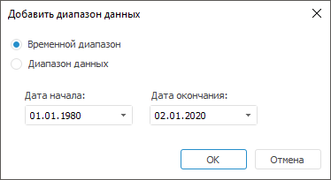

# Добавление диапазона данных

Добавление диапазона данных
-

# Добавление диапазона данных

Для создания нового диапазона данных базы данных временных рядов нажмите
 кнопку «Добавить» в окне «[Права доступа к данным](Admin_Data_Access_Right.htm)». Будет открыт
 диалог «Добавить диапазон данных».

Определите тип диапазона с помощью переключателей:

	- Временной диапазон.
	 В диалоге добавления временного диапазона задайте даты начала и окончания
	 периода:

	- Диапазон данных. В диалоге
	 добавления диапазона данных задайте атрибут и его значения:

В раскрывающемся списке «Атрибут»
 содержатся все атрибуты базы данных временных рядов, являющиеся ссылкой
 на справочник. Выбор атрибута определяет измерение, отметка которого соответствует
 диапазону данных.

В комбинированном списке «Значение»
 определяется отметка измерения, соответствующая выбранному атрибуту. В
 данном списке возможен поиск элементов, множественная отметка и доступно
 контекстное меню. Для получения подробной информации обратитесь к разделу
 «[Работа
 с элементами измерения](UiSelection.chm::/Selection/Selection_of_the_dimension_elements.htm)».

См. также:

[Дискреционный контроль](../Admin_AdminObjects_Discretionary.htm)
 | [Права
 доступа к данным](Admin_Data_Access_Right.htm)

		Справочная
		 система на версию 10.9
		 от 18/08/2025,
		 © ООО «ФОРСАЙТ»,
