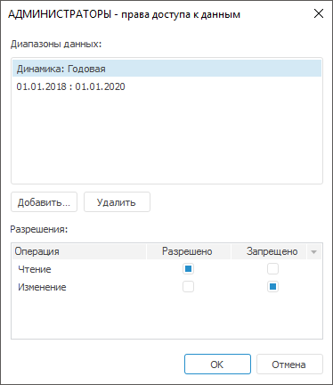
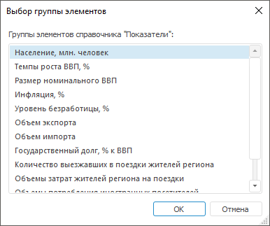
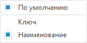
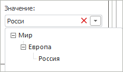

# Права доступа к данным базы данных временных рядов

Права доступа к данным базы данных временных рядов
-

# Права доступа к данным базы данных временных рядов

Для определения прав доступа к данным базы данных временных рядов нажмите
 кнопку «[Права
 доступа к данным](../Admin_AdminObjects_Discretionary.htm#data_access_permissions)» на вкладке «[Дискреционный контроль](../Admin_AdminObjects_Discretionary.htm)».
 После чего будет открыто окно, отображающее все настроенные для выбранного
 пользователя диапазоны данных с возможностью их настройки:

Примечание.
 Кнопка «[Права
 доступа к данным](../Admin_AdminObjects_Discretionary.htm#data_access_permissions)» отображается для определения прав доступа
 к данным базы данных временных рядов только в настольном приложении.

Диапазон данных - это подмножество данных базы данных временных рядов,
 которое определяется путем задания отметки для измерения или календаря
 базы. Диапазоны данных содержатся в одноименном списке.

В списке «Разрешения» отображаются
 права для выбранного диапазона данных. Для разрешения или запрета выполнения
 определенных действий над диапазоном данных необходимо установить соответствующие
 флажки напротив выбранных операций.

Важно. Операция
 запрета имеет более высокий приоритет.

Для создания нового диапазона данных нажмите кнопку «Добавить».
 Будет открыт диалог «Добавить диапазон
 данных».

При помощи переключателей определите тип диапазона:

	- временной диапазон.
	 В диалоге добавления временного диапазона задайте даты начала и окончания
	 периода:

	- диапазон данных. В диалоге
	 добавления диапазона данных задайте атрибут и его значения:

[Выбор атрибута](javascript:TextPopup(this))

	В раскрывающемся списке «Атрибут»
	 содержатся все атрибуты базы данных временных рядов, являющиеся ссылкой
	 на справочник. Выбор атрибута определяет измерение, отметка которого
	 соответствует диапазону данных.

[Выбор значения](javascript:TextPopup(this))

	Комбинированный список «Значение»
	 определяет отметку измерения, соответствующего выбранному атрибуту.
	 В данном списке возможна множественная отметка и доступно контекстное
	 меню:

		- Отметить все. Устанавливает
		 отметку для всех элементов измерения;

		- Снять отметку со всех.
		 Снимает отметку со всех элементов измерения;

		- Отметить все подчиненные.
		 Устанавливает отметку для всех дочерних элементов выбранного элемента
		 измерения;

		- Снять отметку с подчиненных.
		 Снимает отметку со всех дочерних элементов выбранного элемента
		 измерения;

		- Расширенная отметка.
		 Способы расширенной отметки элементов:

			- Отметить уровень.
			 Устанавливает отметку для всех элементов, расположенных на
			 одном уровне с указанным элементом измерения;

			- Снять отметку с уровня.
			 Снимает отметку со всех элементов, расположенных на одном
			 уровне с указанным элементом измерения;

			- Отметить группу.
			 Пункт отображается, если справочник, соответствующий атрибуту,
			 содержит группы отметки. Устанавливает отметку для элементов,
			 входящих в группу отметки справочника, выбранную во всплывающем
			 меню. Всплывающее меню отображает только десять последних
			 использовавшихся групп. Если для справочника определено более
			 десяти групп, то в меню будет присутствовать команда «Другая группа». После ее
			 выполнения будет отображен диалог выбора группы:

	

	В диалоге «Выбор группы элементов»
	 в списке «Группы элементов справочника»
	 содержатся все группы отметки справочника. После выбора необходимой
	 группы диалог будет закрыт, все элементы указанной группы будут отмечены
	 в списке.

		- Отобразить группу.
		 Пункт отображается, если справочник, соответствующий атрибуту,
		 содержит группы отметки. Отображает в списке только элементы,
		 входящие в группу отметки элементов справочника, выбранную во
		 всплывающем меню. Работа со всплывающим меню аналогична работе
		 с меню пункта «Отметить группу».
		 После выбора группы в меню будет отображена команда «Сбросить»,
		 позволяющая отобразить полный список элементов измерения;

		- Развернуть всю иерархию.
		 Разворачивает иерархию списка;

		- Свернуть всю иерархию.
		 Сворачивает иерархию списка;

		- Наименование уровней.
		 Позволяет изменить наименование уровней измерения. В качестве
		 наименований элементов используются значения атрибута справочника,
		 указанного во всплывающем меню, например:

	

		- Строка поиска. Позволяет
		 найти элемент измерения. При нажатии на кнопку поиска появится
		 поле для ввода искомого значения:

	

	Отмеченные элементы в данном списке будут
	 добавлены к ранее имеющейся отметке в измерении.

Для удаления выбранного диапазона нажмите кнопку «Удалить».

См. также:

[Параметры
 управления доступом](../Admin_AdminObjects.htm) | [Настройка
 параметров при дискреционном контроле](../Admin_AdminObjects_Discretionary.htm)

		Справочная
		 система на версию 10.9
		 от 18/08/2025,
		 © ООО «ФОРСАЙТ»,
