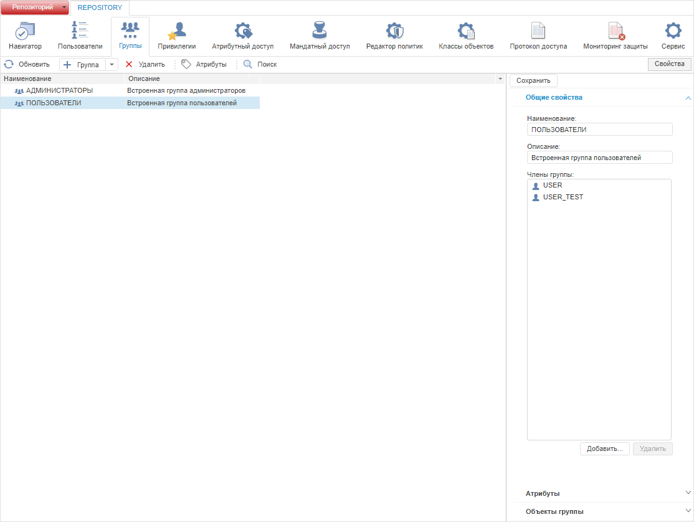
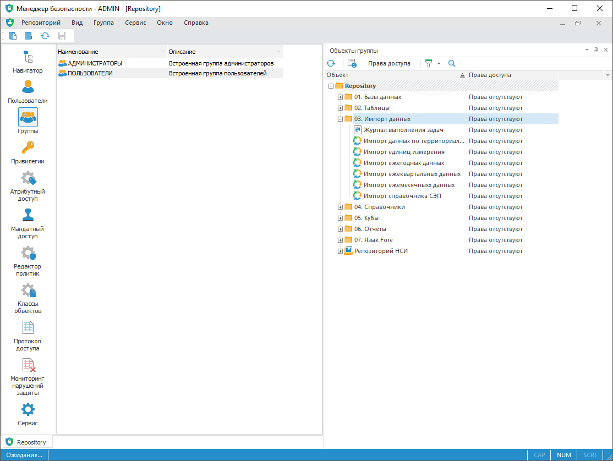

# Создание групп пользователей и работа с ними

Создание групп пользователей и работа с ними
-

# Создание групп пользователей и
 работа с ними

Для создания групп пользователей используйте раздел «Группы»
 [панели
 навигации](../../01_RunSecManager/Admin_Organizational_Starting.htm).

Группы пользователей являются субъектами безопасности системы, основное
 назначение групп – это объединение нескольких пользователей под одним
 учетным именем с целью унифицированного управления правами доступа для
 них. Членами группы могут быть пользователи и группы, созданные в «Форсайт. Аналитическая платформа»,
 доменные группы и пользователи.

Группе, как и отдельным пользователям, могут назначаться определенные
 права доступа. В этом случае назначенные права распространяются на всех
 членов группы (доменные и встроенные пользователи/группы) и являются дополнительными
 к их индивидуальным правам. Права любого пользователя системы являются
 объединением прав самого субъекта и всех групп, в которые он входит.

В системе предусмотрены две встроенные группы: «Администраторы» и «Пользователи».
 По умолчанию владелец схемы ADMIN входит в группу «Администраторы». Встроенные
 группы обладают разными наборами привилегий. Для получения подробной информации
 обратитесь к разделу «[Распределение
 привилегий](../../04_SecurityPolicy/Admin_Priv.htm)».

Примечание.
 При [разделении
 ролей](../../04_SecurityPolicy/Editor_of_Politicy/Security_EditorPoliticy_Adm.htm) между администратором информационной безопасности и прикладным
 администратором раздел «Группы»
 будет доступен только администратору информационной безопасности.

Раздел «Группы»:

	Веб-приложение
	 Настольное
	 приложение

		

		

Ключевые возможности:

	- [создание и редактирование группы
	 пользователей](Admin_GroupsCreate.htm);

	- [подключение доменной
	 группы](Admin_GroupsCreateDomain.htm);

	- [создание
	 пользовательских атрибутов](../../04_SecurityPolicy/Creating_attributes.htm);

	- [обновление прав группы пользователей](Groups_Update.htm);

	- [поиск группы пользователей](Users_Group_Search.htm);

	- [удаление группы пользователей](Admin_GroupsDel.htm);

	- [просмотр объектов пользователя
	 и группы](../Users/Admin_UserObjects.htm);

	- [выбор пользователей и групп](../Admin_UsersGroups.htm).

Для применения заданных настроек группы пользователей:

	- в веб-приложении нажмите кнопку  «Сохранить»
	 на [панели
	 инструментов](../../01_RunSecManager/Admin_Organizational_Starting.htm) или на [боковой
	 панели](../../01_RunSecManager/Admin_Organizational_Starting.htm);

	- в настольном приложении выполните
	 одно из действий:

		- выполните команду «Репозиторий
		 > Применить политику безопасности» в [главном
		 меню](../../01_RunSecManager/Admin_Organizational_Starting.htm);

		- нажмите кнопку 
		 «Применить политику безопасности»
		 на [панели
		 инструментов](../../01_RunSecManager/Admin_Organizational_Starting.htm).

Примечание.
 Если параметры раздела были изменены, то при попытке перехода на другой
 раздел или при закрытии менеджера безопасности будет выдан запрос о применении
 измененных настроек.

См. также:

[Настройка
 политики безопасности системы](../../01_RunSecManager/Admin_Intro.htm) | [Создание
 учетных записей пользователей и работа с ними](../Users/Admin_Users.htm) | [Распределение
 привилегий](../../04_SecurityPolicy/Admin_Priv.htm)

		Справочная
		 система на версию 10.9
		 от 18/08/2025,
		 © ООО «ФОРСАЙТ»,
