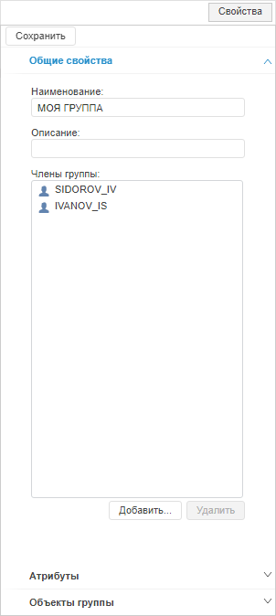
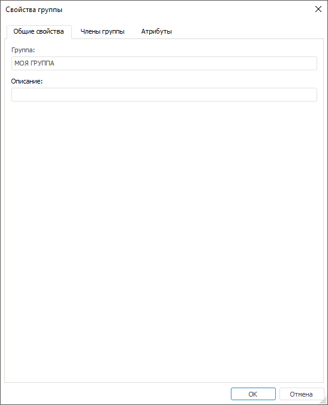

# Создание и редактирование группы пользователей

Создание и редактирование группы пользователей
-

# Создание и редактирование группы
 пользователей

Для создания и редактирования группы пользователей используйте раздел
 «[Группы](Admin_Groups.htm)».

[Создание
 группы пользователей](javascript:TextPopup(this))

	Для создания группы пользователей:

		- в веб-приложении:

			- нажмите кнопку  «Группа»
			 на [панели
			 инструментов](../../01_RunSecManager/Admin_Organizational_Starting.htm);

			- выполните команду «Создать группу» в раскрывающемся
			 меню кнопки  «Группа» на [панели
			 инструментов](../../01_RunSecManager/Admin_Organizational_Starting.htm).

		- в настольном приложении:

			- выполните команду «Создать
			 группу» в контекстном меню менеджера безопасности;

			- выполните команду «Группа
			 > Создать группу» в [главном
			 меню](../../01_RunSecManager/Admin_Organizational_Starting.htm).

	После выполнения одного из действий будет открыта боковая панель
	 «Свойства» в веб-приложении
	 или окно «Свойства группы»
	 в настольном приложении. Задайте [свойства](Admin_GroupsCreate.htm#properties)
	 создаваемой группы пользователей.

	Примечание.
	 Создание группы пользователей доступно пользователям, обладающим [привилегией](../../04_SecurityPolicy/Admin_Priv.htm) «Изменение прав пользователей, раздача ролей,
	 изменение политики», и недоступно в репозиториях на базе СУБД
	 SQLite.

[Редактирование
 группы пользователей](javascript:TextPopup(this))

	Для редактирования группы пользователей:

		- в веб-приложении выберите группу
		 пользователей;

		- в настольном приложении:

			- выполните команду контекстного
			 меню «Свойства» для
			 выбранной группы пользователей;

			- выполните команду [главного
			 меню](../../01_RunSecManager/Admin_Organizational_Starting.htm) «Пользователь >
			 Свойства» для выбранной группы пользователей;

			- дважды щелкните по выбранной
			 группе пользователей.

	После выполнения одного из действий будет открыта боковая панель
	 «Свойства» в веб-приложении
	 или окно «Свойства группы»
	 в настольном приложении. Измените [свойства](Admin_GroupsCreate.htm#properties)
	 группы пользователей.

Для изменения свойств при [создании](Admin_GroupsCreate.htm#create)
 и [редактировании](Admin_GroupsCreate.htm#edit) группы
 пользователей используйте боковую панель «Свойства»
 в веб-приложении или окно «Свойства группы»
 в настольном приложении.

	Веб-приложение
	 Настольное
	 приложение

		

		

Свойства группы пользователей содержат:

	- [параметры общих свойств](Admin_GroupProp_Common.htm);

	- [добавление членов группы пользователей](Group_Members.htm);

	- [добавление значений
	 атрибутам группы пользователей](Admin_GroupProp_Attributes.htm.htm).

См. также:

[Создание
 групп пользователей и работа с ними](Admin_Groups.htm) | [Подключение
 доменной группы](Admin_GroupsCreateDomain.htm)

		Справочная
		 система на версию 10.9
		 от 18/08/2025,
		 © ООО «ФОРСАЙТ»,
