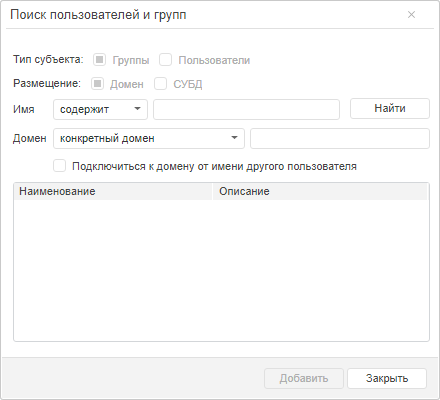
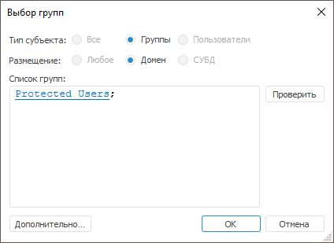

# Подключение доменной группы

Подключение доменной группы
-

# Подключение доменной группы

Продукт «Форсайт. Аналитическая платформа»
 использует информацию из [службы
 каталогов домена](../communication_with_ad.htm) или глобального каталога для работы с доменными субъектами
 безопасности. Подключение доменной группы доступно при использовании следующих
 [поддерживаемых
 СУБД](Setup.chm::/01_sysreq/database_support.htm): PostgreSQL/Postgres Pro, Oracle, Microsoft SQL
 Server.

Правами добавления доменных групп обладает прикладной администратор
 или пользователь, входящий в группу АДМИНИСТРАТОРЫ. Если включено разделение
 ролей между АИБ'ом и прикладным администратором, то только АИБ всегда
 имеет право добавления доменных групп. Если требуется, чтобы другой пользователь
 также мог добавлять доменные группы, то ему необходимо дать дополнительные
 привилегии - «Создание, удаление пользователей»
 и «Изменение прав пользователей, раздача
 ролей, изменение политики».

Для СУБД PostgreSQL/Postgres Pro необходимо предварительно [подготовить
 сервер PostgreSQL](Setup.chm::/03_DB_Server_Config/Postgres_server_preparation.htm#domain). Для СУБД Oracle требуются [дополнительные
 настройки](Admin_GroupsCreateDomain.htm#oracle), при этом будет использоваться специальный механизм авторизации
 доменных пользователей. Если репозиторий использует СУБД Microsoft SQL
 Server, то подключение доменной группы пользователей доступно только в
 настольном приложении.

Совет. Перед подключением
 доменных групп рекомендуется проверять идентичность настроек LDAP в файлах
 settings.xml, расположенных в различных окружениях. Если настройки совпадают,
 то для корректной работы с доменными группами подключайте их в рамках
 одного приложения: либо в веб-приложении, либо в настольном приложении.

Для подключения доменной группы пользователей в разделе «[Группы](Admin_Groups.htm)»:

	- в веб-приложении выполните команду «Добавить
	 доменную группу» в раскрывающемся меню кнопки  «Группа»
	 на [панели
	 инструментов](../../01_RunSecManager/Admin_Organizational_Starting.htm);

	- в настольном приложении:

		- выполните команду «Группа
		 > Добавить доменную группу» в [главном
		 меню](../../01_RunSecManager/Admin_Organizational_Starting.htm);

		- выполните команду «Добавить
		 доменную группу» в контекстном меню менеджера безопасности.

После выполнения действия будет открыт [диалог
 выбора доменных групп](../Admin_UsersGroups.htm) в веб-приложении и настольном приложении.

	Веб-приложение

	 Настольное
	 приложение

		

		

Для получения подробной информации о работе с диалогами выбора доменной
 группы пользователей обратитесь к разделу «[Выбор
 пользователей и групп](../Admin_UsersGroups.htm)».

Примечание.
 При выборе доменной группы пользователей в окнах недоступны переключатели
 «Тип субъекта» и «Размещение».

Выберите необходимые группы пользователей
 и нажмите кнопку «ОК», после чего
 появится диалог создания учетных записей:

Примечание.
 Данный диалог недоступен для групп, которые уже были созданы в репозитории.

При установке флажка «Создать на сервере
 БД» добавляемая группа будет создана на сервере БД, при этом будет
 выдан [запрос
 учётных данных пользователя](UiNavObj.chm::/database/UiDb_database_authorization.htm), обладающего правами создания
 пользователей. По умолчанию данный флажок снят. Если подключение доменной
 группы выполняется в репозитории на базе СУБД PostgreSQL, то администратор
 должен обладать привилегией CREATEROLE на уровне СУБД.

При установке флажка «Раздать права
 на уровне СУБД» для добавляемой группы будет произведена раздача
 прав на уровне СУБД, для этого будет выдан [запрос
 имени и пароля пользователя](UiNavObj.chm::/database/UiDb_database_authorization.htm), обладающего правами создания
 таблиц.

При установке флажка «Применить во
 всех подобных случаях» для всех добавляемых доменных групп в репозиторий
 будут выполнены выбранные действия без дополнительных запросов. По умолчанию
 данный флажок установлен.

## Интегрированная доменная авторизация при работе с сервером СУБД PostgreSQL

При использовании интегрированной доменной аутентификации, определённой
 в [параметрах
 подключения к репозиторию](Setup.chm::/06_AK_Client_Config/UiNav_RepoConfig_repo1.htm#authentication), доступен вход в систему
 через доменные группы. Права доменной группы распространяются на входящих
 в неё пользователей СУБД без явного добавления каждой учётной записи в
 менеджере безопасности.

Примечание.
 Поддержка доменных групп доступна, если на уровне СУБД содержатся группы
 в виде ролей и пользователи, входящие в эти роли.

Для входа в систему через доменную группу:

	- Убедитесь, что в СУБД PostgreSQL включена [поддержка
	 доменных групп](setup.chm::/03_DB_Server_Config/Postgres_server_preparation.htm#domain). Субъекты безопасности базы данных
	 синхронизируются с субъектами службы каталогов.

	- Подключите доменную группу в менеджере безопасности. В окне
	 «[Создание
	 учётных записей](#domainsubject)» установите флажок «Раздать
	 права на уровне СУБД».

	- Добавьте [привилегии](../../04_SecurityPolicy/Admin_Priv.htm)
	 и настройте [права
	 доступа](../../02_ComonFunction/Admin_SecManager_CommonFunction.htm) к объектам для доменной группы.

После выполнения действий будет доступен вход в систему пользователю,
 состоящему в доменной группе.

## Доменная авторизация при работе с сервером СУБД
 Oracle

При работе с репозиторием на базе СУБД Oracle реализован специальный
 механизм авторизации доменных пользователей, которые не добавлены в менеджере
 безопасности. Данный механизм использует доменные группы и настроенные
 для них на уровне СУБД роли. Для включения возможности добавления доменных
 групп в менеджере безопасности репозитория необходимо включить [режим
 совместимости](KeSom.chm::/Interface/IMetabasePolicy/IMetabasePolicy.ESKMode.htm) для работы с доменными группами в СУБД
 Oracle через использование языка Fore. После этого в менеджере безопасности
 появится возможность подключения доменных групп.

Для дальнейшей настройки выполните следующие шаги:

	- На сервере СУБД создайте роль, для роли раздайте гранты CONNECT
	 и RESOURCE.

	- На сервере СУБД добавьте доменного пользователя. Формат добавления
	 зависит от настроек СУБД и должен соответствовать формату, используемому
	 при [подключении
	 к репозиторию](Setup.chm::/06_AK_Client_Config/UiNav_RepoConfig_repo1.htm#more). Включите пользователя в созданную
	 на первом шаге роль.

	- В менеджере безопасности на вкладке «Группы»
	 добавьте доменную группу, в которую входит пользователь. В свойствах
	 группы будет доступно поле «Роль
	 СУБД Oracle». По умолчанию в качестве значения роли указывает
	 наименование доменной группы. Укажите в этом поле роль, созданную
	 на первом шаге.

	- Для добавленной доменной группы раздайте необходимые [привилегии](../../04_SecurityPolicy/Admin_Priv.htm)
	 или включите доменную группу в какую-либо уже имеющуюся группу с настроенными
	 правами доступа - Администраторы, Пользователи или другую. Если в
	 репозитории используется [разграничение
	 доступа по уровням](../../04_SecurityPolicy/Security_levels.htm), то определите для доменной группы необходимый
	 уровень доступа.

Важно. Для
 каждой доменной группы должна быть создана только одна роль. Нельзя связывать
 разные группы с одной ролью. Также несколько ролей нельзя связывать с
 одной доменной группой.

После этого при подключении доменного пользователя, который отсутствует
 в менеджере безопасности репозитория, осуществляется проверка на вхождение
 этого пользователя в доменные группы, которые в свою очередь подключены
 в менеджере безопасности. Если пользователь входит в какую-либо доменную
 группу, то проверяется соответствие роли, заданной для группы, тем ролям,
 которые созданы на сервере СУБД. Если на сервере имеется указанная роль,
 то осуществляется подключение пользователя. При использовании разграничения
 доступа по уровням подключение пользователя осуществляется в соответствии
 с заданным для группы уровнем безопасности. Иначе выдаётся соответствующее
 сообщение об ошибке.

См. также:

[Создание
 групп пользователей и работа с ними](Admin_Groups.htm) | [Создание
 и редактирование группы пользователей](Admin_GroupsCreate.htm)

		Справочная
		 система на версию 10.9
		 от 18/08/2025,
		 © ООО «ФОРСАЙТ»,
