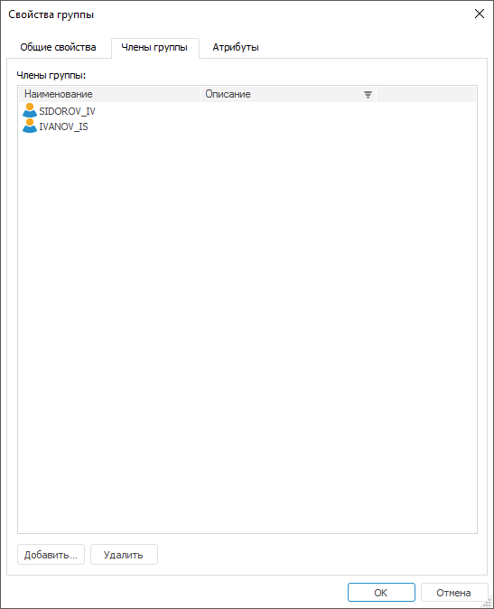

# Добавление членов группы пользователей

Добавление членов группы пользователей
-

# Добавление членов группы пользователей

Для добавления и удаления пользователей, входящих в группу, используйте
 вкладку «Общие свойства» на боковой
 панели «[Свойства](Admin_GroupsCreate.htm#properties)»
 в веб-приложении и вкладку «Члены группы»
 в окне «[Свойства
 группы](Admin_GroupsCreate.htm#properties)» в настольном приложении.

Примечание.
 Добавление и удаление пользователей из группы доступно пользователям,
 обладающим [привилегией](../../04_SecurityPolicy/Admin_Priv.htm)
 «Изменение прав пользователей, раздача
 ролей, изменение политики».

	Веб-приложение
	 Настольное
	 приложение

		

		

Для добавления пользователей в группу нажмите кнопку «Добавить»,
 после чего будет открыт стандартный диалог [выбора
 групп и пользователей](../Admin_UsersGroups.htm).

Примечание.
 Если при добавлении члена группы был выбран доменный пользователь (группа),
 который не создан в «Форсайт. Аналитическая платформа»,
 то будет запущен процесс создания данного [доменного
 пользователя](../Users/Admin_UserCreate_Domain.htm) ([доменной группы](Admin_GroupsCreateDomain.htm)).

Для удаления выбранных пользователей из группы нажмите кнопку «Удалить».

См. также:

[Создание
 и редактирование группы пользователей](Admin_GroupsCreate.htm) | [Добавление
 значений атрибутам группы пользователей](Admin_GroupProp_Attributes.htm.htm)

		Справочная
		 система на версию 10.9
		 от 18/08/2025,
		 © ООО «ФОРСАЙТ»,
