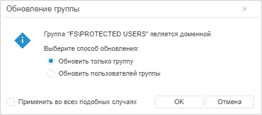
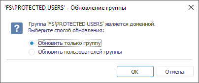
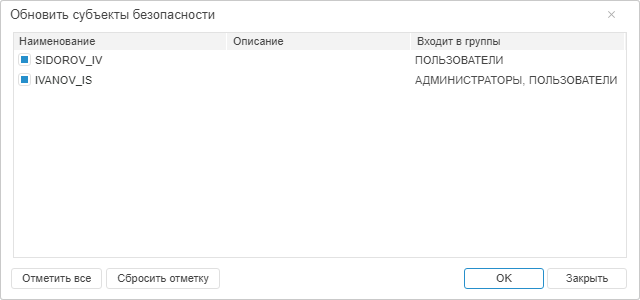
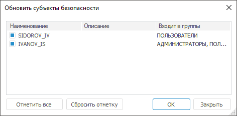

# Обновление прав группы пользователей

Обновление прав группы пользователей
-

# Обновление прав группы пользователей

Обновление прав группы пользователей на уровне СУБД осуществляется в
 разделе «[Группы](Admin_Groups.htm)».

Примечание.
 При [разделении
 ролей](../../04_SecurityPolicy/Editor_of_Politicy/Security_EditorPoliticy_Adm.htm) между администратором информационной безопасности и прикладным
 администратором в зависимости от выбранных параметров при активации режима
 право обновлять права группы пользователей будет принадлежать только одному
 из администраторов.

Для обновления прав выбранных групп пользователей:

	- в веб-приложении:

		- выполните команду «Обновить
		 права» в контекстном меню группы;

		- выполните команду «Обновить
		 права» в раскрывающемся меню кнопки 
		 «Группа» на [панели
		 инструментов](../../01_RunSecManager/Admin_Organizational_Starting.htm);

	- в настольном приложении:

		- выполните команду «Обновить»
		 в контекстном меню группы;

		- выполните команду «Группа
		 > Обновить» в [главном
		 меню](../../01_RunSecManager/Admin_Organizational_Starting.htm).

Если среди выбранных групп есть доменные группы,
 при добавлении которых была произведена [раздача
 прав на уровне СУБД](../Users/Admin_UserCreate_Domain.htm#grant), то будет открыто окно «Обновление
 группы»/«'<наименование группы>'-
 Обновление группы».

	Веб-приложение
	 Настольное
	 приложение

		

		

Выберите способ обновления прав:

	- Обновить только группу.
	 Будут обновлены права группы пользователей;

	- Обновить пользователей группы.
	 Будет сформирован список пользователей, входящих в группу, для последующего
	 обновления их прав.

При необходимости установите флажок «Применить
 во всех подобных случаях» для повторного применения выбранного
 способа обновления прав группы. Для всех обновляемых групп будет выполнено
 выбранное действие без дополнительных запросов. По умолчанию флажок снят.

Примечание.
 Флажок «Применить во всех подобных
 случаях» доступен только в веб-приложении.

После выполнения действий нажмите кнопку «ОК».

Сформируется список пользователей в окне «Обновить субъекты безопасности»,
 в который попадают:

	- пользователи выбранных групп «Форсайт. Аналитическая платформа»;

	- доменные группы, не имеющие прав на уровне СУБД;

	- доменные группы, имеющие права на уровне СУБД, с выбранной опцией
	 «Обновить пользователей группы».

	Веб-приложение

	 Настольное
	 приложение

		

		

Отметьте пользователей, права которых необходимо обновить.

Для работы с отметкой доступно контекстное меню и кнопки «Отметить
 все» и «Сбросить отметку».

В настольном приложении для выделения всего списка используйте сочетание
 клавиш CTRL+A.

Примечание.
 Если список пользователей пуст, то окно «Обновить
 субъекты безопасности» не отображается.

См. также:

[Создание
 групп пользователей и работа с ними](Admin_Groups.htm) | [Поиск
 группы пользователей](Users_Group_Search.htm)

		Справочная
		 система на версию 10.9
		 от 18/08/2025,
		 © ООО «ФОРСАЙТ»,
