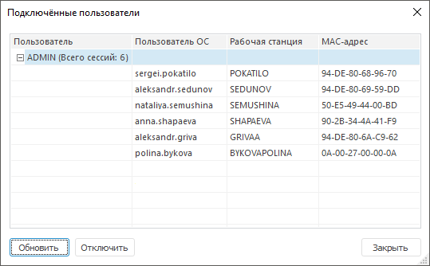

# Просмотр подключенных пользователей

Просмотр подключенных пользователей
-

# Просмотр подключенных пользователей

Просмотр подключенных пользователей доступен только в настольном приложении
 и при отключенном [пуле
 соединений](setup.chm::/UiWebSetup/01_BIServer/PoolConnections.htm).

Для просмотра подключенных пользователей и сессий обращения к репозиторию
 перейдите в раздел «[Пользователи](Admin_Users.htm)»
 и выполните команду «Сервис > Подключенные
 пользователи» в [главном
 меню](../../01_RunSecManager/Admin_Organizational_Starting.htm).

Примечание.
 По умолчанию команда «Сервис > Подключенные
 пользователи» в [главном
 меню](../../01_RunSecManager/Admin_Organizational_Starting.htm) недоступна, так как пул соединений включен.

После выполнения этого действия будет открыто окно «Подключенные
 пользователи»:

В окне содержится таблица:

	- Пользователь. Пользователь
	 репозитория, под которым осуществлен вход;

	- Пользователь ОС. Пользователь
	 операционной системы, под которым осуществляется доступ;

	- Рабочая станция. Рабочая
	 станция, с которой осуществляется доступ;

	- МАС-адрес. Уникальный
	 адрес сетевой карты.

Примечание.
 Возможно ограничение числа сеансов пользователя при установленном флажке
 «[Ограничить
 число сеансов](Admin_UserProp_Time.htm#sessions)».

Для множественной отметки пользователей зажмите и удерживайте клавишу
 CTRL или SHIFT для отметки всех пользователей с текущей строки по строку
 N (предыдущая отметка снимается).

Для обновления списка:

	- нажмите кнопку «Обновить»;

	- выполните команду «Обновить»
	 в контекстном меню.

После выполнения одного из действий будет обновлен список пользователей.

Для отключения одного или нескольких выбранных пользователей от репозитория:

	- нажмите кнопку «Отключить»;

	- выполните команду «Отключить»
	 в контекстном меню;

	- нажмите клавишу DELETE.

После выполнения одного из действий будет выдано сообщение о подтверждении
 производимого действия. Отключенные пользователи получат сообщение о том,
 что соединение было прервано администратором. Пользователь (-ли) не будет
 иметь возможности сохранить изменения.

Примечание.
 При [разделении
 ролей](../../04_SecurityPolicy/Editor_of_Politicy/Security_EditorPoliticy_Adm.htm) между администратором информационной безопасности (АИБ) и прикладным
 администратором отключение пользователей доступно только для АИБ.

См. также:

[Создание
 учетных записей пользователей и работа с ними](Admin_Users.htm) | [Просмотр
 объектов пользователя и группы](Admin_UserObjects.htm)

		Справочная
		 система на версию 10.9
		 от 18/08/2025,
		 © ООО «ФОРСАЙТ»,
