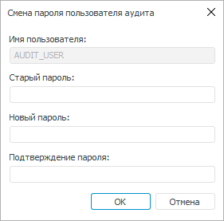

# Редактирование служебного пользователя

Редактирование служебного пользователя
-

# Редактирование служебного пользователя

Служебный пользователь подсистемы безопасности обеспечивает:

	- вход в систему;

	- корректную работу аудита и блокировку пользователей;

	- использование [роли
	 приложения](../Access_control_settings.htm#role) при работе с СУБД;

	- использование функции [хеширования
	 паролей](../Access_control_settings.htm#hash).

[Создание
 служебного пользователя](Setup.chm::/05_RepoMngr/Setup_RepoMngr_Service_User.htm) выполняется в [менеджере
 репозитория](setup.chm::/05_repomngr/Setup_RepoMngr_Work_Main.htm).

При изменении пароля служебного пользователя в СУБД выполните редактирование
 служебного пользователя в менеджере безопасности.

Примечание.
 Редактирование служебного пользователя доступно пользователю с [привилегиями](../../04_SecurityPolicy/Admin_Priv.htm)
 «Создание и удаление пользователей»
 и «Применение прав на уровне СУБД».

Для редактирования служебного пользователя в разделе «[Пользователи](Admin_Users.htm)»:

	- Выполните одно из действий:

		- в веб-приложении выполните команду
		 «Редактировать служебного пользователя
		 подсистемы безопасности» в раскрывающемся меню кнопки  «Пользователь»;

		- в настольном приложении выполните
		 команду «Сервис > Редактировать
		 служебного пользователя подсистемы безопасности» в [главном
		 меню](../../01_RunSecManager/Admin_Organizational_Starting.htm).

После выполнения действия будет открыто окно
 «Смена пароля пользователя аудита»:

	- Задайте параметры:

		- Старый пароль. Введите
		 старый пароль служебного пользователя;

Важно.
 Если забыли старый пароль, то [пересоздайте
 служебного пользователя](Setup.chm::/05_RepoMngr/Setup_RepoMngr_Service_User.htm) для восстановления учётных
 данных.

		- Новый пароль. Введите
		 новый пароль служебного пользователя;

		- Подтверждение пароля.
		 Введите повторно новый пароль служебного пользователя.

Примечание.
 Имя служебного пользователя доступно только для просмотра.

	- Нажмите кнопку «ОК».
	 После выполнения действия будет выдан стандартный [диалог
	 запроса учётных данных](uinavobj.chm::/database/uidb_database_authorization.htm).

Измененный пароль служебного пользователя
 сохраняется в СУБД и на текущем компьютере пользователя.

Примечание.
 Изменение пароля, сохраненного в ветке реестра локальной машины, выполняется
 от имени пользователя, обладающего правами администратора.

	- [Обновите
	 учётные данные служебного пользователя](Setup.chm::/05_RepoMngr/Setup_RepoMngr_Service_User.htm#add_service_user) на каждом
	 компьютере пользователя с помощью приложения [PP.Util](Setup.chm::/05_RepoMngr/Service_Applications/PP_Util.htm).

После выполнения действий будет изменен пароль служебного пользователя.

См. также:

[Создание
 учетных записей пользователей и работа с ними](Admin_Users.htm) | [Создание
 и редактирование учетной записи пользователя](Admin_UserCreate.htm) | [Подключение
 доменного пользователя](Admin_UserCreate_Domain.htm)

		Справочная
		 система на версию 10.9
		 от 18/08/2025,
		 © ООО «ФОРСАЙТ»,
