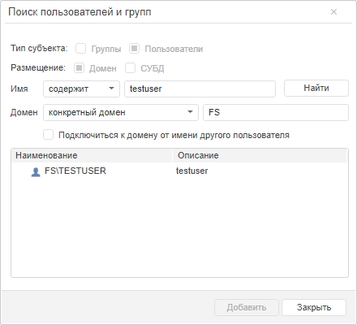
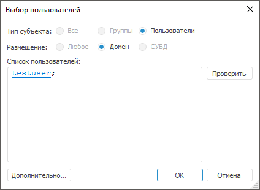
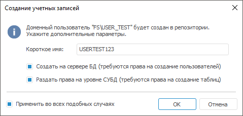

# Подключение доменного пользователя

Подключение доменного пользователя
-

# Подключение доменного пользователя

Продукт «Форсайт. Аналитическая платформа»
 использует информацию из [службы
 каталогов домена](../communication_with_ad.htm) или глобального каталога для работы с доменными субъектами
 безопасности. Подключение доменного пользователя доступно при использовании
 следующих [поддерживаемых
 СУБД](Setup.chm::/01_sysreq/database_support.htm): PostgreSQL/Postgres Pro, Oracle, Microsoft SQL
 Server.

Подключение доменного пользователя доступно пользователям, обладающим
 [привилегиями](../../04_SecurityPolicy/Admin_Priv.htm) «Изменение прав пользователей, раздача ролей,
 изменение политики», «Создание,
 удаление пользователей».

Совет. Перед подключением
 доменных пользователей рекомендуется проверять идентичность настроек LDAP
 в файлах settings.xml, расположенных в различных окружениях. Если настройки
 совпадают, то для корректной работы с доменными пользователями подключайте
 их в рамках одного приложения: либо в веб-приложении, либо в настольном
 приложении.

Для подключения доменного пользователя в разделе «[Пользователи](Admin_Users.htm)»:

	- в веб-приложении выполните команду «Добавить
	 доменного пользователя» в раскрывающемся меню кнопки  «Пользователь»
	 на [панели
	 инструментов](../../01_RunSecManager/Admin_Organizational_Starting.htm);

	- в настольном приложении выполните одно из действий:

		- выполните команду «Пользователь
		 > Добавить доменного пользователя» в [главном
		 меню](../../01_RunSecManager/Admin_Organizational_Starting.htm);

		- выполните команду «Добавить
		 доменного пользователя» в контекстном меню.

Примечание.
 При [разделении
 ролей](../../04_SecurityPolicy/Editor_of_Politicy/Security_EditorPoliticy_Adm.htm) между администратором информационной безопасности и прикладным
 администратором подключение доменных пользователей доступно только прикладному
 администратору.

После выполнения одного из действий откроется [диалог
 выбора доменного пользователя](../Admin_UsersGroups.htm).

	Веб-приложение
	 Настольное
	 приложение

		

		

Для получения подробной информации о работе с диалогами выбора доменного
 пользователя обратитесь к разделу «[Выбор
 пользователей и групп](../Admin_UsersGroups.htm)».

Примечание.
 При выборе доменного пользователя в окнах недоступны переключатели
 «Тип субъекта» и «Размещение».

После определения необходимых пользователей
 нажмите кнопку «ОК», появится
 окно создания учетных записей:

Примечание.
 Диалог «Создание учетных записей»
 недоступен для пользователей, которые уже были созданы в репозитории.

[Добавление
 короткого имени пользователя](javascript:TextPopup(this))

	Для избежания ошибок от СУБД Oracle ограничена длина наименования
	 пользователя в 30 латинских символов или 15 символов кириллицы при
	 кодировке UTF-8.

	В поле «Короткое имя» введите
	 дополнительное краткое наименование пользователя, которое будет использоваться
	 при раздаче прав на уровне СУБД.

	Примечание.
	 Поле доступно только в настольном приложении при добавлении доменного
	 пользователя в СУБД Oracle с нарушением ограничения по длине наименования.

	При вводе короткого имени числовой формат доступен только после
	 текстового, например, «USERTEST123».

	После добавления доменного пользователя в СУБД Oracle все запросы
	 будут выполняться через короткое имя, которое связывается с полным
	 наименованием в «Форсайт. Аналитическая платформа» и
	 отображается в [свойствах](Admin_UserProp_Common.htm#description)
	 пользователя.

	Например, при добавлении доменного пользователя в СУБД Oracle проверяется
	 ограничение по длине наименования. В «Форсайт. Аналитическая платформа»
	 пользователь с полным наименованием «SIDOROV_IV» передается в СУБД
	 Oracle с учетом домена «SIDOROV_IV@DEV.FS.FSIGHT.DOMAINTEST», тем
	 самым нарушая ограничение по длине наименования в 30 символов. Необходимо
	 добавить пользователю короткое имя «SIDOROV» для дальнейшего обмена
	 данными между СУБД Oracle и «Форсайт. Аналитическая платформа»
	 без ошибок.

[Создание пользователя
 на сервере БД](javascript:TextPopup(this))

	При установке флажка «Создать на
	 сервере БД» добавляемый пользователь будет создан на сервере
	 БД, при этом будет выдан [запрос
	 учётных данных пользователя](UiNavObj.chm::/database/UiDb_database_authorization.htm), обладающего правами
	 создания пользователей. Если подключение доменного пользователя выполняется
	 в репозитории на базе СУБД PostgreSQL, то администратор должен обладать
	 привилегией CREATEROLE на уровне СУБД.

[Раздача
 прав на уровне СУБД](javascript:TextPopup(this))

	При установке флажка «Раздать права
	 на уровне СУБД» для добавляемого пользователя будет произведена
	 раздача прав на уровне СУБД, для этого будет выдан [запрос
	 имени и пароля пользователя](UiNavObj.chm::/database/UiDb_database_authorization.htm), обладающего правами
	 создания таблиц.

	Если флажок снят, то после добавления пользователя и изменения его
	 привилегий, либо раздаче прав на объекты репозитория, пользователю
	 не будут раздаваться соответствующие гранты на сервере БД.

При установке флажка «Применить во
 всех подобных случаях» для всех добавляемых доменных пользователей
 в репозиторий платформы будут выполнены выбранные действия без дополнительных
 запросов.

Примечание.
 Доменные пользователи также будут добавлены в список пользователей, если
 произошло их добавление в группу или в список обладателей привилегий.

## Особенности подключения доменных пользователей для различных СУБД

При работе репозитория через СУБД PostgreSQL для добавления доменного
 пользователя необходимо задать тип аутентификации SSPI либо GSS API:

	- SSPI задается настройками сервера PostgreSQL;

	- GSS API [задается](KeSom.chm::/Interface/IPrimaryPostgresSPLD/IPrimaryPostgresSPLD.htm)
	 через язык Fore.

См. также:

[Создание
 учетных записей пользователей и работа с ними](Admin_Users.htm) | [Создание
 и редактирование учетной записи пользователя](Admin_UserCreate.htm) | [Редактирование
 служебного пользователя](Admin_Service_User.htm)

		Справочная
		 система на версию 10.9
		 от 18/08/2025,
		 © ООО «ФОРСАЙТ»,
