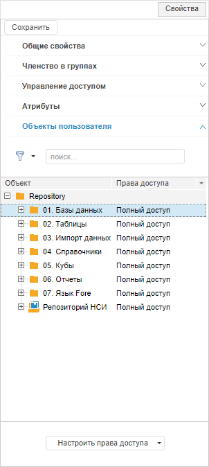
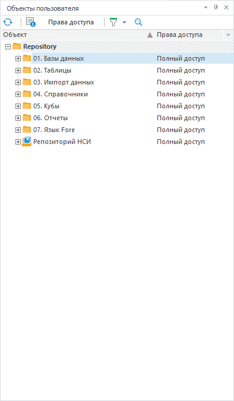

# Просмотр объектов пользователя и группы

Просмотр объектов пользователя и группы
-

# Просмотр объектов пользователя и группы

Для просмотра объектов пользователя и группы используйте вкладку/панель
 «Объекты пользователя» или «Объекты группы» в разделе «[Пользователи](Admin_Users.htm)»
 на боковой панели «[Свойства](Admin_UserCreate.htm#properties)»
 в веб-приложении и с помощью пункта главного меню «Вид
 > Объекты пользователя/Объекты
 группы» в настольном приложении.

Примечание. Просмотр
 объектов пользователя и группы доступен в разделах «[Пользователи](Admin_Users.htm)» и «[Группы](../Groups/Admin_Groups.htm)».

	Веб-приложение
	 Настольное
	 приложение

		

		

Для удобного просмотра прав доступа пользователя или группы пользователей
 на объекты репозитория выберите одного пользователя/группу пользователей
 в разделе «[Пользователи](Admin_Users.htm)»
 или «[Группы](../Groups/Admin_Groups.htm)».
 Если выбрано несколько пользователей/групп пользователей, то панель будет
 пуста.

В дереве объектов отображается столбец «Права
 доступа», содержащий права доступа, которые есть у выбранного пользователя/группы
 пользователей на конкретный объект.

Примечание.
 Проверка эффективных прав доступа на объекты репозитория может занять
 значительное время.

Для работы с панелью «Объекты пользователя»/«Объекты группы» доступны следующие
 операции:

[Обновление списка
 объектов](javascript:TextPopup(this))

	Для обновления списка объектов:

		- в веб-приложении нажмите кнопку
		  «Обновить»
		 на [панели
		 инструментов](../../01_RunSecManager/Admin_Organizational_Starting.htm);

		- в настольном приложении:

			- нажмите кнопку  на [панели
			 инструментов](../../01_RunSecManager/Admin_Organizational_Starting.htm);

			- выполните команду «Обновить» в контекстном
			 меню.

[Просмотр прав
 доступа](javascript:TextPopup(this))

	Для просмотра прав доступа выбранного объекта:

		- в веб-приложении:

			- нажмите кнопку «Настроить
			 права доступа > Открыть права доступа».

	Права доступа объекта отобразятся на
	 боковой панели раздела «[Навигатор](../../02_ComonFunction/Admin_SecManager_CommonFunction.htm)».

		- в настольном приложении:

			- нажмите кнопку «Права
			 доступа» на [панели
			 инструментов](../../01_RunSecManager/Admin_Organizational_Starting.htm);

			- выполните команду «Права
			 доступа» в контекстном меню;

			- дважды щёлкните по объекту.

	Будет открыт диалог «[Параметры управления доступом](../Admin_AdminObjects.htm)».

[Просмотр свойств
 объекта](javascript:TextPopup(this))

	Для просмотра свойств выбранного объекта:

		- нажмите кнопку 
		 «Свойства» на [панели
		 инструментов](../../01_RunSecManager/Admin_Organizational_Starting.htm);

		- выполните команду «Свойства»
		 в контекстном меню.

	Будет открыт диалог «[Свойства
	 объекта](UiNav.chm::/03_Objects/UiNav_Obj_BasicProp.htm)».

	Примечание.
	 Просмотр свойств объекта доступен только в настольном приложении.

[Фильтрация объектов](javascript:TextPopup(this))

	Для настройки фильтрации нажмите кнопку  на панели
	 инструментов/боковой панели и выберите вариант фильтрации:

		- Все объекты. В списке
		 будут отображены объекты с правами доступа и без них;

		- С правами доступа.
		 В списке будут отображены объекты, на которые у пользователя/группы
		 есть какие-либо права доступа. Если у пользователя/группы нет
		 прав на родительский объект и есть права на вложенный объект,
		 то при использовании фильтрации «С
		 правами доступа» родительский объект будет также отображаться
		 в дереве и будет выделен курсивным начертанием и другим цветом;

		- Без прав доступа.
		 В списке будут отображены объекты, на которые у пользователя/группы
		 отсутствуют права. Если у пользователя/группы есть права на родительский
		 объект и нет прав на вложенный объект, то при использовании фильтрации
		 «Без прав доступа» родительский
		 объект будет также отображаться в дереве и будет выделен курсивным
		 начертанием и другим цветом.

[Поиск объектов](javascript:TextPopup(this))

	Для поиска объекта:

		- в веб-приложении на вкладке «Объекты
		 пользователя» введите в строке поиска нужный объект.

	Найденный объект будет выделен в дереве
	 объектов.

		- в настольном приложении:

			- нажмите кнопку  на [панели
			 инструментов](../../01_RunSecManager/Admin_Organizational_Starting.htm);

			- выполните команду «Найти» в контекстном меню.

	Будет открыт диалог «[Поиск](UiNav.chm::/02_Navigator/UiNav_FindObject.htm)».

[Изменение отображения
 и порядка столбцов](javascript:TextPopup(this))

	Изменение отображения и порядка столбцов на панели «Объекты
	 пользователя»/«Объекты группы»
	 осуществляется аналогично изменению [отображения
	 и порядка столбцов](../Admin_AdminObjects_AuditTuning.htm) в разделе «[Пользователи](Admin_Users.htm)»/«[Группы](../Groups/Admin_Groups.htm)».

См. также:

[Создание
 и редактирование учетной записи пользователя](Admin_UserCreate.htm) | [Создание
 групп пользователей и работа с ними](../Groups/Admin_Groups.htm) | [Выбор
 пользователей и групп](../Admin_UsersGroups.htm)

		Справочная
		 система на версию 10.9
		 от 18/08/2025,
		 © ООО «ФОРСАЙТ»,
