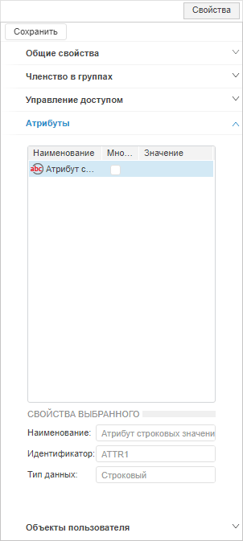
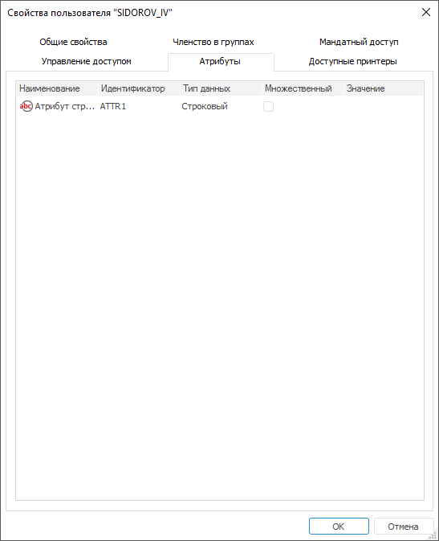
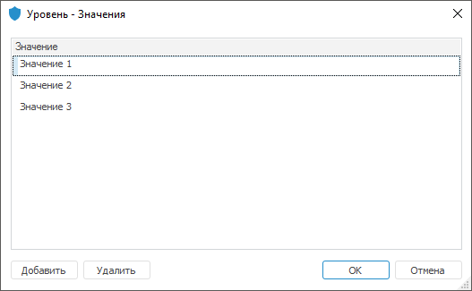

# Добавление значений атрибутам пользователя

Добавление значений атрибутам пользователя
-

# Добавление значений атрибутам пользователя

Атрибуты задаются пользователю при выборе [атрибутного
 метода](../../04_SecurityPolicy/Admin_ABAC.htm) разграничения доступа.

Примечание.
 При [разделении
 ролей](../../04_SecurityPolicy/Editor_of_Politicy/Security_EditorPoliticy_Adm.htm) вкладка «Атрибуты» будет
 доступна только администратору информационной безопасности с [привилегией](../../04_SecurityPolicy/Admin_Priv.htm)
 «Изменение прав пользователей, раздача
 ролей, изменение политики», «Изменение
 метки безопасности и списка контроля доступа любого объекта».

Для добавления или редактирования значений добавленным [атрибутам](../../04_SecurityPolicy/Creating_attributes.htm)
 пользователя используйте вкладку «Атрибуты»
 на боковой панели «[Свойства](Admin_UserCreate.htm#properties)»
 в веб-приложении и в окне «[Свойства
 пользователя](Admin_UserCreate.htm#properties)» в настольном приложении.

	Веб-приложение
	 Настольное
	 приложение

		

		

В таблице отображается список [добавленных
 атрибутов](../../04_SecurityPolicy/Creating_attributes.htm#subject) пользователя с заданным наименованием, идентификатором и
 типом данных.

На вкладке «Атрибуты» возможно
 только редактирование или добавление значения атрибута:

	- при нажатии в поле «Значение».
	 Устанавливается единственное значение атрибута;

	- при установке флажка в столбце «Множественный». Устанавливается
	 несколько значений атрибута с помощью окна «<наименование атрибута> - Значения»:

Для открытия окна «<наименование атрибута> - Значения» нажмите на пиктограмму
  в
 поле «Значение».

Введите в каждой строке значение, соответствующее
 типу данных атрибута, с помощью кнопки «Добавить».
 При необходимости удалите строку со значением с помощью кнопки «Удалить».

После редактирования или добавления значения нажмите кнопку «ОК»
 для сохранения изменений.

Заданные значения атрибутам пользователя используйте для дальнейшей
 проверки доступа к объектам в [свойствах](../../04_SecurityPolicy/Admin_AttributeAccess.htm#properties)
 элементов атрибутного доступа: [цель](../../04_SecurityPolicy/Target.htm),
 [условие](../../04_SecurityPolicy/Creating_conditions.htm).

См. также:

[Создание
 и редактирование учетной записи пользователя](Admin_UserCreate.htm) | [Создание
 пользовательских атрибутов](../../04_SecurityPolicy/Creating_attributes.htm)

		Справочная
		 система на версию 10.9
		 от 18/08/2025,
		 © ООО «ФОРСАЙТ»,
