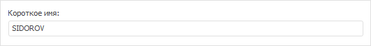
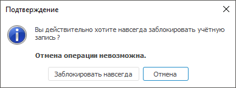

# Параметры общих свойств

Параметры общих свойств
-

# Параметры общих свойств

Для изменения параметров общих свойств пользователя используйте вкладку
 «Общие свойства» на боковой панели
 «[Свойства](Admin_UserCreate.htm#properties)»
 в веб-приложении и в окне «[Свойства
 пользователя](Admin_UserCreate.htm#properties)» в настольном приложении.

	Веб-приложение

	 Настольное
	 приложение

		

		

Примечание.
 Для [доменного пользователя](Admin_UserCreate_Domain.htm) недоступно
 изменение пароля.

[Описание
 пользователя](javascript:TextPopup(this))

		- Пользователь. Уникальное
		 имя пользователя среди пользователей и групп пользователей, которое
		 используется при входе в систему. Имя пользователя задаётся последовательностью
		 букв латинского алфавита, цифр и знаков «_» в любом порядке. Имена
		 пользователей полностью регистронезависимые. Создание учётных
		 записей пользователей с одинаковыми именами, отличающихся только
		 регистром написания символов, недоступно.

	Примечание.
	 Имя пользователя доступно для редактирования только при [создании](Admin_UserCreate.htm#create)
	 пользователя.

		- Полное наименование.
		 Полное имя пользователя (строка символов).

		- Короткое имя. Дополнительное
		 краткое имя пользователя, которое используется при раздаче прав
		 на уровне СУБД.

	

	Примечание.
	 Поле отображается только при заданном [коротком
	 имени](Admin_UserCreate_Domain.htm#short_name) доменного пользователя, добавленного в СУБД Oracle.

		- Описание. Описание
		 пользователя по желанию администратора.

		- Объект автозапуска.
		 Воспользуйтесь [поиском](UiNav.chm::/GUI/combine_list.htm)
		 для выбора объекта, который будет автоматически запускаться при
		 входе пользователя в систему. Объектом автозапуска может выступать
		 объект доступный пользователю для [чтения](../Admin_AdminObjects.htm).
		 Если пользователь лишается прав чтения объекта, назначенного для
		 автозапуска, то данный объект не будет открыт при входе пользователя
		 в систему. Если при заданном объекте автозапуска необходимо открыть
		 весь репозиторий, то в окне регистрации при нажатии кнопки «OК» удерживайте клавишу SHIFT.

	Примечание.
	 Помимо пользовательского объекта автозапуска может быть определен
	 [объект
	 автозапуска для репозитория](../../04_SecurityPolicy/Editor_of_Politicy/Security_EditorPoliticy_General.htm#repo_autorun_obj). При этом объект автозапуска для пользователя
	 имеет более высокий приоритет, чем объект автозапуска для репозитория.
	 Автозапуск доступен только в настольном приложении.

[Установка
 и изменение пароля](javascript:TextPopup(this))

		- Пароль. В данное
		 поле вводится пароль - учетные данные, которые позволяют аутентифицировать
		 пользователя при входе в систему. Пароль может начинаться с цифры,
		 буквы или символа «_» и может содержать латинские буквы (a-z,
		 A-Z), цифры 0-9, символы «_@#$&*%^».

		- Подтверждение пароля.
		 Введение подтверждения пароля необходимо для того, чтобы убедиться
		 в правильности набора пароля.

		- Потребовать смену пароля
		 при следующем входе в систему/Сменить
		 при следующем входе. Если установлен данный флажок, то
		 при попытке пользователя войти в систему появится [окно
		 смены пароля](Admin_User_EditPass.htm). Операция выполняется только один раз при следующем
		 входе пользователя в систему после установки данной опции. Если
		 используется [разделение
		 ролей администраторов](../../04_SecurityPolicy/Editor_of_Politicy/Security_EditorPoliticy_Adm.htm), то флажок будет автоматически установлен:

			- при создании нового пользователя прикладным администратором
			 (или пользователем с привилегией «Создание,
			 удаление пользователей»);

			- при смене пароля пользователя администратором информационной
			 безопасности (или пользователем с привилегией «Изменение
			 метки безопасности и списка контроля доступа любого объекта»),
			 если для пользователя снят флаг «Запретить
			 смену пароля пользователем».

		- Запретить смену пароля
		 пользователем. Пользователю запрещено менять пароль, установленный
		 в менеджере безопасности. При установке данного флажка:

			- в веб-приложении будет отсутствовать команда «Сервис > Смена пароля»
			 в главном меню навигатора объектов;

			- в настольном приложении при выполнении команды «Сервис > Смена пароля»
			 в главном меню навигатора объектов будет выдана ошибка об
			 отсутствии прав доступа на изменение пароля.

		- Срок действия пароля не
		 ограничен. При установленном флажке к пользователю не применяются
		 настройки [парольной
		 политики](../../04_SecurityPolicy/Editor_of_Politicy/Security_EditorPoliticy_General_Parole.htm) по принудительной смене пароля (максимальный/минимальный
		 срок действия пароля). При использовании данного атрибута флажок
		 «Потребовать смену пароля при
		 следующем входе в систему» станет недоступным.

[Добавление
 сертификата](javascript:TextPopup(this))

	Сертификат. Добавляет пользователю
	 слепок сертификата, который необходимо предъявить пользователю для
	 авторизации в системе. Используется для [настройки
	 двухфакторной аутентификации](Setup.chm::/UiWebSetup/Authentication/double_auth.htm). Для добавления сертификата
	 используйте команды раскрывающегося меню кнопки «Добавить».

[Блокировка
 и сроки действия учётной записи](javascript:TextPopup(this))

		- Заблокировать учётную запись.
		 При установленном флажке вход в систему под этим пользователем
		 невозможен. В списке пользователей менеджера безопасности у заблокированных
		 пользователей выводится значок блокировки: .
		 Пользователь будет заблокирован (данный флажок будет автоматически
		 установлен), если [при
		 входе в систему](Intro.chm::/Starting/Intro_starting.htm) были использованы все [попытки
		 неудачного ввода пароля](../../04_SecurityPolicy/Editor_of_Politicy/Security_EditorPoliticy_General_Parole.htm).

		-

			- Заблокировать без возможности
			 отмены. Установка флажка блокирует пользователя навсегда,
			 отмена будет невозможна. При нажатии кнопки «ОК»
			 в диалоге будет выдан запрос на подтверждение блокировки пользователя
			 навсегда:

	

	Нажатие на кнопку «Заблокировать
	 навсегда» приведет к блокировке пользователя без возможности
	 отмены, нажатие на кнопку «Отмена»
	 возвращает к редактированию свойств пользователя, при этом флажок
	 «Заблокировать без возможности отмены»
	 будет снят.

	После того, как пользователь заблокирован
	 навсегда, флажки «Заблокировать учётную
	 запись» и «Заблокировать без
	 возможности отмены» при открытии его свойств установлены и
	 недоступны для редактирования. В списке такой пользователь помечается
	 затенённым значком блокировки 
	 и серым текстом.

	Примечание.
	 В веб-приложении используйте кнопку  «Заблокировать»
	 на панели инструментов и команды «Заблокировать
	 учетную запись», «Заблокировать
	 без возможности отмены» в раскрывающемся меню кнопки.

		- Подключаемый с сервера.
		 Данный флажок доступен пользователям с привилегией «[Создание,
		 удаление пользователей](../../04_SecurityPolicy/Admin_Priv.htm#create)» только при [создании
		 учётной записи пользователя](Admin_UserCreate.htm#create). Флажок недоступен, если в репозитории
		 используется [встроенная
		 авторизация](../Access_control_settings.htm#buildin). Для подключения существующего пользователя на
		 сервере СУБД и включения его в список субъектов безопасности «Форсайт. Аналитическая платформа»
		 установите флажок и укажите имя пользователя, совпадающее с именем
		 пользователя на сервере, в поле «Пользователь».

	В процессе подключения существующего
	 пользователя:

			- не выполняется проверка фактического наличия указанного
			 пользователя на сервере;

			- распределяются [привилегии](../../04_SecurityPolicy/Admin_Priv.htm)
			 только для системных таблиц базы данных.

	Примечание.
	 Обеспечение доступа пользователя к базе данных и репозиторию зависит
	 от администратора, который добавил пользователя на сервере.

	Например, перед созданием учётной записи
	 пользователя, подключаемого с сервера, на сервере PostgreSQL выполните
	 скрипт для раздачи привилегий данному пользователю:

	GRANT CONNECT ON
	 DATABASE TO USER_NAME

	Если репозиторий создан на пользовательской
	 схеме, отличной от схемы по умолчанию public, то выполните скрипт:

	GRANT USAGE ON SCHEMA
	 TO USER_NAME

	Где:

				- USER_NAME.
				 Имя пользователя на сервере СУБД.

	Если для подключения к репозиторию в
	 веб-приложении используются [внешние
	 сервисы](Setup.chm::/UiWebSetup/Authentication/login_settings_using_external_services.htm), то при работе BI-сервера создаются временные
	 пользователи (например, учётные записи сервиса Google) с установленным
	 флажком «Подключаемый с сервера»,
	 которые существуют в виде отдельных записей в системной таблице репозитория.
	 Физические пользователи СУБД при этом не создаются. Для авторизации
	 под такими пользователями должен быть настроен отдельный пользователь
	 репозитория, который будет использоваться для имперсонации. Для него
	 на BI-сервере должны быть [сохранены
	 учётные данные по умолчанию](Setup.chm::/UiWebSetup/Authentication/login_settings_using_external_services.htm#save).

	При установке флажка поля «Пароль»
	 и «Подтверждение пароля» будут
	 недоступны. Для изменения пароля пользователя обратитесь к разделу
	 «[Смена пароля пользователя](Admin_User_EditPass.htm)».

		- Срок действия временной
		 учетной записи/Ограничить
		 срок действия. Данный флажок устанавливается для создания
		 временной учетной записи. По истечению указанного срока учетная
		 запись будет заблокирована навсегда.
		 Данный атрибут не применим к администраторам.

## Особенности при разделении ролей между администраторами

В случае [разделения
 ролей](../../04_SecurityPolicy/Editor_of_Politicy/Security_EditorPoliticy_Adm.htm) между администратором информационной безопасности и прикладным
 администратором:

	- для прикладного администратора:

		- при просмотре свойств уже имеющегося пользователя будут
		 недоступны для редактирования все флажки, поля «Пароль»
		 и «Подтверждение пароля»;

		- при создании пользователя будут недоступны все флажки, кроме
		 «Подключаемый с сервера»;

	- для администратора информационной безопасности при просмотре
	 свойств уже имеющегося пользователя будет недоступным для редактирования
	 поле «Объект автозапуска».

См. также:

[Создание
 и редактирование учетной записи пользователя](Admin_UserCreate.htm) | [Определение
 членства в группах](Admin_UserProp_Groups.htm)

		Справочная
		 система на версию 10.9
		 от 18/08/2025,
		 © ООО «ФОРСАЙТ»,
