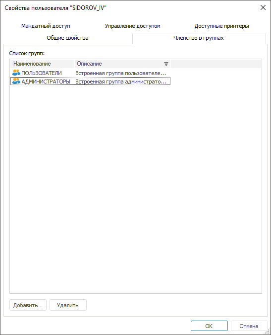

# Определение членства в группах

Определение членства в группах
-

# Определение членства в группах

Для добавления пользователя в состав [группы
 пользователей](../Groups/Admin_Groups.htm) используйте вкладку «Членство
 в группах» на боковой панели «[Свойства](Admin_UserCreate.htm#properties)» в веб-приложении
 и в окне «[Свойства
 пользователя](Admin_UserCreate.htm#properties)» в настольном приложении.

Примечание.
 При [разделении
 ролей](../../04_SecurityPolicy/Editor_of_Politicy/Security_EditorPoliticy_Adm.htm) между администратором информационной безопасности и прикладным
 администратором вкладка «Членство в группах»
 будет доступна только администратору информационной безопасности.

	Веб-приложение
	 Настольное
	 приложение

		

		

Для добавления группы, в состав которой будет входить пользователь,
 нажмите кнопку «Добавить». После
 чего откроется окно «[Поиск
 пользователей и групп](../Admin_UsersGroups.htm)» в веб-приложении или «[Выбор групп и пользователей](../Admin_UsersGroups.htm)»
 в настольном приложении.

Для удаления одной или нескольких выбранных групп из списка нажмите
 кнопку «Удалить».

Примечание.
 Пользователь может входить в несколько групп. Права такого пользователя
 получаются путем объединения прав групп, в которые он входит.

См. также:

[Создание
 и редактирование учетной записи пользователя](Admin_UserCreate.htm) | [Настройка
 мандатного доступа](Admin_UserProp_MC.htm)

		Справочная
		 система на версию 10.9
		 от 18/08/2025,
		 © ООО «ФОРСАЙТ»,
