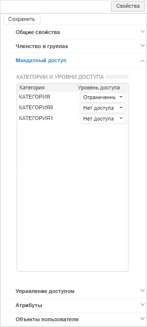
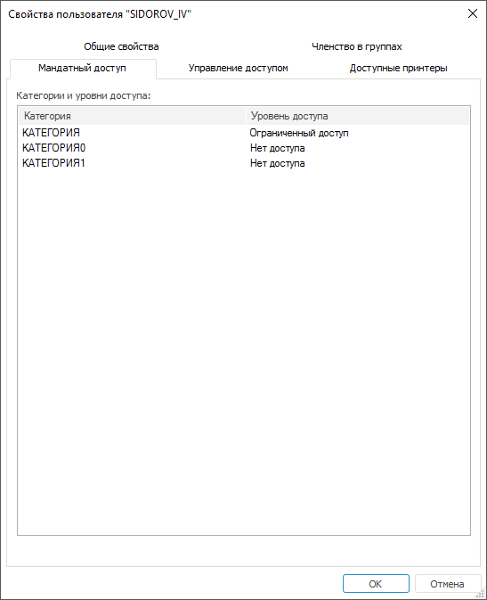

# Настройка мандатного доступа

Настройка мандатного доступа
-

# Настройка мандатного доступа

Для настройки мандатного доступа используйте вкладку «Мандатный
 доступ» на боковой панели «[Свойства](Admin_UserCreate.htm#properties)» в веб-приложении
 и в окне «[Свойства
 пользователя](Admin_UserCreate.htm#properties)» в настольном приложении.

Примечание.
 При [разделении
 ролей](../../04_SecurityPolicy/Editor_of_Politicy/Security_EditorPoliticy_Adm.htm) между администратором информационной безопасности и прикладным
 администратором вкладка «Мандатный доступ»
 будет доступна только администратору информационной безопасности.

	Веб-приложение
	 Настольное
	 приложение

		

		

Для настройки мандатного доступа присвойте категории уровень доступа:

	- Выделите категорию из списка «Категория».

	- Выберите уровень доступа в раскрывающемся списке «Уровень
	 доступа».

Примечание.
 Категории и уровни доступа добавляются в разделе «[Мандатный доступ](../../04_SecurityPolicy/Admin_MandatAccess.htm)».

После выполнения действий для списка категорий будут присвоены определенные
 уровни доступа, в зависимости от которых ограничивается работа пользователя
 с объектом, например, редактирование или удаление.

См. также:

[Создание
 и редактирование учетной записи пользователя](Admin_UserCreate.htm) | [Выбор
 уровня безопасности](Admin_UserProp_SecLevels.htm)

		Справочная
		 система на версию 10.9
		 от 18/08/2025,
		 © ООО «ФОРСАЙТ»,
