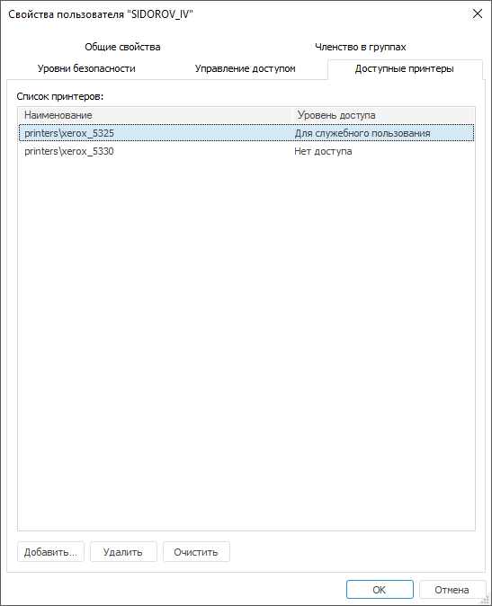
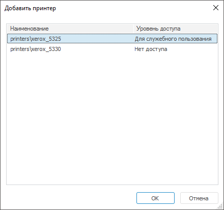

# Настройка доступа к принтерам

Настройка доступа к принтерам
-

# Настройка доступа к принтерам

Для настройки доступа пользователя к принтерам используйте вкладку «Доступные принтеры» в окне «[Свойства
 пользователя](Admin_UserCreate.htm#properties)» настольного приложения:

Примечание.
 Вкладка «Доступные принтеры» доступна,
 если в редакторе политик ограничен [список
 принтеров](../Workstation_and_printer_access.htm#printers), с которыми могут работать пользователи репозитория.

Добавьте или измените уровень доступа для принтеров. Если список доступных
 для печати принтеров пуст, то отобразится информация о доступе всех принтеров
 для пользователя, заданных в [редакторе
 политик](../Workstation_and_printer_access.htm#printers).

В списке принтеров доступна [сортировка](../Admin_AdminObjects_AuditTuning.htm#sorting)
 столбцов.

Важно. В веб-приложении
 отсутствует возможность проверки доступных принтеров, при добавлении в
 список принтера печать будет запрещена.

[Добавление
 принтеров в список](javascript:TextPopup(this))

	Для добавления принтеров в список:

		- нажмите кнопку «Добавить»
		 на вкладке «Доступные принтеры»;

		- выполните команду «Добавить»
		 в контекстном меню.

	Будет открыт диалог выбора принтеров:

	

	Список содержит принтеры, добавленные в [контроле
	 доступа](../../04_SecurityPolicy/Admin_SecPolicy.htm#access_control). Кнопка «OK» доступна,
	 если выделен хотя бы один элемент списка.

[Удаление
 принтеров из списка](javascript:TextPopup(this))

	Для удаления из списка:

		- выбранных принтеров:

			- нажмите кнопку «Удалить»
			 на вкладке «Доступные принтеры»;

			- выполните команду «Удалить»
			 в контекстном меню выбранных принтеров;

		- всех принтеров:

			- нажмите кнопку «Очистить»
			 на вкладке «Доступные принтеры»;

			- выполните команду «Очистить»
			 в контекстном меню списка принтеров.

	Перед удалением выдается стандартное подтверждение.

Для выделения всех принтеров списка выполните команду контекстного меню
 «Выделить все».

Примечание.
 Команды «Очистить» и «Выделить
 все» доступны, если список непустой.

См. также:

[Создание
 и редактирование учетной записи пользователя](Admin_UserCreate.htm) | [Настройка
 доступа рабочих станций и принтеров](../Workstation_and_printer_access.htm)

		Справочная
		 система на версию 10.9
		 от 18/08/2025,
		 © ООО «ФОРСАЙТ»,
