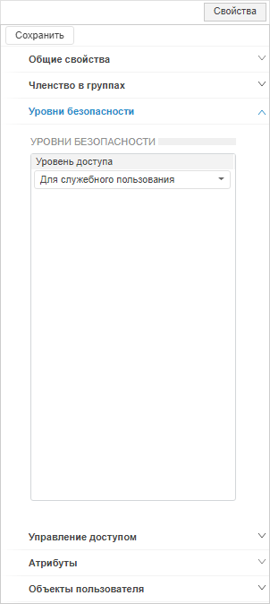
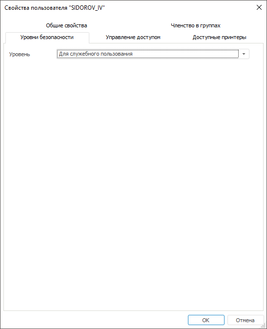

# Выбор уровня безопасности

Выбор уровня безопасности
-

# Выбор уровня безопасности

Для выбора уровня безопасности используйте вкладку «Уровни
 безопасности» на боковой панели «[Свойства](Admin_UserCreate.htm#properties)» в веб-приложении
 и в окне «[Свойства
 пользователя](Admin_UserCreate.htm#properties)» в настольном приложении.

Примечание.
 Вкладка «Уровни безопасности»
 доступна только [администратору
 информационной безопасности](../../04_SecurityPolicy/Editor_of_Politicy/Security_EditorPoliticy_Adm.htm) при выборе [метода
 разграничения доступа по уровням](../../04_SecurityPolicy/Security_levels.htm).

	Веб-приложение
	 Настольное
	 приложение

		

		

Выберите уровень безопасности в раскрывающемся списке «Уровень».

Примечание.
 Уровни безопасности добавляются в разделе «[Уровни
 безопасности](../../04_SecurityPolicy/Security_levels_section.htm)».

После выбора уровня безопасности пользователю будет ограничена работа
 с объектом, например, редактирование или удаление.

См. также:

[Создание
 и редактирование учетной записи пользователя](Admin_UserCreate.htm) | [Управление
 доступом пользователя](Admin_UserProp_Time.htm)

		Справочная
		 система на версию 10.9
		 от 18/08/2025,
		 © ООО «ФОРСАЙТ»,
