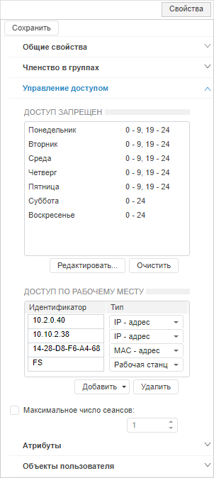
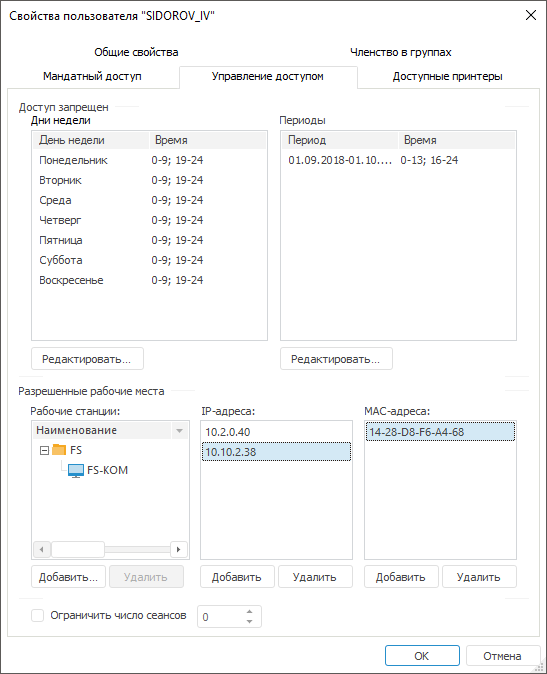
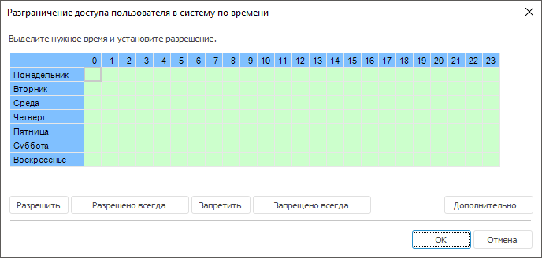
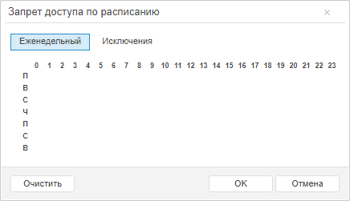
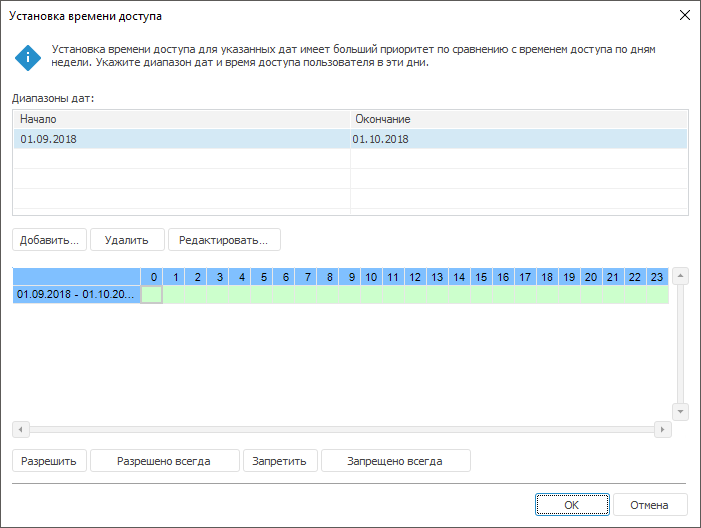
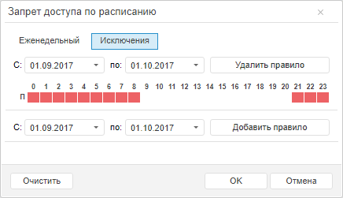
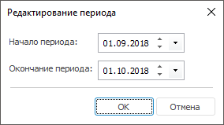
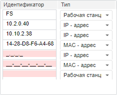
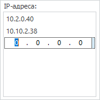
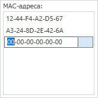

# Управление доступом пользователя

Управление доступом пользователя
-

# Управление доступом пользователя

Для управления параметрами доступа пользователя в систему используйте
 вкладку «Управление доступом»
 на боковой панели «[Свойства](Admin_UserCreate.htm#properties)»
 в веб-приложении и в окне «[Свойства
 пользователя](Admin_UserCreate.htm#properties)» в настольном приложении.

Примечание.
 При [разделении
 ролей](../../04_SecurityPolicy/Editor_of_Politicy/Security_EditorPoliticy_Adm.htm) между администратором информационной безопасности и прикладным
 администратором вкладка «Управление доступом»
 будет доступна только администратору информационной безопасности.

	Веб-приложение
	 Настольное
	 приложение

		

		

По умолчанию пользователю разрешен доступ в систему в любое время, с
 любых рабочих станций, IP и MAC-адресов.

Если для пользователя настроено время доступа, то во время работы с
 «Форсайт. Аналитическая платформа»
 будет выдано предупреждающее сообщение первый раз за 15 минут и второй
 раз за 5 минут до окончания времени. По истечении времени пользователь
 будет отключен.

[Запрет
 доступа по дням недели](javascript:TextPopup(this))

	Для настройки доступа по дням недели в настольном приложении нажмите
	 кнопку «Редактировать», расположенную
	 ниже списка «Дни недели».
	 Будет открыто окно «Разграничение
	 доступа пользователя в систему по времени»:

	

	Для настройки доступа по дням недели в веб-приложении:

		- Нажмите кнопку «Редактировать»,
		 расположенную ниже списка «Доступ
		 запрещен».

		- Нажмите кнопку «Еженедельный»
		 в окне «Запрет доступа по расписанию»:

	

	В окне «Разграничение доступа пользователя
	 в систему по времени» или «Запрет
	 доступа по расписанию» отображается таблица по дням недели
	 и времени суток. Одна ячейка - это один час доступа в определенный
	 день недели, начиная с указанного часа.

	Для разграничения времени доступа выделите необходимый диапазон
	 ячеек.

	Примечание.
	 В веб-приложении выделенный диапазон ячеек запрещает вход в систему
	 в выбранное время.

	После выделения диапазона ячеек в настольном приложении нажмите
	 соответствующую кнопку:

		- Разрешить. Разрешает
		 вход в систему в выбранное время, ячейки будут выделены зеленым
		 цветом;

		- Запретить. Запрещает
		 вход в систему в выбранное время, ячейки будут выделены красным
		 цветом;

		- Разрешено всегда.
		 При нажатии на кнопку «Разрешено
		 всегда» для пользователя будет разрешен доступ в любое
		 время, все ячейки будут выделены зеленым цветом;

		- Запрещено всегда.
		 При нажатии на кнопку «Запрещено
		 всегда» для пользователя будет всегда запрещен доступ,
		 все ячейки будут выделены красным цветом;

		- Дополнительно. Открывает
		 диалог для задания времени доступа по определенным датам.

[Запрет
 доступа по определенным датам](javascript:TextPopup(this))

	Для настройки доступа по определенным датам в настольном приложении:

		- нажмите кнопку «Редактировать»,
		 расположенную ниже списка «Периоды»;

		- нажмите кнопку «Дополнительно»
		 при настройке доступа [по
		 дням недели](Admin_UserProp_Time.htm#week).

	

	Для настройки доступа по определенным датам в веб-приложении:

		- Нажмите кнопку «Редактировать»,
		 расположенную ниже списка «Доступ
		 запрещен».

		- Нажмите кнопку «Исключения»
		 в окне «Запрет доступа по расписанию»:

	

	Для добавления диапазона дат:

		- в веб-приложении начальная и конечная даты задаются в окне
		 «Запрет доступа по расписанию».
		 После заданного периода добавьте правило, нажав кнопку «Добавить правило», для настройки
		 доступа;

		- в настольном приложении нажмите кнопку «Добавить».
		 В открывшемся окне создайте начальную и конечную даты:

	

	Добавленный диапазон будет отображен
	 в нижней части окна в таблице с временем суток.

	Примечание.
	 Настройка доступа осуществляется аналогично настройке доступа [по
	 дням недели](Admin_UserProp_Time.htm#week).

	Для редактирования выделенного диапазона дат в настольном приложении
	 используйте кнопку «Редактировать»,
	 после нажатия на которую будет открыто окно «Редактирование
	 периода».

	Для удаления выбранного диапазона дат нажмите кнопку «Удалить»/«Удалить правило» в окне «Установка
	 времени доступа»/«Запрет доступа
	 по расписанию».

	Для удаления всего списка запретов доступа в веб-приложении нажмите
	 кнопку «Очистить», расположенную
	 ниже списка «Доступ запрещен».

	Созданные диапазоны дат будут отображены на вкладке «Управление
	 доступом» в списке «Периоды»/«Доступ запрещен».

	Примечание.
	 В веб-приложении список диапазонов дат и дней недели содержится в
	 общем списке «Доступ запрещен».

Важно. Запрет
 доступа по определенным датам имеет больший приоритет по сравнению с запретом
 доступа по дням недели.

[Разрешенные
 рабочие места](javascript:TextPopup(this))

	В
	 веб-приложении рабочие станции, IP-адреса, MAC-адреса задаются в списке
	 «Доступ
	 по рабочему месту»:

	

	В настольном приложении для пользователя формируется список рабочих
	 станций, IP-адресов и MAC-адресов, с которых ему будет разрешен доступ
	 в систему, в группе «Разрешенные
	 рабочие места». По умолчанию доступ разрешен с любых рабочих
	 станций, IP и MAC-адресов:

		- Рабочие станции.
		 В данном списке содержатся рабочие станции, с которых разрешен
		 доступ для пользователя;

		- IP-адреса. В данном
		 списке содержатся IP-адреса, с которых разрешен доступ для пользователя.
		 IP-адрес состоит из четырех групп десятичных чисел, разделенных
		 точками. Первая группа должна содержать число в диапазоне от 1
		 до 223, остальные группы должны содержать числа в диапазоне от
		 0 до 255;

	

		- MAC-адреса. В данном
		 списке содержатся MAC-адреса, с которых разрешен доступ для пользователя.
		 MAC-адрес состоит из шести групп шестнадцатеричных чисел, разделенных
		 знаком «-» (тире). Допускается ввод только числовых значений и
		 следующих символов: «A», «B», «C», «D», «E», «F».

	

[Работа
 со списками разрешенных рабочих мест](javascript:TextPopup(this))

	Для добавления рабочей станции/IP-адреса/MAC-адреса:

		- в веб-приложении нажмите кнопку «Добавить»,
		 расположенную ниже списка. В список будет добавлен новый элемент
		 для ввода рабочей станции/c маской для ввода IP-адреса/MAC-адреса. После ввода адреса
		 нажмите клавишу ENTER, либо переведите фокус ввода на другой компонент.
		 Для отказа от ввода адреса нажмите кнопку «Удалить»;

		- в настольном приложении:

			- нажмите кнопку «Добавить»,
			 расположенную ниже списка;

			- выполните пункт контекстного меню «Добавить»;

			- переведите фокус ввода в список и нажмите клавишу INSERT.

	При добавлении рабочей станции будет
	 открыт диалог «[Выбор
	 рабочих станций](../../04_SecurityPolicy/Security_chooseWKS.htm)». В данном окне отметьте флажками те рабочие
	 станции, с которых необходимо разрешить доступ. При добавлении IP-адреса/MAC-адреса
	 в список будет добавлен новый элемент с маской для ввода адреса. После
	 ввода адреса нажмите клавишу ENTER, либо переведите фокус ввода на
	 другой компонент. Для отказа от ввода адреса нажмите клавишу ESC.

	Для редактирования IP-адреса/MAC-адреса, выбранного в списке:

		- в веб-приложении нажмите на строку адреса и внесите нужные
		 изменения. Для подтверждения изменений или для перевода фокуса
		 ввода на другой компонент нажмите клавишу ENTER;

		- в настольном приложении выполните пункт контекстного меню
		 «Редактировать». Для подтверждения
		 изменений или для перевода фокуса ввода на другой компонент нажмите
		 клавишу ENTER, для отказа от изменений нажмите клавишу ESC.

	Для удаления выбранных рабочих
	 станций/IP-адресов/MAC-адресов из списка выполните
	 одно из следующих действий:

		- в веб-приложении нажмите кнопку «Удалить»;

		- в настольном приложении:

			- нажмите кнопку «Удалить»;

			- выполните пункт «Удалить»
			 контекстного меню списка;

			- нажмите клавишу DELETE.

	После одного из действий будет отображен
	 диалог подтверждения операции.

	Для удаления всех станций/IP-адресов/MAC-адресов
	 из списка выполните пункт контекстного меню «Очистить»
	 в настольном приложении, после выполнения команды будет выдан диалог
	 подтверждения операции.

	В списках возможна множественная отметка с зажатой клавишей CTRL.

	Для выделения всех элементов списка в настольном приложении:

		- выполните пункт контекстного меню «Выделить
		 все»;

		- нажмите сочетание клавиш CTRL+A.

[Ограничение
 числа сеансов](javascript:TextPopup(this))

	Флажок «Ограничить число сеансов»/«Максимальное число сеансов» позволяет
	 определить предельное число подключений пользователя к репозиторию.
	 По умолчанию флажок снят и число сеансов не ограничено. При установке
	 флажка задайте количество сеансов. Для проверки текущего количества
	 сеансов пользователя откройте окно «[Подключенные пользователи](Admin_ConnectedUsers.htm)»
	 в настольном приложении.

	Примечание.
	 На серверах Microsoft SQL Server для работы ограничения числа сеансов
	 дайте пользователю грант VIEW SERVER STATE.

См. также:

[Создание
 и редактирование учетной записи пользователя](Admin_UserCreate.htm) | [Добавление
 значений атрибутам пользователя](Admin_UserProp_Attributes.htm)

		Справочная
		 система на версию 10.9
		 от 18/08/2025,
		 © ООО «ФОРСАЙТ»,
