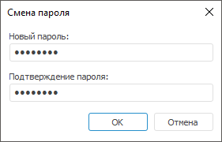

# Смена пароля пользователя

Смена пароля пользователя
-

# Смена пароля пользователя

Пароль пользователя может быть изменён одним из способов:

	- в менеджере безопасности при работе со списком пользователей
	 в разделе «[Пользователи](Admin_Users.htm)».
	 Доступно только в настольном приложении;

	- в менеджере безопасности при редактировании [свойств](Admin_UserCreate.htm)
	 конкретного пользователя на вкладке «[Общие свойства](Admin_UserProp_Common.htm)»;

	- в [навигаторе
	 объектов](UiNav.chm::/02_Navigator/UiNav_ChangePass.htm) для текущего пользователя.

Примечание.
 При [разделении
 ролей между администраторами](../../04_SecurityPolicy/Editor_of_Politicy/Security_EditorPoliticy_Adm.htm) смена пароля пользователя доступна только
 администратору информационной безопасности, и в этом случае может быть
 автоматически установлен флажок «[Потребовать
 смену пароля при следующем входе в систему](Admin_UserProp_Common.htm)».

Для смены пароля выбранного пользователя в разделе «[Пользователи](Admin_Users.htm)»:

	- Выполните команду «Сменить
	 пароль» в контекстном меню пользователя.

После выполнения действия будет открыто окно
 «Смена пароля»:

	- Задайте параметры:

		- Новый пароль. Введите
		 новый пароль пользователя. Пароль может начинаться с цифры, буквы
		 или символа "_" и может содержать латинские буквы (a-z,
		 A-Z), цифры 0-9, символы "_@#$&*%^" и должен соответствовать
		 установленной [парольной
		 политике](../../04_SecurityPolicy/Editor_of_Politicy/Security_EditorPoliticy_General_Parole.htm);

		- Подтверждение пароля.
		 Повторите ввод нового пароля пользователя.

	- Нажмите кнопку «ОК».

После выполнения действий пароль пользователя будет изменён.

Окно «Смена пароля» автоматически
 открывается при подключении к репозиторию в случаях:

	- если данное действие определено политикой безопасности продукта
	 «Форсайт. Аналитическая платформа»;

	- если данное действие было потребовано администратором (или пользователем
	 с привилегией «Создание, удаление
	 пользователей»);

	- если было включено/отключено [хеширование
	 пароля](../Access_control_settings.htm#hash), и пароль пользователя ранее не был/был захеширован;

	- если для пароля истек срок действия, заданный средствами СУБД.
	 Возможность смены пароля пользователя в данной ситуации поддерживается
	 только драйвером ORACLE 9.

В этих случаях в окне будет указана причина вызова окна смены пароля,
 например, «Пользователь ADMIN инициировал смену вашего пароля».

См. также:

[Создание
 учетных записей пользователей и работа с ними](Admin_Users.htm) | [Работа
 с личными папками пользователей](Admin_UserFolder.htm)

		Справочная
		 система на версию 10.9
		 от 18/08/2025,
		 © ООО «ФОРСАЙТ»,
