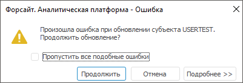
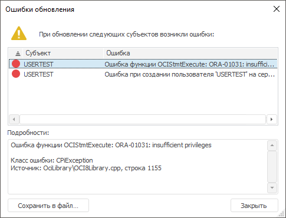

# Обновление прав пользователя

Обновление прав пользователя
-

# Обновление прав пользователя

Обновление прав доступа пользователя к объектам осуществляется в разделе
 «[Пользователи](Admin_Users.htm)»:

	- при [добавлении](Admin_UserProp_Groups.htm) пользователя
	 в состав группы пользователей;

	- при переносе пользователя между репозиториями с сохранением
	 [членства в группах](Admin_UserProp_Groups.htm). Для получения
	 подробной информации обратитесь к разделам «[Добавление
	 субъекта безопасности](updmanager.chm::/createupdate/admin_createupdate_adduser.htm)» и «[Установка обновления](updmanager.chm::/admin_upmbobj_doupdate.htm)».

Например, пользователя добавили в состав группы пользователей. После
 обновления пользователя права доступа группы пользователей будут распространяться
 на данного пользователя.

Для обновления прав одного или нескольких выбранных пользователей:

	- выполните команду «Пользователь
	 > Обновить
	 права» на [панели
	 инструментов](../../01_RunSecManager/Admin_Organizational_Starting.htm) в веб-приложении или в [главном
	 меню](../../01_RunSecManager/Admin_Organizational_Starting.htm) настольного приложения;

	- выполните команду «Обновить
	 права» в контекстном меню пользователя.

После выполнения одного из действий будут обновлены права выбранных
 пользователей.

Для обновления прав всех пользователей:

	- выполните команду «Пользователь
	 > Обновить
	 права всех пользователей» на [панели
	 инструментов](../../01_RunSecManager/Admin_Organizational_Starting.htm) в веб-приложении или в [главном
	 меню](../../01_RunSecManager/Admin_Organizational_Starting.htm) настольного приложения;

	- выполните команду «Обновить
	 права всех пользователей» в контекстном меню пользователя в
	 веб-приложении;

После выполнения одного из действий будут обновлены права всех пользователей.

При обновлении прав пользователя могут быть запрошены [учётные
 данные пользователя](UiNavObj.chm::/database/UiDb_database_authorization.htm), обладающего правами администрирования
 пользователей на сервере СУБД, а также учётные данные, необходимые для
 раздачи прав на объекты репозитория.

Примечание.
 При [разделении
 ролей](../../04_SecurityPolicy/Editor_of_Politicy/Security_EditorPoliticy_Adm.htm) между администратором информационной безопасности и прикладным
 администратором в зависимости от выбранных параметров при активации режима
 право обновлять пользователей может принадлежать только прикладному администратору
 или обоим администраторам.

Если при обновлении прав двух и более пользователей возникла критическая
 ошибка, то будет открыто окно уведомления:

Выберите вариант решения ошибки:

	- Пропустить все подобные ошибки.
	 По умолчанию флажок снят и при продолжении обновления прав пользователей
	 каждая подобная ошибка будет выдаваться в окне уведомления. При установке
	 флажка и продолжении обновления подобные ошибки не будут выведены
	 в окне уведомления;

	- Продолжить. Продолжает
	 обновление прав пользователей;

	- Отмена. Прерывает обновление
	 прав пользователей;

	- Подробнее. Открывает
	 детали ошибки.

Если в процессе обновления прав пользователей возникли ошибки, то после
 окончания обновления будет выдано окно «Ошибки
 обновления», содержащее список всех ошибок, произошедших во время
 обновления:

При необходимости сохраните ошибки во внешний файл с помощью кнопки
 «Сохранить в файл».

[Механизм обновления
 прав пользователя при использовании флажка «Использовать роли с правами
 Create, Drop и Alter User»](javascript:TextPopup(this))

	Установите флажок «
	[Использовать роли с правами Create, Drop и Alter User](../Access_control_settings.htm#update_user)» для управления правами пользователя
	 на уровне СУБД Oracle.

	При обновлении прав появляется возможность создания ролей, содержащих
	 права «Create user», «Drop user» и «Alter
	 user», когда активирован режим [разделения
	 ролей](../../04_SecurityPolicy/Editor_of_Politicy/Security_EditorPoliticy_Adm.htm) между АИБ’ом и прикладным администратором при условии обладания
	 пользователями необходимым набором [привилегий](../../04_SecurityPolicy/Admin_Priv.htm).

	Пользователю присваиваются роли по набору привилегий:

		- если пользователь является АИБ’ом,
		 т.е. обладает привилегиями: «Изменение
		 прав пользователей, раздача ролей, изменение политики»,
		 «Изменение метки безопасности
		 и списка контроля доступа любого объекта» и «Просмотр
		 всех объектов в навигаторе», то:

		-

			- пользователь, обладающий привилегией «Применение
			 прав пользователей на уровне СУБД», получает обе роли
			 с опцией «with admin option». Если обновление прав пользователя
			 осуществляется под учётной записью пользователя, не обладающего
			 привилегией «Применение прав
			 пользователей на уровне СУБД», то для обновления прав
			 пользователя необходимо привлечение администратора СУБД или
			 иного пользователя, обладающего правами на обе роли, содержащие
			 привилегии «Create user»,
			 «Drop user» и «Alter user», с опцией «with
			 admin option»;

			- пользователь, не имеющий привилегии «Применение
			 прав пользователей на уровне СУБД», получает только
			 роль, содержащую права «Alter
			 user». Если обновление прав пользователя осуществляется
			 под учётной записью пользователя, не обладающего привилегией
			 «Применение прав пользователей
			 на уровне СУБД», то для обновления прав пользователя
			 необходимо привлечение администратора СУБД или иного пользователя,
			 обладающего правами на роль, содержащую привилегию «Alter user», с опцией «with
			 admin option»;

		- если пользователь является прикладным
		 администратором, т.е. обладает привилегией «Создание,
		 удаление пользователей», то:

		-

			- пользователь получает роль, содержащую права «Create user» и «Drop
			 user». Если обновление прав пользователя осуществляется
			 под учётной записью пользователя, не обладающего привилегией
			 «Применение прав пользователей
			 на уровне СУБД», то для обновления прав пользователя
			 необходимо привлечение администратора СУБД или иного пользователя,
			 обладающего правами на роль, содержащую привилегии «Create user» и «Drop
			 user», с опцией «with admin option».

См. также:

[Создание
 учётных записей пользователей и работа с ними](Admin_Users.htm) | [Поиск
 пользователя](User_search.htm)

		Справочная
		 система на версию 10.9
		 от 18/08/2025,
		 © ООО «ФОРСАЙТ»,
