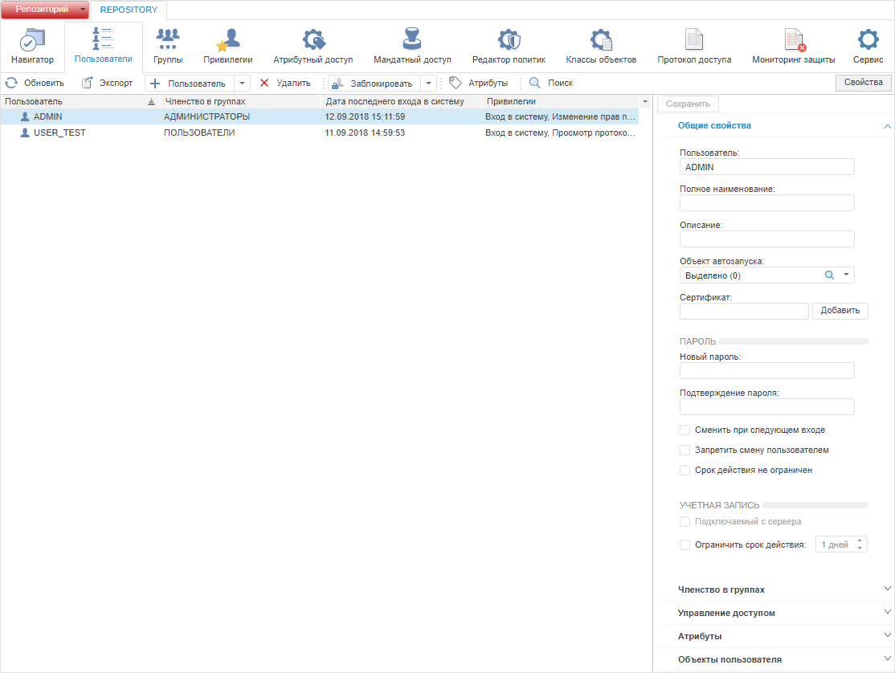
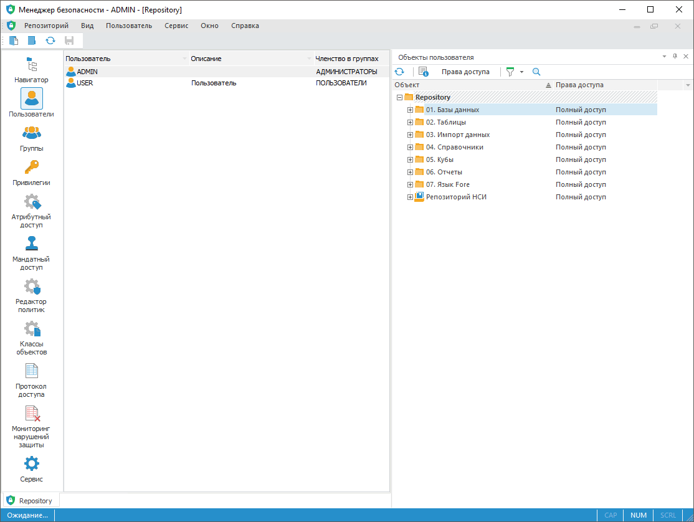

# Создание учетных записей пользователей и работа с ними

Создание учетных записей пользователей и работа с ними
-

# Создание учетных записей пользователей
 и работа с ними

Для создания и работы с учетными записями пользователей используйте
 раздел «Пользователи» [панели
 навигации](../../01_RunSecManager/Admin_Organizational_Starting.htm).

Пользователи являются субъектами безопасности системы, которые наделены
 определенными правами для работы с объектами репозитория. Права могут
 быть получены явно (если права определены отдельно для пользователя) и
 неявно (если права унаследованы от группы пользователей).

Примечание.
 При [разделении
 ролей](../../04_SecurityPolicy/Editor_of_Politicy/Security_EditorPoliticy_Adm.htm) между администратором информационной безопасности и прикладным
 администратором в разделе «Пользователи»
 администратору информационной безопасности будут недоступны операции создания,
 обновления (при определенных условиях) и удаления пользователей, а прикладному
 администратору недоступны операции смены пароля пользователя и отключения
 подключенного пользователя.

Раздел «Пользователи»:

	Веб-приложение
	 Настольное
	 приложение

		

		

В разделе содержится список учетных записей пользователей с пиктограммами.
 В зависимости от текущего состояния пользователя пиктограмма выглядит
 следующим образом:

	-  для активного пользователя;

	-  для заблокированного пользователя;

	-  для заблокированного навсегда пользователя.

Для списка учетных записей доступна настройка [отображения
 столбцов](../Admin_AdminObjects_AuditTuning.htm#columns), в которых содержится информация о [свойствах
 пользователей](Admin_UserCreate.htm).

[Информация о
 свойствах пользователей в столбцах раздела](javascript:TextPopup(this))

	В столбцах раздела содержится следующая информация о свойствах пользователей:

		- Пользователь. Имя
		 пользователя;

		- Наименование. Полное
		 имя пользователя;

		- Описание. Описание
		 пользователя;

		- Объект автозапуска.
		 [Объект](Admin_UserProp_Common.htm#description), который
		 автоматически запускается при входе пользователя в систему;

		- Запретить смену пароля.
		 Признак [запрета изменения
		 пароля](Admin_UserProp_Common.htm#password) пользователем;

		- Заблокирован. Признак
		 [блокировки пользователя](Admin_UserProp_Common.htm#restriction);

		- Срок пароля не ограничен.
		 Признак [неограниченного
		 срока действия пароля](Admin_UserProp_Common.htm#password) пользователя;

		- Подключаемый с сервера.
		 Признак пользователя, [подключаемого
		 с сервера](Admin_UserProp_Common.htm#restriction);

		- Членство в группах.
		 [Группы пользователей](Admin_UserProp_Groups.htm),
		 в которых состоит данный пользователя;

		- Мандатный доступ.
		 Настройки [мандатного метода разграничения
		 доступа](Admin_UserProp_MC.htm) для пользователя;

		- Доступ запрещен по дням.
		 [Дни недели](Admin_UserProp_Time.htm#week), по которым
		 пользователю запрещен доступ в систему;

		- Доступ запрещен на период.
		 [Диапазоны дат](Admin_UserProp_Time.htm#time), по которым
		 пользователю запрещен доступ в систему;

		- Разрешенные станции.
		 [Рабочие станции](Admin_UserProp_Time.htm#workstations),
		 с которых пользователю разрешен доступ в систему;

		- Разрешенные IP-адреса.
		 [IP-адреса](Admin_UserProp_Time.htm#workstations),
		 с которых пользователю разрешен доступ в систему;

		- Разрешенные МАС-адреса.
		 [МАС-адреса](Admin_UserProp_Time.htm#workstations),
		 с которых пользователю разрешен доступ в систему;

		- Число сеансов. Предельное
		 число подключений пользователя к репозиторию при заданном [ограничении
		 числа сеансов](Admin_UserProp_Time.htm#sessions);

		- Дата последнего входа в
		 систему. Дата последнего успешного входа пользователя в
		 систему;

		- Привилегии. [Привилегии](../../04_SecurityPolicy/Admin_Priv.htm),
		 которыми обладает пользователь;

		- Уровень безопасности.
		 Настройки [метода разграничения
		 доступа по уровням](Admin_UserProp_SecLevels.htm) для пользователя;

		- Личная папка. Наименование
		 [личной папки пользователя](Admin_UserFolder.htm),
		 если она была создана;

		- Временная учетная запись.
		 Признак временной учетной записи пользователя при [ограничении
		 срока действия](Admin_UserProp_Common.htm#restriction);

		- Дата создания учетной записи.
		 Дата [создания](Admin_UserCreate.htm#create) учетной
		 записи пользователя;

	Примечание.
	 Отображается только в веб-приложении.

		- Срок действия учетной записи.
		 Дата окончания [срока
		 действия](Admin_UserProp_Common.htm#restriction) учетной записи пользователя при его ограничении.

Ключевые возможности:

	- [создание и редактирование учетной
	 записи пользователя](Admin_UserCreate.htm);

	- [редактирование служебного пользователя](Admin_Service_User.htm);

	- [подключение доменного
	 пользователя](Admin_UserCreate_Domain.htm);

	- [смена пароля пользователя](Admin_User_EditPass.htm);

	- [работа с личными папками пользователей](Admin_UserFolder.htm);

	- [создание
	 пользовательских атрибутов](../../04_SecurityPolicy/Creating_attributes.htm);

	- [обновление прав пользователя](Admin_User_Update.htm);

	- [поиск пользователя](User_search.htm);

	- [удаление пользователя](Admin_UserDel.htm);

	- [просмотр подключенных пользователей](Admin_ConnectedUsers.htm);

	- [просмотр объектов пользователя
	 и группы](Admin_UserObjects.htm);

	- [выбор пользователей и групп](../Admin_UsersGroups.htm);

	- [выбор
	 рабочих станций](../../04_SecurityPolicy/Security_chooseWKS.htm).

Если параметры раздела были изменены, то при попытке перехода на другой
 раздел или при закрытии менеджера безопасности будет выдан запрос о применении
 измененных настроек. Для применения заданных настроек учетной записи пользователя:

	- в веб-приложении нажмите кнопку  «Сохранить»
	 на [панели
	 инструментов](../../01_RunSecManager/Admin_Organizational_Starting.htm) или на [боковой
	 панели](../../01_RunSecManager/Admin_Organizational_Starting.htm);

	- в настольном приложении выполните
	 одно из действий:

		- выполните команду «Репозиторий
		 > Применить политику безопасности» в [главном
		 меню](../../01_RunSecManager/Admin_Organizational_Starting.htm);

		- нажмите кнопку 
		 «Применить политику безопасности»
		 на [панели
		 инструментов](../../01_RunSecManager/Admin_Organizational_Starting.htm).

См. также:

[Настройка
 политики безопасности системы](../../01_RunSecManager/Admin_Intro.htm) | [Настройка
 проверки паролей пользователей](../../04_SecurityPolicy/Editor_of_Politicy/Security_EditorPoliticy_General_Parole.htm) | [Создание
 групп пользователей и работа с ними](../Groups/Admin_Groups.htm)

		Справочная
		 система на версию 10.9
		 от 18/08/2025,
		 © ООО «ФОРСАЙТ»,
