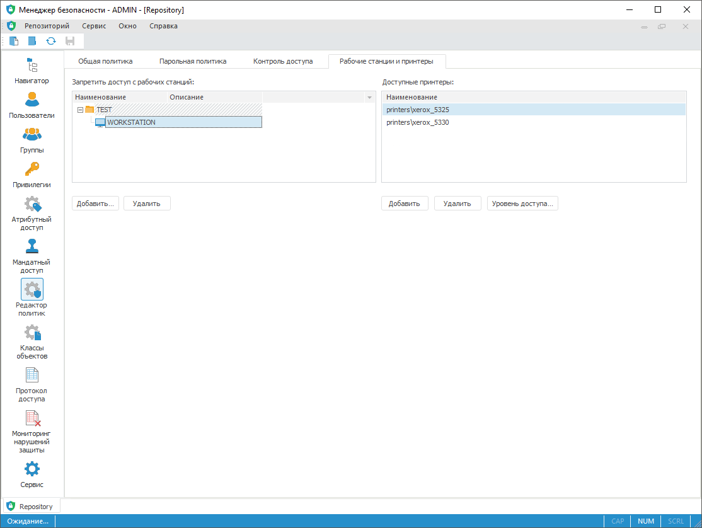
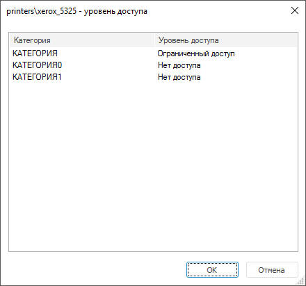

# Настройка доступа рабочих станций и принтеров

Настройка доступа рабочих станций и принтеров
-

# Настройка доступа рабочих станций и принтеров

Для настройки доступа рабочих станций и принтеров:

	- в веб-приложении используйте флажок «Запретить
	 доступ с рабочих станций» в [контроле
	 доступа](../04_SecurityPolicy/Admin_SecPolicy.htm#access_control);

	- в настольном приложении используйте вкладку «Рабочие
	 станции и принтеры» в редакторе политик [панели
	 навигации](../01_RunSecManager/Admin_Organizational_Starting.htm).

Примечание.
 В веб-приложении доступна настройка только рабочих станций.

	Веб-приложение
	 Настольное
	 приложение

		

		

## Запрет доступа с рабочих станций

Для добавления рабочей станции, с которой будет запрещен доступ:

	- в веб-приложении установите флажок
	 «Запретить доступ с рабочих станций»
	 и создайте список рабочих станций в соответствующем поле. Рабочие
	 станции задаются в текстовом формате, разделяя их пробелами, запятыми
	 или точками с запятой;

	- в настольном приложении:

		- нажмите кнопку «Добавить»;

		- выполните команду контекстного меню «Добавить».

После выполнения одного из действий будет
 открыт диалог [выбора
 рабочих станций](../04_SecurityPolicy/Security_chooseWKS.htm). Установите флажки напротив рабочих станций и нажмите
 кнопку «Запретить доступ».

После выполнения действий будет запрещен доступ к текущему репозиторию
 с рабочих станций, добавленных в список.

Для удаления выбранной рабочей станции:

	- в веб-приложении удалите рабочую
	 станцию в соответствующем поле;

	- в настольном приложении:

		- нажмите кнопку «Удалить»;

		- выполните команду «Удалить»
		 в контекстном меню;

		- выполните команду «Очистить»
		 в контекстном меню для удаления всех рабочих станций;

Примечание.
 Удерживайте нажатую клавишу CTRL или SHIFT для дальнейшего удаления нескольких
 рабочих станций.

После выполнения действий будет удалена выбранная рабочая станция из
 списка.

После изменений нажмите кнопку 
 «Сохранить» на [панели
 инструментов](../01_RunSecManager/Admin_Organizational_Starting.htm).

## Настройка доступных принтеров

Настройка доступных принтеров определяет, на каких принтерах пользователи
 могут осуществлять печать. Если в области доступных принтеров список пуст,
 то печать доступна для любых принтеров.

Примечание.
 Настройка доступных принтеров доступна только в настольном приложении.

[Добавление доступного
 принтера](javascript:TextPopup(this))

	Для добавления принтера:

		- нажмите кнопку «Добавить».

		- выполните команду «Добавить»
		 в контекстном меню.

	После выполнения одного из действий в список будет добавлен новый
	 элемент в режим редактирования. Формат принтера должен соответствовать
	 шаблону «hostname\printer».

	По окончанию редактирования выполняется проверка на корректность
	 введенного текста. Если текст не соответствует шаблону, то будет выдано
	 соответствующее сообщение.

[Удаление принтера](javascript:TextPopup(this))

	Для удаления выбранного принтера:

		- нажмите кнопку «Удалить»;

		- выполните команду «Удалить»
		 в контекстном меню;

		- выполните команду «Очистить»
		 в контекстном меню для удаления всех принтеров.

	После выполнения действий будет удален выбранный принтер из списка.

	Примечание.
	 Удерживайте нажатую клавишу CTRL или SHIFT для дальнейшего удаления
	 нескольких принтеров.

[Присвоение уровня
 доступа](javascript:TextPopup(this))

	Для присвоения уровня доступа:

		- нажмите кнопку «Уровень доступа»;

	Примечание.
	 Команда доступна, если выделен хотя бы один элемент списка и используется
	 [мандатный метод
	 разграничения доступа](../04_SecurityPolicy/Admin_PermSep_M.htm) или [метод
	 разграничения доступа по уровням](../04_SecurityPolicy/Security_levels.htm).

		- выполните команду «Уровень
		 доступа» в контекстном меню одного и более выделенных принтеров.

	После выполнения одного из действий будет открыт диалог для настройки
	 уровня доступа выбранного принтера:

	

	Если выбрано несколько принтеров, то в заголовке через запятую перечисляются
	 все выбранные принтеры.

	Если для принтеров не совпадает уровень доступа по категории, то
	 соответствующее поле в таблице не заполняется.

	Для присвоения уровня доступа каждой категории:

		- Выделите одну из категорий в столбце «Категория».

		- Выберите уровень доступа в раскрывающемся списке столбца
		 «Уровень доступа».

	После выполнения действий будет присвоена категория безопасности
	 с уровнем доступа выбранному принтеру.

Для выделения всех принтеров списка используйте команду «Выделить
 все» в контекстном меню.

### Режим сопоставления пользователя с устройством вывода

При использовании режима сопоставления пользователя с устройством вывода
 учитывайте установленные в репозитории [методы
 разграничения доступа](../04_SecurityPolicy/Admin_SecPolicy.htm):

	- для дискреционного контроля достаточным признаком доступности
	 печати на том или ином принтере является присутствие этого принтера
	 в списке разрешенных для печати;

	- для мандатного доступа (либо мандатного доступа совместно с
	 дискреционным контролем) доступность печати для пользователя определяется
	 сопоставлением принтера с меткой безопасности. Алгоритм определения
	 доступности соответствует существующему в платформе алгоритму, определяющему
	 доступность чтения объекта пользователем при мандатном доступе, то
	 есть субъект может производить печать на принтере:

	-

		- для иерархических категорий: только в случае, когда метка
		 доступа принтера больше или равна метке доступа пользователя,
		 исключая случай, когда метка доступа пользователя равна нулю;

		- для неиерархических категорий: только в случае равенства
		 меток доступа принтера и пользователя.

Также при мандатном доступе необходимо учитывать
 флажок «[Разрешить
 печать объектов](Admin_MandatAccessParam.htm)», устанавливаемый для уровня безопасности;

	- в случае мандатного доступа и иерархической категории при печати
	 должно происходить сопоставление метки объекта и метки принтера, печать
	 объекта на принтере должна быть доступна только в том случае, если
	 метка объекта больше или равна метке принтера.

См. также:

[Дополнительные
 настройки контроля доступа](Access_control_settings.htm) | [Общие
 настройки политики](../04_SecurityPolicy/Editor_of_Politicy/Security_EditorPoliticy_General.htm)

		Справочная
		 система на версию 10.9
		 от 18/08/2025,
		 © ООО «ФОРСАЙТ»,
