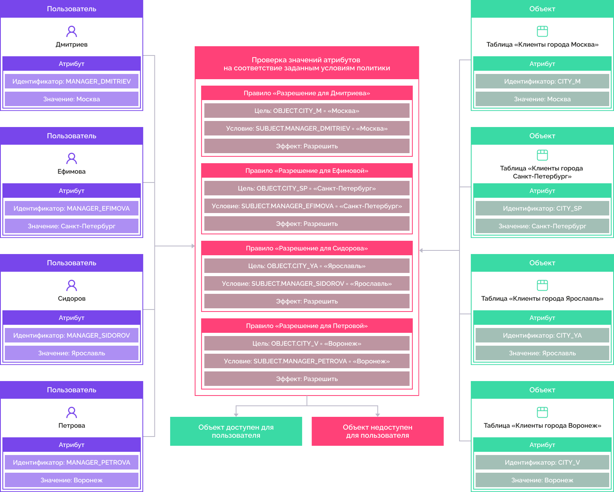
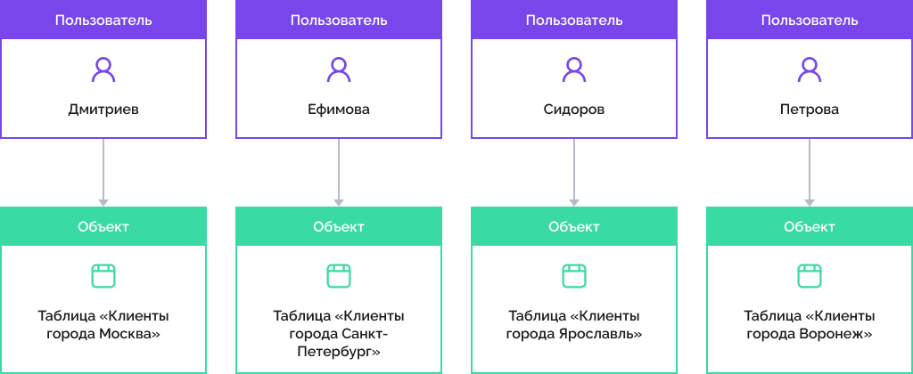

# Настройка атрибутного метода

Настройка атрибутного метода
-

# Настройка атрибутного метода

Атрибутный метод раздает права на уровне аналитической платформы, является
 фильтрацией данных при доступе пользователя к данным через проверку политик
 и правил. Метод управления доступом на основе атрибутов (англ. Attribute-based
 access control, ABAC)
 реализован через модель контроля доступа, которая направлена на оптимизацию
 подсистемы управления доступом. Атрибутный доступ рассматривается как
 отдельный вид управления доступом наряду с дискреционным и мандатным.

Примечание.
 Атрибутный метод доступен для одновременного использования с [дискреционным
 методом](Admin_PermSep_D.htm). Алгоритм комбинации прав двух методов устанавливается в [контроле доступа](Admin_SecPolicy.htm#access_control).

Разграничение доступа происходит за счет политик и правил, которые содержат
 набор условий для проверки атрибутов. Такой метод дает возможность создавать
 комбинации из условий для выражения различных политик. Предоставление
 прав доступа пользователю к объекту или сегменту данных происходит только
 в том случае, если значения атрибутов пользователя и объекта позволяют
 пользователю предоставить данный доступ к объекту.

Атрибутный метод определяется элементами:

	- Набор политик. Объединяет
	 политики или наборы политик, определяет возможность совершения какого-либо
	 действия или доступа к объекту/сегменту данных на основе политик;

	- Политика. Объединяет
	 набор правил и определяет возможность совершения какого-либо действия
	 или доступа к объекту/сегменту данных на основе правил;

	- Правила. Определяет
	 возможность совершения какого-либо действия или доступа к объекту/сегменту
	 данных;

	- Атрибуты. Атрибуты субъектов
	 и объектов/сегментов данных, для которых можно получить значение на
	 основе информации, хранящейся в системе.

Каждый элемент состоит из свойств, которые задаются в [атрибутном
 доступе](Admin_AttributeAccess.htm).

Включение метода доступно только администратору, или администратору
 информационной безопасности в случае активного режима [разделения
 ролей](Editor_of_Politicy/Security_EditorPoliticy_Adm.htm) администраторов системы.

Примечание.
 Формирование структуры атрибутного доступа (добавление атрибутов, редактирование
 политик и правил) контролируется системой и доступно администратору с
 [привилегией](Admin_Priv.htm) «Изменение
 прав пользователей, раздача ролей, изменение политики», «Изменение метки безопасности и списка контроля
 доступа любого объекта».

Настройка атрибутного метода осуществляется:

	- владельцем схемы ADMIN;

	- членами группы «[Администраторы](../03_Admin/Groups/Admin_Groups.htm)»;

	- пользователями с [привилегиями](Admin_Priv.htm) «Вход в систему», «Изменение
	 прав пользователей, раздача ролей, изменение политики», «Изменение метки безопасности и списка контроля
	 доступа любого объекта. Просмотр всех объектов в навигаторе»,
	 «Право чтения и открытия всех объектов»;

	- [администратором
	 информационной безопасности](Editor_of_Politicy/Security_EditorPoliticy_Adm.htm) при разделении ролей администраторов.

Для использования атрибутного метода разграничения доступа:

	- Установите флажок «Использовать
	 атрибутный доступ» на вкладке «[Контроль доступа](Admin_SecPolicy.htm#access_control)»
	 редактора политик.

	- Создайте [учетные
	 записи пользователей](../03_Admin/Users/Admin_Users.htm) и [группы
	 пользователей](../03_Admin/Groups/Admin_Groups.htm).

	- Создайте [пользовательские
	 атрибуты](Creating_attributes.htm) для пользователей, групп пользователей, объектов в зависимости
	 от поставленной задачи.

	- Создайте набор политик, политику и правила в разделе «[Атрибутный
	 доступ](Admin_AttributeAccess.htm)».

## Механизм контроля доступа

Перед совершением определенного действия пользователя над объектом система
 проверяет возможность выполнения этого действия. Проверка возможности
 выполнения начинается с получения всех атрибутов, загрузки наборов политик,
 политик и правил. После проверки вычисляются значения всех атрибутов,
 указанных в наборах политик, политиках и правилах. Наборы политик фильтруются
 по значениям атрибутов. В дальнейшем вычисляются только отфильтрованные
 политики и правила. В результате вычисления атрибутного доступа будет
 получено решение о предоставлении доступа пользователю.

Важно. Если
 в структуре атрибутного доступа не задано ни одно условие, то доступ ко
 всем операциям с объектами запрещен.

## Пример

Для пользователей, которые являются менеджерами компании, необходимо
 предоставить доступ к клиентам своего филиала.

Менеджеры: Дмитриев, Ефимова, Сидоров, Петрова. Филиалы в городах: Москва,
 Санкт-Петербург, Ярославль, Воронеж.

Представим выполнение примера в виде схемы:

	- Добавим [атрибуты](Creating_attributes.htm) пользователям
	 и объектам, которые содержат информацию о клиентах.

	- Создадим политику с [правилами](Admin_AttributeAccess.htm#rule)
	 в [атрибутном доступе](Admin_AttributeAccess.htm).

В результате для каждого менеджера будет разрешен доступ к таблице клиентов
 своего филиала:

См. также:

[Выбор
 методов разграничения доступа и их настройка](Admin_SecPolicy.htm) | [Добавление
 правил и политик проверки доступа](Admin_AttributeAccess.htm)

		Справочная
		 система на версию 10.9
		 от 18/08/2025,
		 © ООО «ФОРСАЙТ»,
