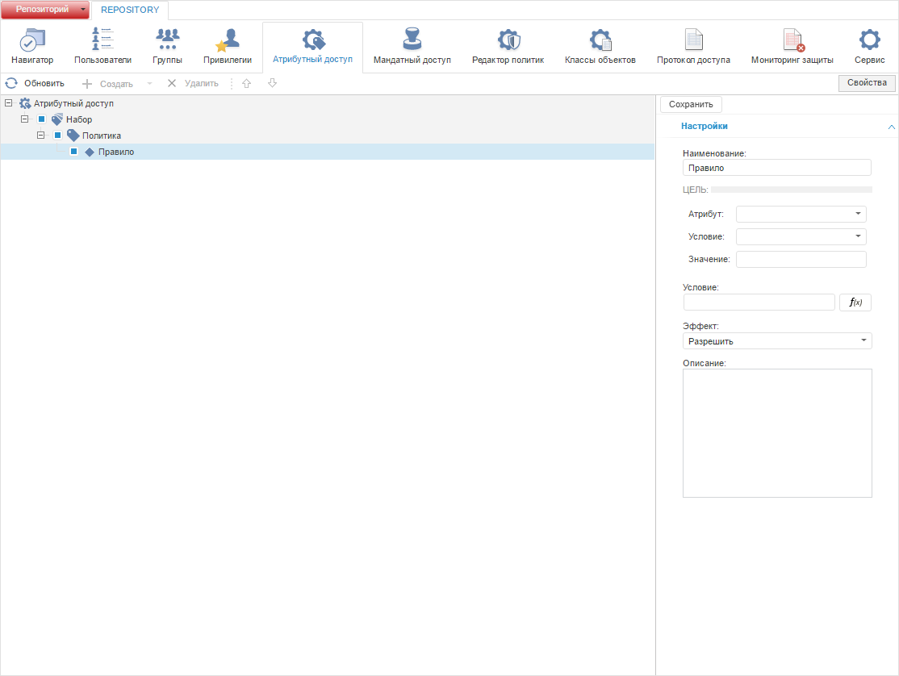
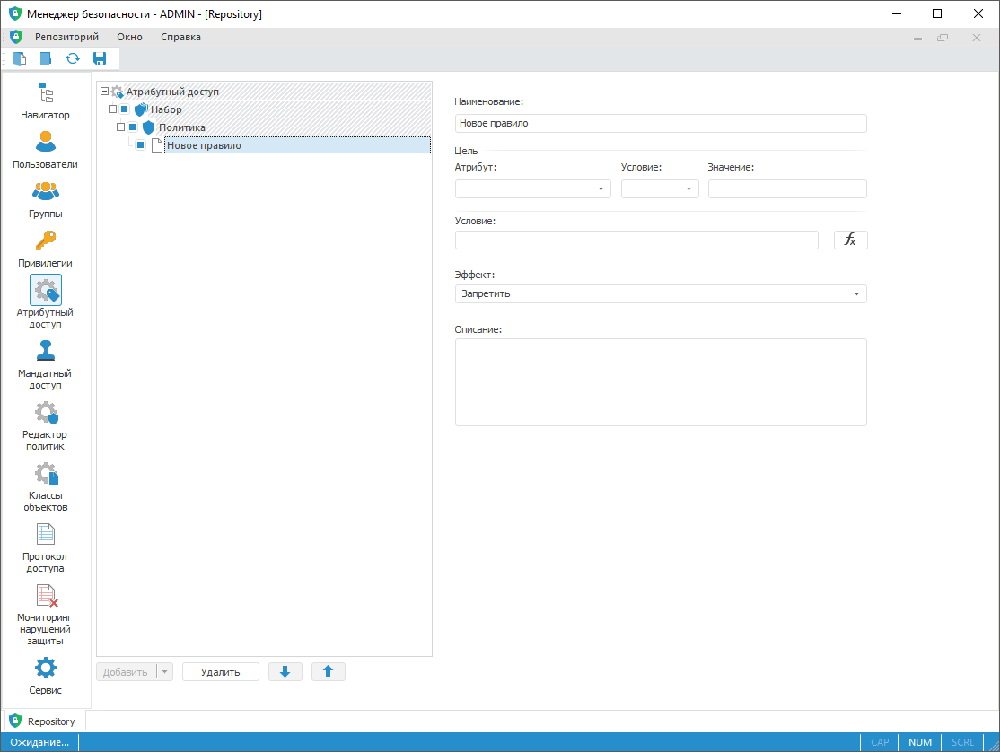

# Добавление правил и политик проверки доступа

Добавление правил и политик проверки доступа
-

# Добавление правил и политик проверки доступа

Для добавления правил и политик проверки доступа используйте раздел
 «Атрибутный доступ» [панели
 навигации](../01_RunSecManager/Admin_Organizational_Starting.htm).

Примечание.
 При [разделении
 ролей](Editor_of_Politicy/Security_EditorPoliticy_Adm.htm) между администратором информационной безопасности и прикладным
 администратором раздел «Атрибутный доступ»
 будет доступен только администратору информационной безопасности. Формирование
 структуры атрибутного доступа (добавление атрибутов, редактирование политик
 и правил) контролируется системой и доступно администратору с [привилегией](Admin_Priv.htm)
 «Изменение прав пользователей, раздача
 ролей, изменение политики», «Изменение
 метки безопасности и списка контроля доступа любого объекта».

Раздел основан на принципе [атрибутного метода](Admin_ABAC.htm),
 предназначен для создания правил проверки доступа с необходимыми условиями.
 Система проверяет возможность выполнения определенного действия пользователя
 над объектом и/или сегментом данных через проверку атрибутов.

Примечание.
 Атрибутный метод доступен для одновременного использования с [дискреционным
 методом](Admin_PermSep_D.htm).

Атрибуты делятся на [системные](Creating_conditions.htm#available_attributes)
 и [пользовательские](Creating_attributes.htm), используются
 при формировании [цели](Target.htm) и [дополнительных
 условий](Creating_conditions.htm) проверки доступа. Системные атрибуты недоступны для изменения,
 можно добавить или отредактировать только пользовательские атрибуты для
 [пользователей](../03_Admin/Users/Admin_UserProp_Attributes.htm),
 [групп
 пользователей](../03_Admin/Groups/Admin_GroupProp_Attributes.htm.htm), [классов
 объектов](Admin_Object_Classes.htm#attributes), отдельных [типов объектов](Admin_PermSep_Attributes.htm),
 отдельных [объектов](UiNav.chm::/03_Objects/UiNav_Obj_BasicPropAttributes.htm)
 в зависимости от поставленной задачи.

Примечание.
 Добавление пользовательских атрибутов выполняется перед началом работы
 с разделом.

Убедитесь, что в [контроле
 доступа](Admin_SecPolicy.htm#access_control) установлен флажок «Использовать
 атрибутный доступ».

Раздел «Атрибутный доступ»:

	Веб-приложение
	 Настольное
	 приложение

		

		

В разделе содержится структура атрибутного доступа, состоящая из иерархии
 элементов:

	- на первом уровне «Атрибутный
	 доступ», определяющий всю структуру наборов политик, политик
	 и правил;

	- на втором уровне наборы политик;

	- на третьем уровне политики;

	- на четвертом уровне правила.

Важно. Если
 структура атрибутного доступа не задана, то все операции с объектами запрещены.

Ключевые возможности:

[Добавление
 набора политик](javascript:TextPopup(this))

	Для добавления набора политик:

		- в веб-приложении:

			- выделите в иерархии списка
			 политик «Атрибутный доступ»:

				- нажмите кнопку  «Создать»
				 на [панели
				 инструментов](../01_RunSecManager/Admin_Organizational_Starting.htm);

				- выполните команду «Добавить
				 набор» в открывающемся списке кнопки  «Создать»;

			- выделите в иерархии списка
			 существующий набор политик:

				- выполните команду «Добавить
				 набор» в открывающемся списке кнопки  «Создать»;

		- в настольном приложении:

			- выделите в иерархии списка
			 политик «Атрибутный доступ»:

				- нажмите кнопку «Добавить»;

				- выполните команду «Добавить
				 набор» в открывающемся списке кнопки «Добавить»;

			- выделите в иерархии списка
			 существующий набор политик:

				- выполните команду «Добавить
				 набор» в открывающемся списке кнопки «Добавить».

	После выполнения одного из действий будет добавлен набор политик
	 для выбранного элемента в иерархии списка. Задайте [свойства](Admin_AttributeAccess.htm#properties)
	 набора политик на боковой панели «Свойства»
	 в веб-приложении или в правой половине окна менеджера безопасности
	 в настольном приложении.

[Добавление
 политики](javascript:TextPopup(this))

	Для добавления политики выделите в иерархии списка существующий
	 [набор политик](Admin_AttributeAccess.htm#policies_set):

		- в веб-приложении:

			- нажмите кнопку  «Создать»
			 на [панели
			 инструментов](../01_RunSecManager/Admin_Organizational_Starting.htm);

			- выполните команду «Добавить политику» в открывающемся
			 списке кнопки  «Создать»;

		- в настольном приложении:

			- нажмите кнопку «Добавить»;

			- выполните команду «Добавить политику» в открывающемся
			 списке кнопки «Добавить».

	После выполнения одного из действий будет добавлена политика для
	 выбранного набора политик. Задайте [свойства](Admin_AttributeAccess.htm#properties)
	 набора политик на боковой панели «Свойства»
	 в веб-приложении или в правой половине окна менеджера безопасности
	 в настольном приложении.

[Добавление
 правила](javascript:TextPopup(this))

	Для добавления правила выделите в иерархии списка существующую [политику](Admin_AttributeAccess.htm#policy):

		- в веб-приложении:

			- нажмите кнопку  «Создать»
			 на [панели
			 инструментов](../01_RunSecManager/Admin_Organizational_Starting.htm);

			- выполните команду «Добавить правило» в открывающемся
			 списке кнопки  «Создать»;

		- в настольном приложении:

			- нажмите кнопку «Добавить»;

			- выполните команду «Добавить правило» в открывающемся
			 списке кнопки «Добавить».

	После выполнения одного из действий будет добавлено правило для
	 выбранной политики. Задайте [свойства](Admin_AttributeAccess.htm#properties)
	 набора политик на боковой панели «Свойства»
	 в веб-приложении или в правой половине окна менеджера безопасности
	 в настольном приложении.

[Определение
 свойств атрибутного доступа](javascript:TextPopup(this))

	Для атрибутного доступа, выбранного набора политик, политики, правила
	 задайте свойства, определяющие доступ к объектам и/или сегментам данных,
	 в правой половине окна менеджера безопасности в настольном приложении
	 или на боковой панели «Свойства»
	 в веб-приложении.

	

	Описание свойств:

		- Наименование.
		 Наименование, объединяющее по смыслу наборы политик, политики
		 и правила;

		- [Цель](Target.htm). Задает условие для дальнейшей
		 проверки доступа действий пользователя к объекту;

	Важно.
	 Поле обязательно для заполнения при добавлении правила. При добавлении
	 набора политик и политики цель задается в качестве фильтрации данных.

		- [Условие](Creating_conditions.htm).
		 Дополнительное условие проверки доступа в виде динамически вычисляемого
		 логического выражения. В качестве условия также задается [атрибут
		 элемента справочника НСИ](../03_Admin/Admin_ElementAccess.htm#abac) для настройки прав доступа пользователя
		 к элементу;

		- Эффект.
		 Разрешение или запрет доступа по результату выполнения правила;

	Примечание.
	 Эффект срабатывает при совпадении результата вычисления логического
	 выражения в цели и условии.

		- Алгоритм
		 комбинации корневого набора/политик/правил. Раскрывающийся
		 список алгоритмов, по которому определяется получение доступа:

			- Переопределение отказом.
			 Запрет доступа, если хотя бы один из результатов вычисления
			 вернул запрет;

			- Переопределение разрешением.
			 Разрешение доступа, если хотя бы один из результатов вычисления
			 вернул разрешение;

			- Применение первого
			 доступного правила. Результат вычисления первого доступного
			 правила в иерархии политики. Правило доступно при совпадении
			 результата вычисления логического выражения в цели и условии;

	Примечание.
	 Если ни одно из правил недоступно, то политика не выполнится.

			- Применение единственного
			 доступного правила. Результат вычисления единственного
			 доступного правила в иерархии политики. Правило доступно при
			 совпадении результата вычисления логического выражения в цели
			 и условии;

	Примечание.
	 Если политика содержит несколько правил или единственное правило недоступно,
	 то политика не выполнится.

		- Описание.
		 Комментарий к формируемому набору политик, политике, правилу.

Для создания политики проверки доступа:

	- Убедитесь, что необходимые атрибуты добавлены для [пользователей](../03_Admin/Users/Admin_UserProp_Attributes.htm),
	 [групп
	 пользователей](../03_Admin/Groups/Admin_GroupProp_Attributes.htm.htm), [классов
	 объектов](Admin_Object_Classes.htm#attributes), отдельных [типов
	 объектов](Admin_PermSep_Attributes.htm), отдельных [объектов](UiNav.chm::/03_Objects/UiNav_Obj_BasicPropAttributes.htm).

	- Добавьте [набор
	 политик](Admin_AttributeAccess.htm#policies_set), объединяющий политики и наборы политик одним условием.

	- Добавьте [политику](Admin_AttributeAccess.htm#policy),
	 содержащую условия проверки доступа.

	- Добавьте [правило](Admin_AttributeAccess.htm#rule),
	 содержащее дополнительные условия проверки доступа.

	- Задайте [свойства](Admin_AttributeAccess.htm#properties),
	 определяющие доступ к объектам.

	- Определите структуру проверки доступа с помощью флажков напротив
	 элементов атрибутного доступа.

	- Сохраните заданную политику проверки доступа:

		- в веб-приложении нажмите кнопку «Сохранить»
		 на [боковой
		 панели](../01_RunSecManager/Admin_Organizational_Starting.htm);

		- в настольном приложении нажмите кнопку 
		 «Сохранить» на [панели
		 инструментов](../01_RunSecManager/Admin_Organizational_Starting.htm).

После создания политики проверки доступа в разделе будет представлена
 структура атрибутного доступа.

Для удобного размещения элементов атрибутного доступа в структуре используйте
 кнопки 
 «Вверх» и 
 «Вниз» или механизм Drag&Drop.

При необходимости удалите элементы атрибутного доступа с помощью кнопки
 «Удалить».

См. также:

[Настройка
 атрибутного метода](Admin_ABAC.htm) | [Создание пользовательских
 атрибутов](Creating_attributes.htm)

		Справочная
		 система на версию 10.9
		 от 18/08/2025,
		 © ООО «ФОРСАЙТ»,
