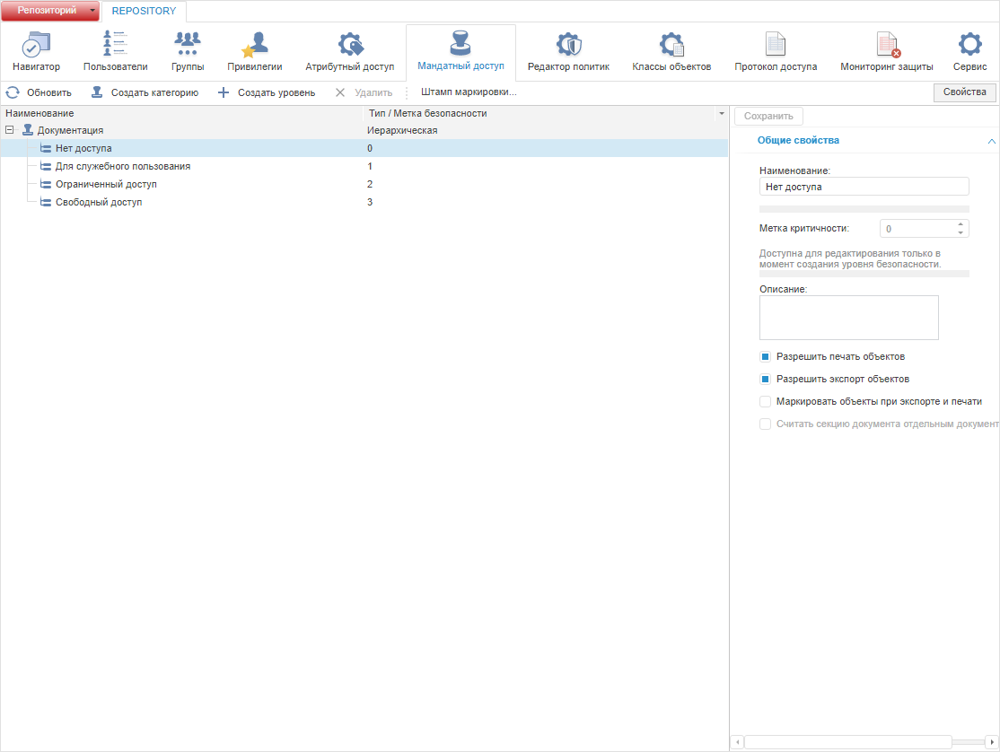
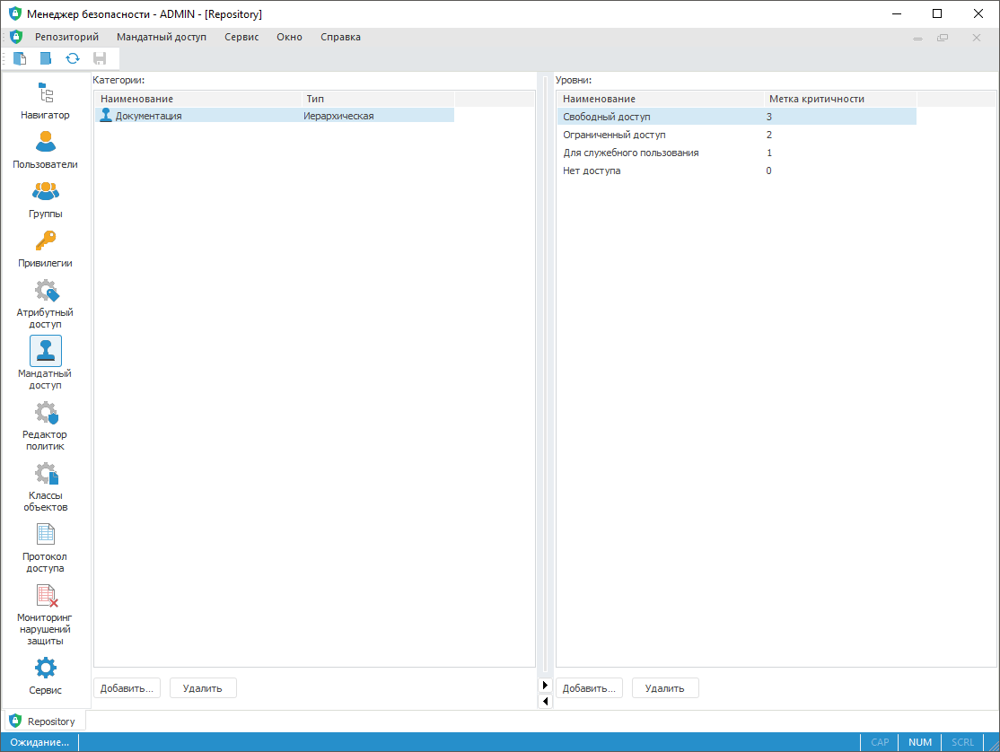
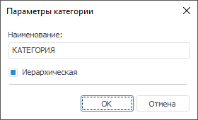

# Добавление категорий и уровней безопасности

Добавление категорий и уровней безопасности
-

# Добавление категорий и уровней безопасности

Для добавления категорий и уровней безопасности используйте раздел «Мандатный доступ» [панели
 навигации](../01_RunSecManager/Admin_Organizational_Starting.htm).

Примечание.
 При [разделении
 ролей](Editor_of_Politicy/Security_EditorPoliticy_Adm.htm) между администратором информационной безопасности и прикладным
 администратором раздел «Мандатный доступ»
 будет доступен только администратору информационной безопасности.

Раздел основан на принципе [мандатного
 метода разграничения доступа](Admin_PermSep_M.htm), предназначен для формирования списка
 категорий секретности и их уровней безопасности, которые будут использоваться
 для разграничения прав.

Примечание.
 Мандатный метод доступен для одновременного использования с [дискреционным
 методом](Admin_PermSep_D.htm).

Убедитесь, что в [контроле
 доступа](Admin_SecPolicy.htm#access_control) установлен флажок «Использовать
 мандатный доступ».

Раздел «Мандатный доступ»:

	Веб-приложение
	 Настольное
	 приложение

		

		

Примечание.
 В веб-приложении список категорий и уровней безопасности представлен в
 виде иерархии.

[Добавление
 категории секретности](javascript:TextPopup(this))

	Для добавления категории секретности:

		- в веб-приложении нажмите кнопку  «Создать категорию» на [панели
		 инструментов](../01_RunSecManager/Admin_Organizational_Starting.htm);

		- в настольном приложении выполните одно из действий:

			- нажмите кнопку «Добавить»,
			 расположенную ниже списка «Категории»;

			- выполните команду «Мандатный доступ > Новая категория»
			 в [главном
			 меню](../01_RunSecManager/Admin_Organizational_Starting.htm).

	После выполнения одного из действий будет
	 открыто окно «Параметры категории»:

	

	Задайте параметры в окне «Параметры
	 категории» или на боковой панели «Свойства»:

		- Наименование. Название
		 создаваемой категории секретности. Определяется администратором,
		 исходя из назначения данной категории;

		- Тип категории. Определяется
		 тип категории секретности:

			- Иерархическая.
			 При установленном флажке «Иерархическая»
			 определяются отношения сравнения между уровнями по значению
			 метки доступа. Результатом сравнения меток может быть более
			 высокий или низкий уровень доступа;

			- Неиерархическая.
			 При снятом флажке «Иерархическая»
			 результатом сравнения меток может быть совпадение меток или
			 их несовпадение, то есть области действий уровней секретности
			 не пересекаются.

	Для получения подробной информации о иерархических и неиерархических
	 категориях обратитесь к разделу «[Настройка
	 мандатного метода](Admin_PermSep_M.htm)».

[Добавление
 уровня безопасности](javascript:TextPopup(this))

	Для добавления уровней безопасности в выбранную категорию:

		- в веб-приложении нажмите
		 кнопку  «Создать
		 уровень» на [панели
		 инструментов](../01_RunSecManager/Admin_Organizational_Starting.htm). На боковой панели «Свойства»
		 задайте [параметры
		 уровня безопасности](../03_Admin/Admin_MandatAccessParam.htm);

		- в настольном приложении
		 нажмите кнопку «Добавить»,
		 расположенную ниже списка «Уровни».
		 Будет открыто окно «[Параметры
		 уровня безопасности](../03_Admin/Admin_MandatAccessParam.htm)».

[Редактирование
 категории/уровня безопасности](javascript:TextPopup(this))

	Для редактирования категории/уровня безопасности:

		- в веб-приложении выберите категорию/уровень безопасности.
		 На боковой панели «Свойства» внесите
		 требуемые изменения в параметры категории/уровня безопасности;

		- в настольном приложении дважды щёлкните по выбранному элементу
		 списка. Будет открыт такой же диалог, как и при добавлении категории/уровня.

[Удаление
 категории/уровня безопасности](javascript:TextPopup(this))

	Для удаления категории/уровня безопасности:

		- в веб-приложении
		 нажмите кнопку 
		 «Удалить» на [панели
		 инструментов](../01_RunSecManager/Admin_Organizational_Starting.htm);

		- в настольном приложении
		 нажмите кнопку «Удалить»
		 под списком.

Для применения заданных настроек мандатного доступа:

	- в веб-приложении нажмите кнопку  «Сохранить»
	 на [панели
	 инструментов](../01_RunSecManager/Admin_Organizational_Starting.htm) или на [боковой
	 панели](../01_RunSecManager/Admin_Organizational_Starting.htm);

	- в настольном приложении выполните
	 одно из действий:

		- выполните команду «Репозиторий
		 > Применить политику безопасности» в [главном
		 меню](../01_RunSecManager/Admin_Organizational_Starting.htm);

		- нажмите кнопку 
		 «Применить политику безопасности»
		 на [панели
		 инструментов](../01_RunSecManager/Admin_Organizational_Starting.htm).

Примечание.
 Если параметры раздела были изменены, то при попытке перехода на другой
 раздел или при закрытии менеджера безопасности будет выдан запрос о применении
 измененных настроек.

См. также:

[Выбор
 методов разграничения доступа и их настройка](Admin_SecPolicy.htm) | [Настройка
 мандатного метода](Admin_PermSep_M.htm)

		Справочная
		 система на версию 10.9
		 от 18/08/2025,
		 © ООО «ФОРСАЙТ»,
