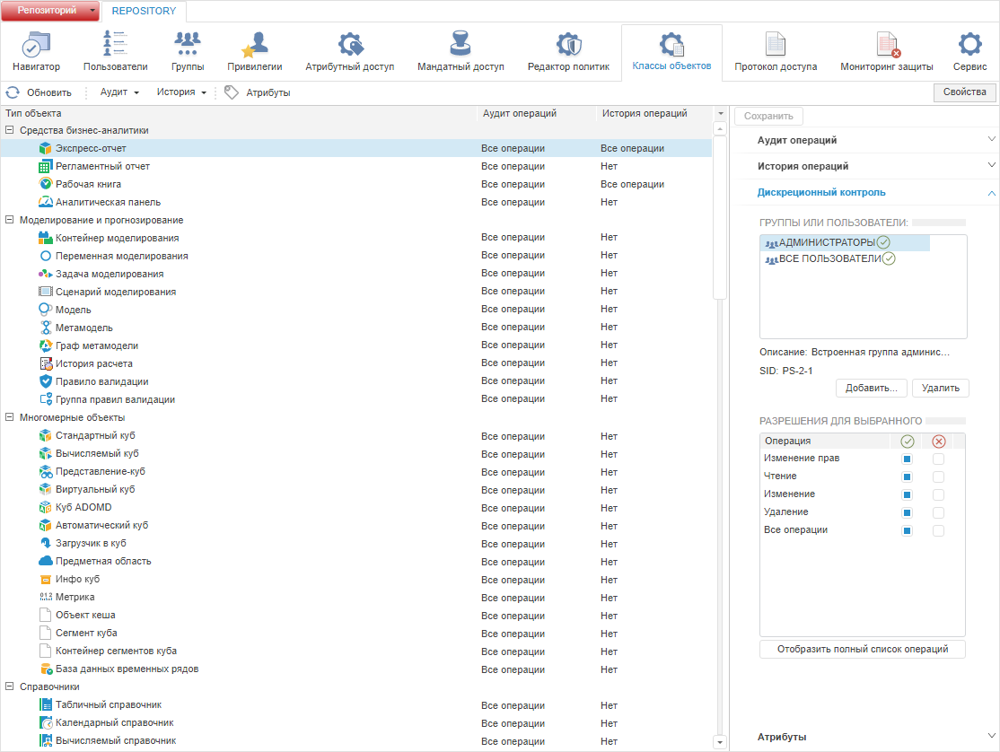
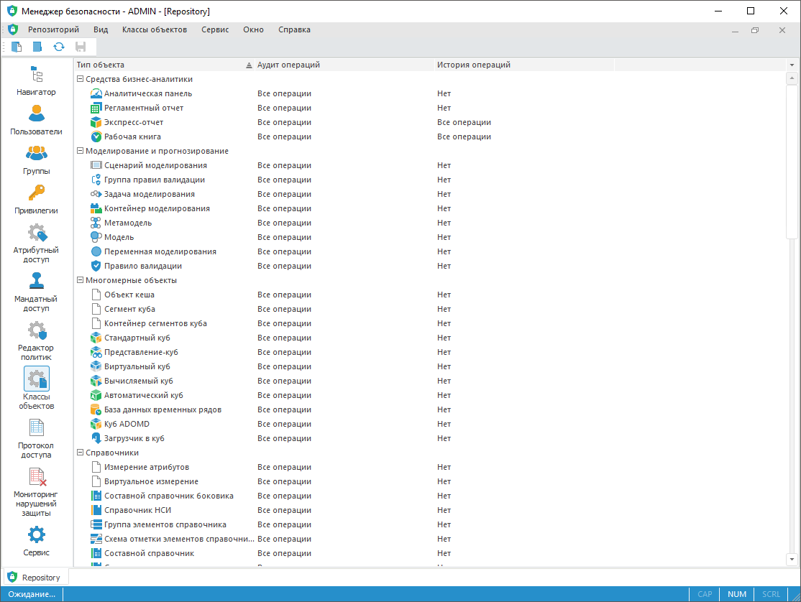

# Настройка аудита действий пользователя

Настройка аудита действий пользователя
-

# Настройка аудита действий пользователя

Для настройки аудита действий пользователя используйте раздел «Классы объектов» [панели
 навигации](../01_RunSecManager/Admin_Organizational_Starting.htm).

Примечание.
 При [разделении
 ролей](Editor_of_Politicy/Security_EditorPoliticy_Adm.htm) между администратором информационной безопасности и прикладным
 администратором раздел «Классы объектов»
 будет доступен только администратору информационной безопасности.

Раздел «Классы объектов»:

	Веб-приложение
	 Настольное
	 приложение

		

		

Менеджер безопасности производит автоматический аудит действий субъектов
 в системе и записывает информацию о производимых действиях в [протокол
 доступа](../05_AccessProtocol/Admin_AccessProtocol.htm). [Протоколируемые
 операции](../05_AccessProtocol/Admin_AccessProtocol_EvetsType.htm) делятся на общие, которые можно производить над всеми типами
 объектов, и специфические, которые можно производить только с определенным
 типом объектов. Для каждого типа объекта ведется история по операциям:
 изменение объекта, изменение прав, удаление объекта. При ведении полной
 истории сохраняется история изменений объекта по всем операциям.

[Выделение
 типов объектов](javascript:TextPopup(this))

	Для выделения типов объектов:

		- в веб-приложении:

			- удерживайте нажатую клавишу CTRL для выделения выбранных
			 строк;

			- удерживайте нажатую клавишу SHIFT для выделения всех
			 строк с текущей строки по строку N (предыдущая отметка снимается);

		- в настольном приложении:

			- выполните команду контекстного меню типа объектов:

				- Выделить все.
				 Выделяет все элементы списка;

				- Обратить выделение.
				 Инвертирует существующее выделение (изменение состояния
				 элементов списка на обратное);

				- Снять выделение.
				 Снимает выделение со всех элементов списка;

			- удерживайте нажатую клавишу CTRL для выделения выбранных
			 строк;

			- удерживайте нажатую клавишу SHIFT для выделения всех
			 строк с текущей строки по строку N (предыдущая отметка снимается).

	После выполнения одного из действий типы объектов будут выделены
	 для дальнейшей настройки [прав
	 доступа](Admin_Object_Classes.htm#access_permissions), [аудита](Admin_Object_Classes.htm#audit) и
	 [истории](Admin_Object_Classes.htm#history).

[Изменение
 прав доступа объектов](javascript:TextPopup(this))

	Для изменения или просмотра прав доступа типа объектов:

		- в веб-приложении выберите объект;

		- в настольном приложении:

			- выполните команду «Права доступа» в контекстном
			 меню типа объектов;

			- выделите тип объекта и выполните
			 команду «Классы объектов
			 > Права доступа»
			 в [главном
			 меню](../01_RunSecManager/Admin_Organizational_Starting.htm);

			- дважды щёлкните основной
			 кнопкой мыши по наименованию типа объектов.

	После выполнения одного из действий отобразится боковая панель «[Свойства](../03_Admin/Admin_AdminObjects.htm)»
	 в веб-приложении и будет открыто окно «[Параметры управления доступом](../03_Admin/Admin_AdminObjects.htm)»
	 в настольном приложении. Настройте параметры [дискреционного
	 контроля](../03_Admin/Admin_AdminObjects_Discretionary.htm), [аудита](Admin_PermSep_AuditPermission.htm),
	 [атрибутов](Admin_PermSep_Attributes.htm), [меток
	 безопасности](../03_Admin/Admin_AdminObjects_Marks.htm).

[Включение
 и отключение аудита](javascript:TextPopup(this))

	Для включения аудита, который определяет набор протоколируемых операций
	 выбранного типа объектов:

		- в веб-приложении:

			- нажмите кнопку «Аудит
			 > Все операции» на [панели
			 инструментов](../01_RunSecManager/Admin_Organizational_Starting.htm) для включения всех операций на вкладке «[Аудит
			 операций](Admin_PermSep_AuditPermission.htm)»;

			- нажмите кнопку «Аудит
			 > Общие операции» на [панели
			 инструментов](../01_RunSecManager/Admin_Organizational_Starting.htm) для включения всех операций, кроме специфических,
			 на вкладке «[Аудит
			 операций](Admin_PermSep_AuditPermission.htm)»;

			- установите флажки напротив необходимых операций на вкладке
			 «[Аудит
			 операций](Admin_PermSep_AuditPermission.htm)» боковой панели «Свойства»;

		- в настольном приложении установите
		 флажки напротив необходимых операций на вкладке «[Аудит](Admin_PermSep_AuditPermission.htm)».

	После выполнения действий в [протоколе
	 доступа](../05_AccessProtocol/Admin_AccessProtocol.htm) будет записываться аудит действий субъектов по [выбранным
	 операциям](Admin_PermSep_AuditPermission.htm).

	Для отключения аудита выбранного типа объектов:

		- в веб-приложении:

			- нажмите кнопку «Аудит
			 > Отключить» на [панели
			 инструментов](../01_RunSecManager/Admin_Organizational_Starting.htm);

			- снимите флажки напротив
			 операций на вкладке «[Аудит
			 операций](Admin_PermSep_AuditPermission.htm)» боковой панели «Свойства»;

		- в настольном приложении:

			- выполните команду «Отключить
			 аудит» в контекстном меню типа объектов;

			- выполните команду «Классы
			 объектов > Отключить
			 аудит» в [главном
			 меню](../01_RunSecManager/Admin_Organizational_Starting.htm);

			- снимите флажки напротив операций на вкладке «[Аудит](Admin_PermSep_AuditPermission.htm)».

	После выполнения действий в [протоколе
	 доступа](../05_AccessProtocol/Admin_AccessProtocol.htm) будет отключен аудит действий субъектов по [выбранным
	 операциям](Admin_PermSep_AuditPermission.htm).

[Включение
 и отключение ведения истории](javascript:TextPopup(this))

	Для включения ведения истории выбранного типа объектов:

		- в веб-приложении:

			- нажмите кнопку «История
			 > Все операции» на [панели
			 инструментов](../01_RunSecManager/Admin_Organizational_Starting.htm) для ведения истории по всем операциям на
			 вкладке «[История
			 операций](Admin_PermSep_AuditPermission.htm)»;

			- установите флажки напротив необходимых операций ведения
			 истории на вкладке «[История
			 операций](Admin_PermSep_AuditPermission.htm)» боковой панели «Свойства»;

		- в настольном приложении установите
		 флажки напротив необходимых операций ведения истории на вкладке «[Аудит](Admin_PermSep_AuditPermission.htm)».

	После выполнения действий история изменений объектов будет вестись
	 по [выбранным операциям](Admin_PermSep_AuditPermission.htm).

	Для выключения ведения истории:

		- в веб-приложении:

			- нажмите кнопку «История
			 > Отключить» на [панели
			 инструментов](../01_RunSecManager/Admin_Organizational_Starting.htm);

			- снимите флажки напротив
			 операций ведения истории на вкладке «[История операций](Admin_PermSep_AuditPermission.htm)»
			 боковой панели «Свойства»;

		- в настольном приложении:

			- выполните команду «Отключить
			 историю» в контекстном меню типа объектов;

			- выполните команду «Классы
			 объектов > Отключить историю» в [главном
			 меню](../01_RunSecManager/Admin_Organizational_Starting.htm);

			- снимите флажки напротив операций ведения истории на
			 вкладке «[Аудит](Admin_PermSep_AuditPermission.htm)».

	После выполнения действий история изменений объектов по [выбранным
	 операциям](Admin_PermSep_AuditPermission.htm) будет отключена.

	Примечание.
	 При включенном ведении истории частое изменение объектов репозитория
	 может привести к сильному увеличению объема системной таблицы, в которой
	 сохраняется история.

Примечание.
 Изменение прав, отключение аудита и истории возможно для нескольких выбранных
 объектов.

Типы объектов отображаются в виде списка:

	- Линейный вид. Список
	 типов объектов представлен в виде таблицы;

Примечание.
 Линейный вид доступен только в настольном приложении.

	- Древовидный вид. Список
	 типов объектов представлен в виде дерева, вершиной которого является
	 класс объектов. Доступно разворачивание и сворачивание иерархии типов
	 объектов с помощью команды контекстного меню «Развернуть/Свернуть
	 всю иерархию».

По умолчанию список объектов представлен в древовидном виде. В линейном
 виде типы объектов не сгруппированы по классам.

Для изменения вида отображения списка выполните команду «Вид
 > Линейный вид/Древовидный вид» в [главном
 меню](../01_RunSecManager/Admin_Organizational_Starting.htm) настольного приложения.

Для применения заданных настроек типов объектов:

	- в веб-приложении нажмите кнопку  «Сохранить»
	 на [панели
	 инструментов](../01_RunSecManager/Admin_Organizational_Starting.htm) или на [боковой
	 панели](../01_RunSecManager/Admin_Organizational_Starting.htm);

	- в настольном приложении выполните
	 одно из действий:

		- выполните команду «Репозиторий
		 > Применить политику безопасности» в [главном
		 меню](../01_RunSecManager/Admin_Organizational_Starting.htm);

		- нажмите кнопку 
		 «Применить политику безопасности»
		 на [панели
		 инструментов](../01_RunSecManager/Admin_Organizational_Starting.htm).

Примечание.
 Если параметры раздела были изменены, то при попытке перехода на другой
 раздел или при закрытии менеджера безопасности будет выдан запрос о применении
 измененных настроек.

## Добавление атрибутов

Задайте атрибуты классам объектов при использовании [атрибутного
 метода](Admin_ABAC.htm) разграничения доступа:

	- Для
	 классов объектов. Атрибуты устанавливаются для всех типов объектов
	 с помощью окна «[Атрибуты](Creating_attributes.htm)»;

	- Для
	 отдельного типа объекта. Атрибуты устанавливаются для одного
	 типа объектов с помощью вкладки «[Атрибуты](Admin_PermSep_Attributes.htm)» при настройке
	 [параметров
	 управления доступом](../03_Admin/Admin_AdminObjects.htm#obj_classes);

	- Для
	 отдельного объекта. [Значение
	 атрибута](UiNav.chm::/03_Objects/UiNav_Obj_BasicPropAttributes.htm) устанавливается для одного объекта, если
	 соответствующий тип объекта содержит атрибуты.

Примечание.
 В настольном приложении редактирование атрибутов отдельного объекта доступно
 в [свойствах
 объекта](UiNav.chm::/03_Objects/UiNav_Obj_BasicProp.htm)
 на вкладке «[Атрибуты](UiNav.chm::/03_Objects/UiNav_Obj_BasicPropAttributes.htm)»
 в [навигаторе
 объектов](GetStarted.chm::/Interface/Interface_Navigator.htm). В веб-приложении доступен только просмотр
 атрибутов отдельного объекта на боковой панели «[Свойства](../03_Admin/Admin_AdminObjects.htm)» в менеджере
 безопасности.

См. также:

[Настройка
 политики безопасности системы](../01_RunSecManager/Admin_Intro.htm) | [Классы
 объектов](Object_classes.htm) | [Выбор операций
 аудита и истории](Admin_PermSep_AuditPermission.htm) | [Создание пользовательских
 атрибутов](Creating_attributes.htm)

		Справочная
		 система на версию 10.9
		 от 18/08/2025,
		 © ООО «ФОРСАЙТ»,
