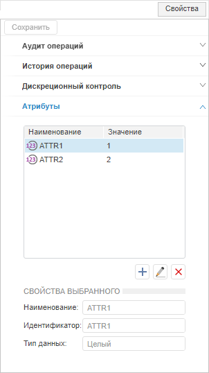
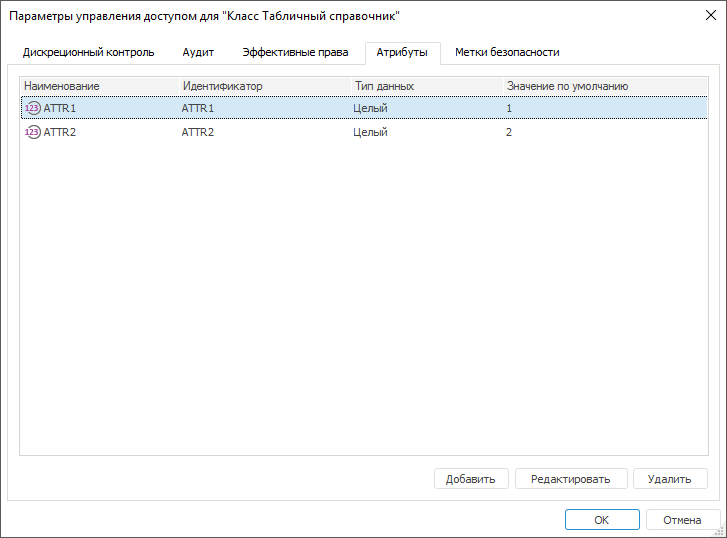
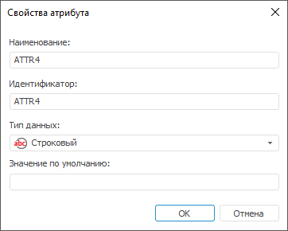

# Добавление атрибутов отдельным типам объектов

Добавление атрибутов отдельным типам объектов
-

# Добавление атрибутов отдельным типам объектов

При использовании [атрибутного метода](Admin_ABAC.htm) разграничения
 доступа добавьте атрибуты типам объектов для дальнейшей проверки доступа
 пользователей к объектам определенного типа в структуре политики [атрибутного
 доступа](Admin_AttributeAccess.htm).

Примечание.
 При [разделении
 ролей](Editor_of_Politicy/Security_EditorPoliticy_Adm.htm) вкладка «Атрибуты»
 будет доступна только администратору информационной безопасности с [привилегией](Admin_Priv.htm)
 «Изменение прав пользователей, раздача ролей, изменение политики», «Изменение метки безопасности
 и списка контроля доступа любого объекта».

Для добавления или редактирования добавленных атрибутов отдельного типа
 объектов используйте вкладку «Атрибуты»
 на боковой панели «[Свойства](../03_Admin/Admin_AdminObjects.htm)»
 в веб-приложении и в окне «[Параметры
 управления доступом](../03_Admin/Admin_AdminObjects.htm)» в настольном приложении.

	Веб-приложение
	 Настольное
	 приложение

		

		

В таблице указаны все содержащиеся атрибуты отдельного типа объектов
 с определенными свойствами.

[Добавление
 атрибута](javascript:TextPopup(this))

	Для добавления нового атрибута:

		- в веб-приложении нажмите кнопку  «Добавить»;

		- в настольном приложении нажмите кнопку «Добавить».

	После выполнения одного из действий будет открыто окно «Свойства
	 атрибута»:

	

	Задайте свойства атрибута: наименование, идентификатор, тип данных,
	 значение по умолчанию.

	Важно.
	 Добавленные атрибуты содержатся в [свойствах](UiNav.chm::/03_Objects/UiNav_Obj_BasicPropAttributes.htm)
	 конкретного объекта для возможности редактирования их значений.

[Редактирование
 атрибута](javascript:TextPopup(this))

	Для редактирования существующего атрибута:

		- Выделите в списке необходимый атрибут.

		- Нажмите кнопку «Редактировать»
		 в настольном приложении или  «Редактировать»
		 в веб-приложении.

	После выполнения действий будет открыто окно «[Свойства атрибута](Admin_PermSep_Attributes.htm#properties_attr)»
	 с заданными свойствами для изменений.

[Удаление
 атрибута](javascript:TextPopup(this))

	Для удаление существующего атрибута:

		- Выделите в списке необходимый атрибут.

		- Нажмите кнопку «Удалить»
		 в настольном приложении или  «Удалить»
		 в веб-приложении.

	После выполнения действий атрибут будет удален из списка.

Заданные значения атрибутам используйте для дальнейшей проверки доступа
 к отдельным типам объектов в [свойствах](Admin_AttributeAccess.htm#properties)
 элементов атрибутного доступа: [цель](Target.htm), [условие](Creating_conditions.htm).

См. также:

[Настройка
 аудита действий пользователя](Admin_Object_Classes.htm) | [Настройка
 атрибутного метода](Admin_ABAC.htm)

		Справочная
		 система на версию 10.9
		 от 18/08/2025,
		 © ООО «ФОРСАЙТ»,
