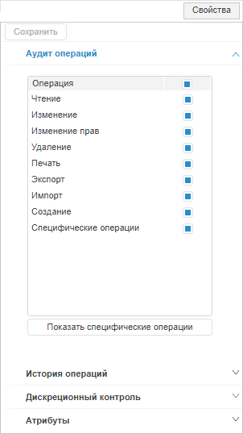
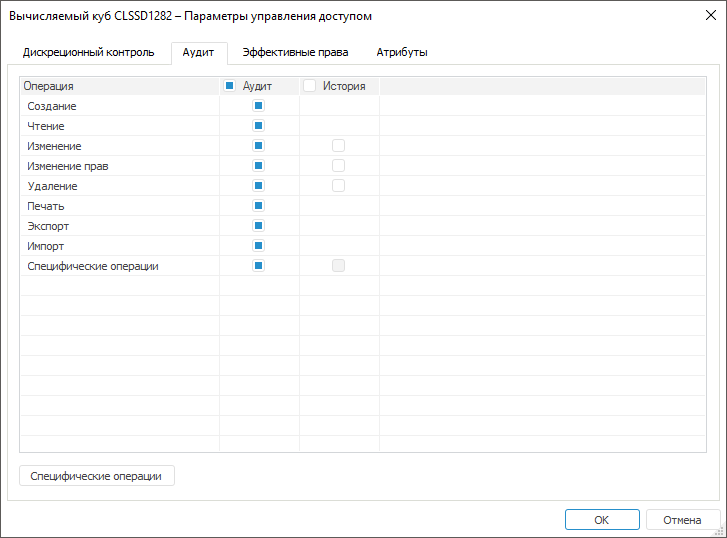
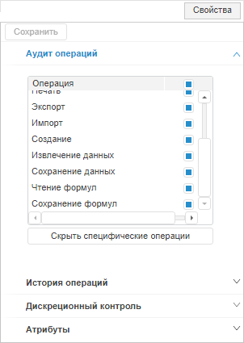
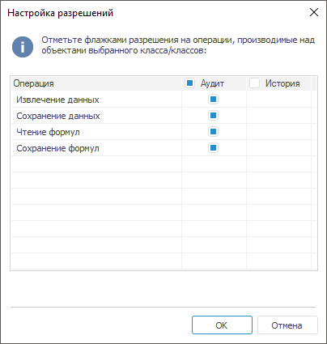

# Выбор операций аудита и истории

Выбор операций аудита и истории
-

# Выбор операций аудита и истории

Для объектов производится автоматический [аудит](Admin_Object_Classes.htm#audit)
 действий субъектов в системе, который записывается в [протокол
 доступа](../05_AccessProtocol/Admin_AccessProtocol.htm), и ведется история изменений.

Выберите операции, по которым будет вестись аудит и история:

	- Откройте боковую панель «Свойства»
	 в веб-приложении или окно «[Параметры
	 управления доступом](../03_Admin/Admin_AdminObjects.htm)» в настольном приложении:

		- в веб-приложении выделите [тип объектов](Admin_Object_Classes.htm#selection);

		- в настольном приложении:

			- выполните команду «Права
			 доступа» в контекстном меню типа объектов;

			- выполните команду «Классы
			 объектов > Права
			 доступа» в [главном
			 меню](../01_RunSecManager/Admin_Organizational_Starting.htm);

			- дважды щёлкните по наименованию типа объектов.

После выполнения действий будет открыта вкладка
 «Аудит операций» на боковой панели
 «Свойства» в веб-приложении или
 окно «Параметры управления доступом»
 в настольном приложении.

	Веб-приложение
	 Настольное
	 приложение

		

		

	- Перейдите на вкладку «Аудит»/«Аудит операций»/«История
	 операций».

	- Установите флажки напротив [операций](../05_AccessProtocol/Admin_AccessProtocol_EvetsType.htm):

		- для протоколирования на вкладке «Аудит»/«Аудит операций»;

		- для ведения истории на вкладке «Аудит»
		 в столбце «История»/на
		 вкладке «История операций».

Примечание.
 Если окно или боковая панель были открыты для нескольких типов объектов,
 то в списке операций будут присутствовать только общие операции.

	- При необходимости отметьте [специфические
	 операции](Admin_PermSep_AuditPermission.htm#specific).

	- Сохраните изменения:

		- в веб-приложении нажмите кнопку «Сохранить»
		 на [боковой
		 панели](../01_RunSecManager/Admin_Organizational_Starting.htm);

		- в настольном приложении нажмите кнопку 
		 «Сохранить» на [панели
		 инструментов](../01_RunSecManager/Admin_Organizational_Starting.htm).

После выполнения действий будет вестись аудит действий субъектов в [протоколе доступа](../05_AccessProtocol/Admin_AccessProtocol.htm)
 и история изменений объектов по выбранным операциям.

[Дополнительные
 действия с операциями в настольном приложении](javascript:TextPopup(this))

	Для установки/снятия флажка нажмите на флажок или используйте команду
	 контекстного меню «Включить»/«Выключить».

	Для смены состояния флажка на противоположное используйте команду
	 контекстного меню «Обратить состояние».

	Для смены состояния выделения на противоположное используйте
	 команду контекстного меню «Обратить
	 выделение».

	Для выделения всех элементов списка используйте команду контекстного
	 меню «Выделить все».

	Для снятия всех установленных флажков нажмите кнопку «Очистить
	 все».

## Специфические операции

В списке общих операций содержится строка и кнопка «Специфические
 операции»/«Показать специфические
 операции», которая определяет настройку аудита по специфическим
 операциям.

Примечание.
 Строка «Специфические операции»
 и кнопка «Специфические операции»/«Показать специфические операции»
 недоступны, если для данного типа объектов не предусмотрены [специфические
 операции](../05_AccessProtocol/Admin_AccessProtocol_EvetsType.htm) или диалог/боковая панель открыты для нескольких типов объектов.

Для настройки аудита по специфическим операциям:

	- в веб-приложении нажмите кнопку «Показать специфические операции»
	 на вкладке «Аудит»;

	- в настольном приложении
	 нажмите кнопку «Специфические
	 операции» на вкладке «Аудит».

После выполнения действий в списке аудита операций дополнительно отобразятся
 специфические операции на боковой панели «Свойства»
 в веб-приложении или будет открыто окно «Настройка
 разрешений» в настольном приложении.

	Веб-приложение
	 Настольное
	 приложение

		

		

Установите флажки напротив специфических операций для протоколирования
 в столбце/на вкладке «Аудит»/«Аудит операций».

Примечание.
 Для разных типов объектов список специфических операций отличается.

В настольном приложении нажмите кнопку «ОК»
 в окне «Настройка разрешений»
 и состояние флажка напротив специфических операций в окне «[Параметры управления доступом](../03_Admin/Admin_AdminObjects.htm)»
 обновится.

В веб-приложении на боковой панели «Свойства»
 нажмите кнопку «Сохранить» или
 перейдите на другой раздел менеджера безопасности для возникновения запроса
 о сохранении изменений.

См. также:

[Настройка
 аудита действий пользователя](Admin_Object_Classes.htm) | [Версии объекта](uinav.chm::/02_Navigator/UiNav_ObjVer.htm)
 | [Протокол
 доступа](../05_AccessProtocol/Admin_AccessProtocol.htm)

		Справочная
		 система на версию 10.9
		 от 18/08/2025,
		 © ООО «ФОРСАЙТ»,
