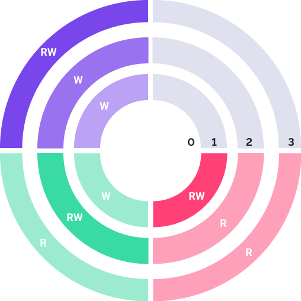

# Настройка мандатного метода

Настройка мандатного метода
-

# Настройка мандатного метода

Мандатный метод разграничения доступа раздает права средствами платформы
 и основан на присвоении объектам и субъектам системы уровня безопасности.
 Уровни безопасности объектов определяют доступ к хранящейся в них информации:
 чем ниже уровень, тем выше секретность. Уровни безопасности субъектов
 определяют доступ к информации.

Примечание.
 Мандатный метод доступен для одновременного использования с [дискреционным
 методом](Admin_PermSep_D.htm).

При использовании мандатного метода разграничения доступа вся информация,
 хранящаяся в системе, разделяется по различным категориям. Каждая категория
 может содержать произвольное количество уровней безопасности. Уровни являются
 сопоставимыми, если они принадлежат одной категории информации. Все уровни
 безопасности имеют разные метки критичности. Уровень имеет большую степень
 секретности, если значение его метки критичности меньше.

Категории могут быть двух видов:

	- Иерархические. Иерархические
	 категории определяют отношения сравнения между уровнями безопасности
	 по значению метки критичности. Таким образом, результатом сравнения
	 меток может быть более высокий или низкий уровень доступа. Если метка
	 критичности пользователя ниже метки объекта, то пользователь получает
	 права только на чтение. Если метка критичности пользователя выше метки
	 объекта, то пользователь получает права только на запись. Если метки
	 критичности объекта и пользователя совпадают, то пользователь получает
	 права на запись и на чтение;

	- Неиерархические. Для
	 неиерархической категории результатом сравнения меток критичности
	 может быть совпадение меток или их несовпадение, то есть области действий
	 уровней безопасности не пересекаются. Если результатом сравнения является
	 совпадение меток, то пользователь получает права на чтение и запись.
	 В случае несовпадения меток критичности определяется запрет доступа
	 к объекту.

Настройка мандатного метода осуществляется:

	- владельцем схемы ADMIN;

	- членами группы «[Администраторы](../03_Admin/Groups/Admin_Groups.htm)»;

	- пользователями с [привилегиями](Admin_Priv.htm) «Вход в систему», «Изменение
	 прав пользователей, раздача ролей, изменение политики», «Изменение метки безопасности и списка контроля
	 доступа любого объекта. Просмотр всех объектов в навигаторе»,
	 «Право чтения и открытия всех объектов»;

	- [администратором
	 информационной безопасности](Editor_of_Politicy/Security_EditorPoliticy_Adm.htm) при разделении ролей администраторов.

Для использования мандатного метода разграничения доступа:

	- Установите флажок «Использовать
	 мандатный доступ» на вкладке «[Контроль доступа](Admin_SecPolicy.htm#access_control)»
	 редактора политик.

	- Создайте [учетные
	 записи пользователей](../03_Admin/Users/Admin_Users.htm) и [группы
	 пользователей](../03_Admin/Groups/Admin_Groups.htm).

	- Добавьте [категории и уровни
	 безопасности](Admin_MandatAccess.htm).

	- Задайте уровни безопасности для [субъектов](../03_Admin/Users/Admin_UserProp_MC.htm)
	 и [объектов](../03_Admin/Admin_AdminObjects_Mandate.htm).

## Механизм контроля доступа

Мандатный контроль определяет только возможность чтения и изменения
 объекта, права на удаление объекта с помощью мандатного доступа не определяются.
 К изменению объекта относятся все операции, каким-либо образом меняющие
 содержимое объекта или права доступа к нему.

Субъект может производить операцию чтения над объектом:

	- для иерархических категорий: если метка критичности пользователя
	 меньше или равна метке критичности объекта;

	- для неиерархических категорий: только в случае равенства меток
	 критичности объекта и пользователя.

Субъект получает права на запись:

	- для иерархических категорий: если метка критичности пользователя
	 больше или равна метке критичности объекта;

	- для неиерархических категорий: только в случае равенства меток
	 критичности объекта и пользователя.

Субъект получает права на чтение и запись одновременно, когда метки
 критичности объекта и пользователя совпадают.

При наличии нескольких категорий информации с различным набором уровней
 безопасности для получения прав на чтение или редактирование вышеуказанные
 правила должны быть соблюдены для каждой категории.

Специфический уровень с меткой критичности «0» означает запрет операций
 чтения и записи. Если он установлен для пользователя, то этот пользователь
 не сможет получить доступа ни к одному объекту репозитория. Если этот
 уровень установлен для объекта, то ни один из пользователей не сможет
 получить доступа к данному объекту.

## Пример

Допустим, имеется несколько уровней безопасности для иерархической категории:

0.
 Доступ запрещен;

1.
 Для служебного пользования;

2.
 Ограниченный доступ;

3.
 Свободный доступ (для общего пользования).

И три пользователя с уровнями безопасности:

 Пользователь1. Для
 служебного пользования (1);

 Пользователь2. Ограниченный
 доступ (2);

 Пользователь3. Свободный
 доступ (3).

Тогда структуру системы можно представить в виде диаграммы:

Окружности символизируют собой уровни безопасности с соответствующими
 метками критичности.

Обозначение подписей:

	- RW. Есть права на чтение
	 и запись;

	- R. Есть права только
	 на чтение;

	- W. Есть права только
	 на запись.

Таким образом, получается, что в данной системе:

	- Пользователь1 имеет
	 права:

	-

		- на чтение и запись объектов с уровнем безопасности «Для
		 служебного пользования(1)»;

		- на чтение объектов с уровнями безопасности «Ограниченный
		 доступ (2)» и «Свободный доступ (3)»;

	- Пользователь2 имеет
	 права:

	-

		- на чтение и запись объектов с уровнем безопасности «Ограниченный
		 доступ (2)»;

		- на чтение объектов с уровнем безопасности «Свободный доступ
		 (3)»;

		- на запись объектов с уровнем безопасности «Для служебного
		 пользования(1)»;

	- Пользователь3 имеет
	 права:

		- на чтение и запись объектов с уровнем безопасности «Свободный
		 доступ (3)»;

		- на запись объектов с уровнями безопасности «Ограниченный
		 доступ (2)» и «Для служебного пользования(1)».

Всем пользователям запрещен доступ к объектам с уровнем безопасности
 «0 – Доступ запрещен».

См. также:

[Выбор
 методов разграничения доступа и их настройка](Admin_SecPolicy.htm) | [Добавление
 категорий и уровней безопасности](Admin_MandatAccess.htm)

		Справочная
		 система на версию 10.9
		 от 18/08/2025,
		 © ООО «ФОРСАЙТ»,
