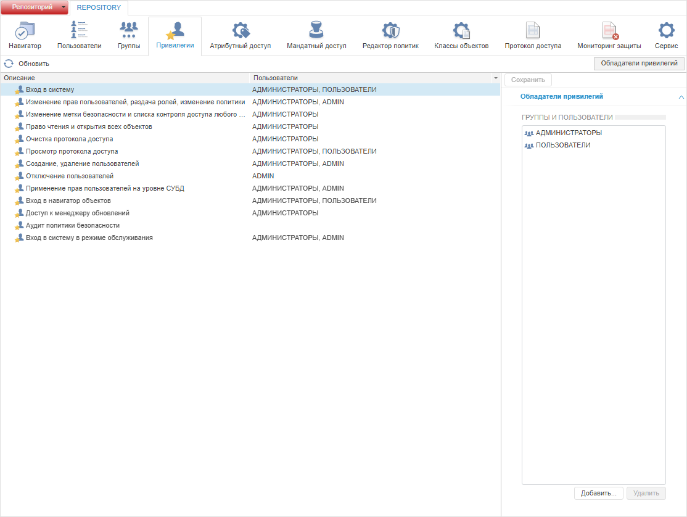
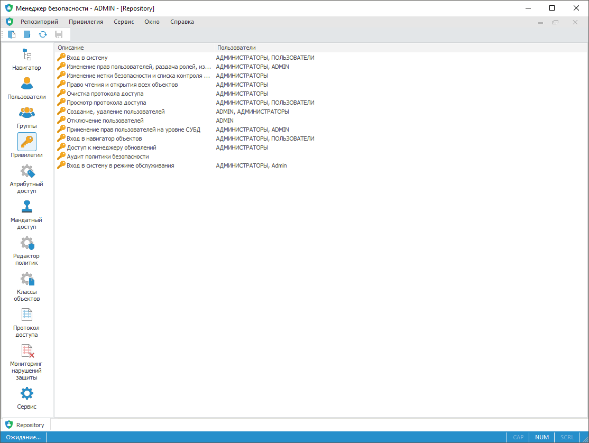
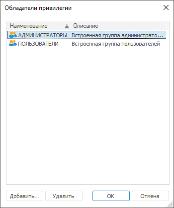

# Распределение привилегий

Распределение привилегий
-

# Распределение привилегий

Для распределения привилегий между пользователями системы используйте
 раздел «Привилегии» [панели
 навигации](../01_RunSecManager/Admin_Organizational_Starting.htm).

Примечание.
 При [разделении
 ролей](Editor_of_Politicy/Security_EditorPoliticy_Adm.htm) между администратором информационной безопасности и прикладным
 администратором раздел «Привилегии»
 будет доступен только администратору информационной безопасности.

Привилегии позволяют пользователю выполнять различные операции в «Форсайт. Аналитическая платформа»
 и на уровне СУБД. При выполнении таких операций, как создание, удаление
 или редактирование структуры объектов, раздача прав доступа на объекты,
 создание и обновление пользователей, происходит подключение к базе данных
 c запросом учётных данных пользователя в окне «[Авторизация
 в базе данных](uinavobj.chm::/database/UiDb_database_authorization.htm)». Для выполнения операции пользователь
 должен обладать соответствующими привилегиями и правами доступа на уровне
 СУБД.

Раздел «Привилегии»:

	Веб-приложение

	 Настольное
	 приложение

		

		

Напротив каждой привилегии перечислены пользователи, которые обладают
 данной привилегией по умолчанию. Владелец схемы ADMIN входит во встроенную
 группу «Администраторы» и наследует набор привилегий данной группы.

Описание привилегий системы:

[Вход
 в систему](javascript:TextPopup(this))

	Привилегия позволяет пользователям осуществлять вход в систему.

	По умолчанию данной привилегией обладают встроенные группы «Администраторы»,
	 «Пользователи».

	При [разделении
	 ролей](Editor_of_Politicy/Security_EditorPoliticy_Adm.htm) между администратором информационной безопасности (АИБ)
	 и прикладным администратором данной привилегией будут обладать: встроенные
	 группы «Администраторы», «Пользователи», и АИБ <имя
	 схемы>_ISA.

[Изменение
 прав пользователей, раздача ролей, изменение политики](javascript:TextPopup(this))

	Привилегия позволяет пользователям выполнять следующие операции:

		- в разделе «[Пользователи](../03_Admin/Users/Admin_Users.htm)»:

			- изменение [свойств](../03_Admin/Users/Admin_UserCreate.htm)
			 пользователя;

			- изменение [пароля](../03_Admin/Users/Admin_User_EditPass.htm)
			 пользователя;

			- редактирование [служебного
			 пользователя](../03_Admin/Users/Admin_Service_User.htm);

			- работа с [личными
			 папками пользователей](../03_Admin/Users/Admin_UserFolder.htm);

			- экспорт списка пользователей в формате *.csv;

			- просмотр [подключённых
			 пользователей](../03_Admin/Users/Admin_ConnectedUsers.htm);

		- в разделе «[Группы](../03_Admin/Groups/Admin_Groups.htm)»:

			- создание группы пользователей;

			- изменение [свойств](../03_Admin/Groups/Admin_GroupsCreate.htm)
			 группы пользователей;

		- в разделе «Привилегии»:

			- добавление и удаление обладателей привилегий;

		- в разделе «Редактор политик»:

			- настройка [общей
			 политики](Editor_of_Politicy/Security_EditorPoliticy_General.htm);

			- настройка [парольной
			 политики](Editor_of_Politicy/Security_EditorPoliticy_General_Parole.htm);

			- выбор [методов разграничения
			 доступа](Admin_SecPolicy.htm) и настройка [контроля
			 доступа](../03_Admin/Access_control_settings.htm);

			- настройка доступа [рабочих
			 станций и принтеров](../03_Admin/Workstation_and_printer_access.htm);

		- в разделе «[Классы
		 объектов](Admin_Object_Classes.htm)»:

			- выбор [операций
			 аудита и истории](Admin_PermSep_AuditPermission.htm).

	По умолчанию данной привилегией обладает встроенная группа «Администраторы».

	При [разделении
	 ролей](Editor_of_Politicy/Security_EditorPoliticy_Adm.htm) между администратором информационной безопасности (АИБ)
	 и прикладным администратором данной привилегией будет обладать только
	 АИБ <имя схемы>_ISA.

[Изменение
 метки безопасности и списка контроля доступа любого объекта. Просмотр
 всех объектов в навигаторе](javascript:TextPopup(this))

	Привилегия позволяет пользователям выполнять следующие операции
	 в разделе «[Навигатор](../02_ComonFunction/Admin_SecManager_CommonFunction.htm)»:

		- изменение [параметров
		 управления доступом к объектам](../03_Admin/Admin_AdminObjects.htm);

		- просмотр [прав
		 доступа в виде пиктограмм](../02_ComonFunction/Admin_Access_Permissions.htm);

		- разграничение прав доступа на [элементы
		 справочников НСИ](../03_Admin/Admin_ElementAccess.htm).

	По умолчанию данной привилегией обладает встроенная группа «Администраторы».

	При [разделении
	 ролей](Editor_of_Politicy/Security_EditorPoliticy_Adm.htm) между администратором информационной безопасности (АИБ)
	 и прикладным администратором данной привилегией будет обладать только
	 АИБ <имя схемы>_ISA.

[Право
 чтения и открытия всех объектов](javascript:TextPopup(this))

	Привилегия позволяет пользователям выполнять следующие операции:

		- создавать реляционные объекты на уровне СУБД;

		- просматривать и открывать все объекты в [навигаторе](GetStarted.chm::/Interface/Interface_Navigator.htm).

	По умолчанию данной привилегией обладает встроенная группа «Администраторы».

	При [разделении
	 ролей](Editor_of_Politicy/Security_EditorPoliticy_Adm.htm) между администратором информационной безопасности (АИБ)
	 и прикладным администратором данной привилегией будет обладать только
	 встроенная группа «Администраторы».

[Очистка
 протокола доступа](javascript:TextPopup(this))

	Привилегия позволяет пользователям [очищать
	 протокол доступа](../05_AccessProtocol/Admin_AccessProtoclo_Clean.htm) в разделе «[Протокол доступа](../05_AccessProtocol/Admin_AccessProtocol.htm)».

	По умолчанию данной привилегией обладает встроенная группа «Администраторы».

	При [разделении
	 ролей](Editor_of_Politicy/Security_EditorPoliticy_Adm.htm) между администратором информационной безопасности (АИБ)
	 и прикладным администратором данной привилегией будет обладать только
	 АИБ <имя схемы>_ISA.

[Просмотр
 протокола доступа](javascript:TextPopup(this))

	Привилегия позволяет пользователям просматривать протокол доступа
	 в разделе «[Протокол
	 доступа](../05_AccessProtocol/Admin_AccessProtocol.htm)».

	По умолчанию данной привилегией обладают встроенные группы «Администраторы»,
	 «Пользователи».

	При [разделении
	 ролей](Editor_of_Politicy/Security_EditorPoliticy_Adm.htm) между администратором информационной безопасности (АИБ)
	 и прикладным администратором данной привилегией будут обладать: встроенные
	 группы «Администраторы», «Пользователи», и АИБ <имя
	 схемы>_ISA.

[Создание,
 удаление пользователей](javascript:TextPopup(this))

	Привилегия позволяет пользователям выполнять следующие операции
	 в разделе «[Пользователи](../03_Admin/Users/Admin_Users.htm)»:

		- создание и удаление [пользователя](../03_Admin/Users/Admin_UserCreate.htm);

		- добавление и удаление [доменного
		 пользователя](../03_Admin/Users/Admin_UserCreate_Domain.htm);

		- добавление и удаление [доменной
		 группы пользователей](../03_Admin/Groups/Admin_GroupsCreateDomain.htm), если пользователь дополнительно обладает
		 привилегией «Изменение прав пользователей,
		 раздача ролей, изменение политики»;

		- редактирование [служебного
		 пользователя](../03_Admin/Users/Admin_Service_User.htm);

		- изменение [общих
		 свойств](../03_Admin/Users/Admin_UserProp_Common.htm) пользователя;

		- изменение [пароля](../03_Admin/Users/Admin_User_EditPass.htm)
		 пользователя;

		- работа с [личными
		 папками пользователей](../03_Admin/Users/Admin_UserFolder.htm);

		- экспорт списка пользователей в формате *.csv;

		- просмотр [подключённых
		 пользователей](../03_Admin/Users/Admin_ConnectedUsers.htm).

	По умолчанию данной привилегией обладает встроенная группа «Администраторы».

	При [разделении
	 ролей](Editor_of_Politicy/Security_EditorPoliticy_Adm.htm) между администратором информационной безопасности (АИБ)
	 и прикладным администратором данной привилегией будет обладать только
	 владелец схемы ADMIN.

[Отключение
 пользователей](javascript:TextPopup(this))

	Привилегия позволяет пользователям [отключать](../03_Admin/Users/Admin_ConnectedUsers.htm)
	 других пользователей, подключённых к репозиторию, в разделе «[Пользователи](../03_Admin/Users/Admin_Users.htm)».

	По умолчанию данной привилегией обладает владелец схемы ADMIN.

	При [разделении
	 ролей](Editor_of_Politicy/Security_EditorPoliticy_Adm.htm) между администратором информационной безопасности (АИБ)
	 и прикладным администратором данной привилегией будет обладать только
	 АИБ <имя схемы>_ISA.

[Применение
 прав пользователей на уровне СУБД](javascript:TextPopup(this))

	Привилегия позволяет пользователям выполнять следующие операции:

		- в разделе «[Пользователи](../03_Admin/Users/Admin_Users.htm)»:

			- [обновление](../03_Admin/Users/Admin_User_Update.htm)
			 прав пользователя;

		- в разделе «[Группы](../03_Admin/Groups/Admin_Groups.htm)»:

			- [обновление](../03_Admin/Groups/Groups_Update.htm)
			 прав группы пользователей.

	По умолчанию данной привилегией обладает встроенная группа «Администраторы».

	При [разделении
	 ролей](Editor_of_Politicy/Security_EditorPoliticy_Adm.htm) между администратором информационной безопасности (АИБ)
	 и прикладным администратором данной привилегией будет обладать только
	 встроенная группа «Администраторы».

[Вход
 в навигатор объектов](javascript:TextPopup(this))

	Привилегия позволяет пользователям открывать [навигатор
	 объектов](GetStarted.chm::/Interface/Interface_Navigator.htm).

	Примечание.
	 Пользователь, не имеющий данную привилегию, сможет открывать отдельные
	 объекты репозитория, на которые у него есть права доступа, при переходе
	 по ссылке на указанный объект или на стартовой странице веб-приложения.

	По умолчанию данной привилегией обладают встроенные группы «Администраторы»,
	 «Пользователи».

	При [разделении
	 ролей](Editor_of_Politicy/Security_EditorPoliticy_Adm.htm) между администратором информационной безопасности (АИБ)
	 и прикладным администратором данной привилегией будут обладать только
	 встроенные группы «Администраторы», «Пользователи».

[Доступ
 к менеджеру обновлений](javascript:TextPopup(this))

	Привилегия позволяет пользователям выполнять следующие операции:

		- [создание
		 обновления](UpdManager.chm::/CreateUpdate/Admin_CreateUpdate.htm) в [менеджере обновлений](UpdManager.chm::/Admin_UpdateTitle.htm);

		- [установка
		 обновления](UpdManager.chm::/Admin_UpMBObj_DoUpdate.htm)
		 в менеджере обновлений;

		- [копирование
		 алгоритмов расчёта](uinav.chm::/02_Navigator/UiNav_ObjectsOperations.htm#copy) в [навигаторе
		 объектов](getstarted.chm::/Interface/Interface_Navigator.htm);

		- [копирование
		 элементов](calculationalgorithm.chm::/Web/Work/Management_of_Elements.htm#copy), расположенных на рабочей области,
		 в [алгоритмах
		 расчёта](calculationalgorithm.chm::/Web/Work/Beginning_of_work.htm).

	По умолчанию данной привилегией обладает встроенная группа «Администраторы».

	При [разделении
	 ролей](Editor_of_Politicy/Security_EditorPoliticy_Adm.htm) между администратором информационной безопасности (АИБ)
	 и прикладным администратором данной привилегией будет обладать только
	 прикладной администратор.

[Аудит
 политики безопасности](javascript:TextPopup(this))

	Привилегия предназначена для контроля соответствия проектной документации
	 и настроек системы, контроля доступа пользователей и администраторов
	 к функциональным возможностям информационной системы. Привилегия не
	 предоставляет возможность редактирования указанных ниже настроек менеджера
	 безопасности.

	Привилегия позволяет пользователям выполнять следующие операции
	 в веб-приложении:

		- просмотр прав доступа к объектам в разделе «[Навигатор](../02_ComonFunction/Admin_SecManager_CommonFunction.htm)»;

		- просмотр списка пользователей и информации об их свойствах
		 в разделе «[Пользователи](../03_Admin/Users/Admin_Users.htm)»;

		- просмотр списка групп пользователей и информации об их свойствах
		 в разделе «[Группы](../03_Admin/Groups/Admin_Groups.htm)»;

		- просмотр информации о распределении привилегий между пользователями/группами
		 пользователей репозитория в разделе «Привилегии»;

		- просмотр набора политик, политик и правил проверки доступа
		 в разделе «[Атрибутный
		 доступ](Admin_AttributeAccess.htm)»;

		- просмотр категорий и уровней безопасности в разделе «[Мандатный
		 доступ](Admin_MandatAccess.htm)»;

		- просмотр настроек политики безопасности в разделе «Редактор политик»: [общей
		 политики](Editor_of_Politicy/Security_EditorPoliticy_General.htm); [парольной
		 политики](Editor_of_Politicy/Security_EditorPoliticy_General_Parole.htm); [контроля
		 доступа](../03_Admin/Access_control_settings.htm) и доступа [рабочих
		 станций и принтеров](../03_Admin/Workstation_and_printer_access.htm);

		- просмотр настроек аудита действий в разделе «[Классы объектов](Admin_Object_Classes.htm)».

	По умолчанию привилегия не назначена ни одному пользователю/группе
	 пользователей.

	При [разделении
	 ролей](Editor_of_Politicy/Security_EditorPoliticy_Adm.htm) между администратором информационной безопасности (АИБ)
	 и прикладным администратором данной привилегией обладают только те
	 субъекты безопасности, которые обладали ей до разделения ролей.

	Примечание.
	 Добавление/удаление привилегии «Аудит
	 политики безопасности» доступно в веб-приложении и настольном
	 приложении. Выполнение операций, соответствующих данной привилегии,
	 доступно только в веб-приложении.

[Вход в
 систему в режиме обслуживания](javascript:TextPopup(this))

	Привилегия позволяет пользователям осуществлять вход в систему в
	 режиме обслуживания.

	В режиме обслуживания выполняется установка обновлений, очистка
	 и обновление кеша сборок BI-сервера, а также различные действия, которые
	 должны выполняться в однопользовательском режиме и могут привести
	 к ошибкам при многопользовательской работе в репозитории.

	По умолчанию данной привилегией обладают встроенная группа АДМИНИСТРАТОРЫ
	 и владелец схемы ADMIN. При [разделении
	 ролей](Editor_of_Politicy/Security_EditorPoliticy_Adm.htm) между администратором информационной безопасности (АИБ)
	 и прикладным администратором данная привилегия также будет дана АИБ'у.

Распределение привилегий осуществляется:

	- владельцем схемы ADMIN;

	- членами группы «[Администраторы](../03_Admin/Groups/Admin_Groups.htm)»;

	- пользователями с [привилегиями](Admin_Priv.htm) «Вход в систему», «Изменение
	 прав пользователей, раздача ролей, изменение политики»;

	- [администратором
	 информационной безопасности](Editor_of_Politicy/Security_EditorPoliticy_Adm.htm) при разделении ролей администраторов.

Для распределения привилегий:

	- в веб-приложении:

		- Выберите привилегию.

		- Нажмите кнопку «Добавить»
		 на боковой панели «Обладатели
		 привилегии».

	- в настольном приложении:

		- Выберите привилегию.

		- Откройте окно «Обладатели
		 привилегий»:

			- выполните команду «Привилегия
			 > Обладатели привилегий» в [главном
			 меню](../01_RunSecManager/Admin_Organizational_Starting.htm);

			- выполните команду «Обладатели
			 привилегий» в контекстном меню;

			- дважды щёлкните по привилегии.

После выполнения
 одного из действий будет открыто окно «Обладатели
 привилегий»:

		- Нажмите кнопку «Добавить».

После выполнения действий откроется диалог «[Выбор групп и пользователей](../03_Admin/Admin_UsersGroups.htm)»/«[Поиск
 пользователей и групп](../03_Admin/Admin_UsersGroups.htm)» для добавления обладателей выбранной
 привилегии.

Для удаления выбранных обладателей привилегии нажмите кнопку «Удалить» в окне «Обладатели
 привилегий» настольного приложения и на боковой панели «Обладатели
 привилегий» в веб-приложении.

Примечание.
 Если в качестве обладателя привилегий был выбран доменный пользователь/группа,
 который не создан в «Форсайт. Аналитическая платформа»,
 то будет запущен процесс создания [доменного
 пользователя](../03_Admin/Users/Admin_UserCreate_Domain.htm)/[доменной
 группы](../03_Admin/Groups/Admin_GroupsCreateDomain.htm).

Для применения заданных настроек привилегий:

	- в веб-приложении нажмите кнопку  «Сохранить»
	 на [панели
	 инструментов](../01_RunSecManager/Admin_Organizational_Starting.htm) или на [боковой
	 панели](../01_RunSecManager/Admin_Organizational_Starting.htm);

	- в настольном приложении выполните
	 одно из действий:

		- выполните команду «Репозиторий
		 > Применить политику безопасности» в [главном
		 меню](../01_RunSecManager/Admin_Organizational_Starting.htm);

		- нажмите кнопку 
		 «Применить политику безопасности»
		 на [панели
		 инструментов](../01_RunSecManager/Admin_Organizational_Starting.htm).

Примечание.
 Если параметры раздела были изменены, то при попытке перехода на другой
 раздел или при закрытии менеджера безопасности будет выдан запрос о применении
 измененных настроек.

См. также:

[Настройка
 политики безопасности системы](../01_RunSecManager/Admin_Intro.htm) | [Настройка
 прав доступа к объектам](../02_ComonFunction/Admin_SecManager_CommonFunction.htm) | [Настройка
 аудита действий пользователя](Admin_Object_Classes.htm)

		Справочная
		 система на версию 10.9
		 от 18/08/2025,
		 © ООО «ФОРСАЙТ»,
