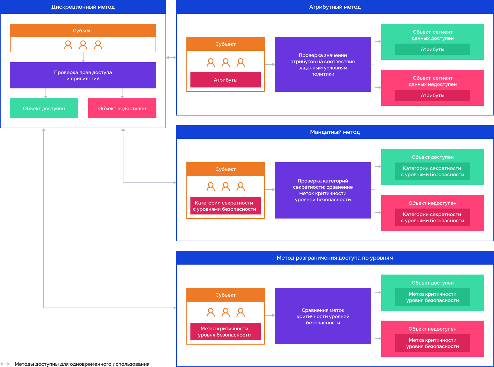
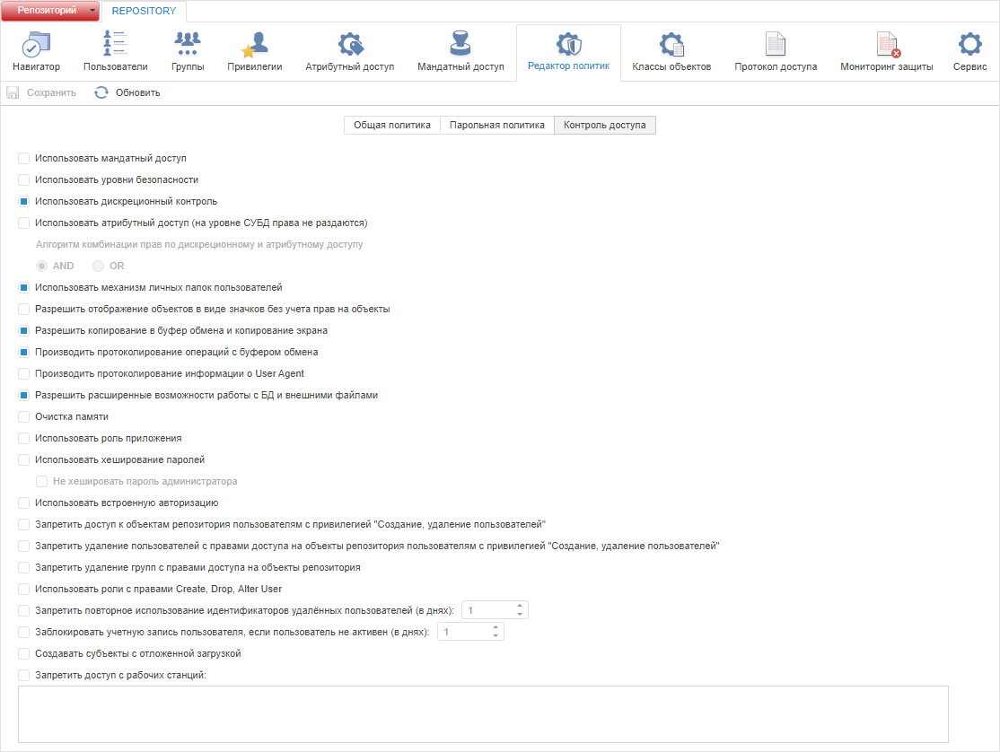
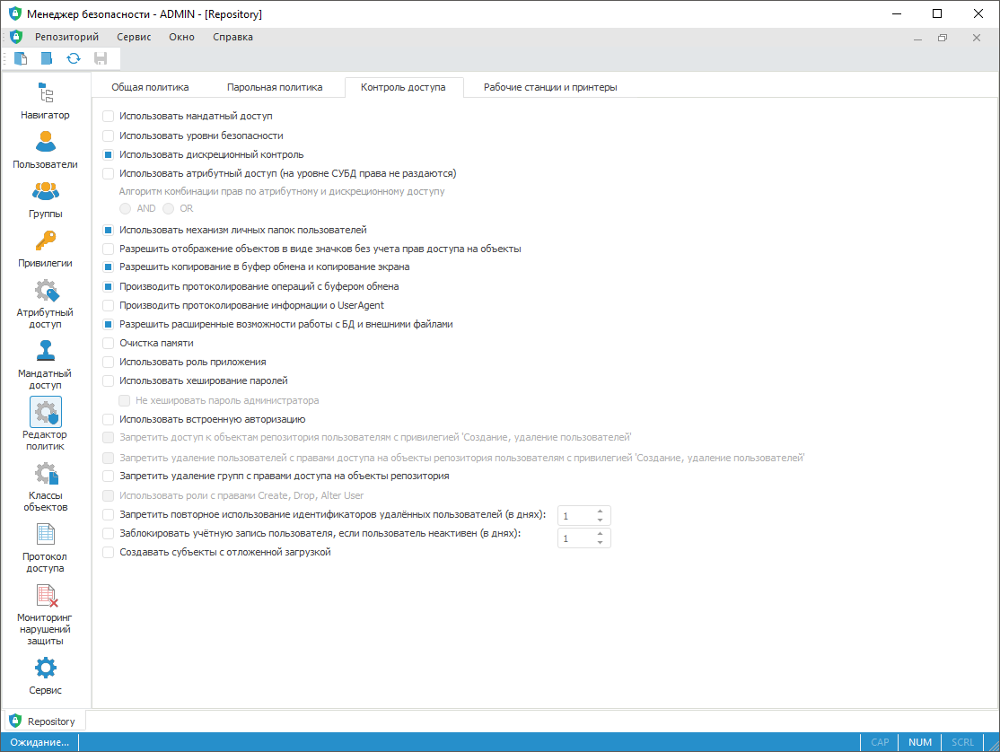

# Выбор методов разграничения доступа и их настройка

Выбор методов разграничения доступа и их настройка
-

# Выбор методов разграничения доступа
 и их настройка

Методы разграничения доступа определяются [политикой
 безопасности](../01_RunSecManager/Admin_Intro.htm). Политика безопасности содержит параметры, имеющие глобальное
 воздействие на степень защиты системы. Определение степени защиты для
 отдельных объектов производится путем изменения контроля доступа и меток
 критичности.

Носителями прав и привилегий являются субъекты безопасности — [пользователи](../03_Admin/Users/Admin_Users.htm)
 и [группы пользователей](../03_Admin/Groups/Admin_Groups.htm).

Менеджер безопасности поддерживает взаимодополняемые методы разграничения
 доступа:

Контроль действий пользователя в системе представляет собой проверку
 наличия привилегии, необходимой для их осуществления. Контроль доступа
 пользователей к объектам и выполнения действий над объектами представляет
 собой проверку наличия прав, необходимых для выполнения соответствующих
 действий над объектами.

Дискреционный метод разграничения доступа раздает права на уровне СУБД.
 Мандатный метод, метод разграничения доступа по уровням и атрибутный метод
 раздают права на уровне платформы. Атрибутный метод является фильтрацией
 данных при доступе пользователя к данным через проверку правил и политик.

Для получения подробной информации
 о методах разграничения доступа обратитесь к разделам «[Настройка
 дискреционного метода](Admin_PermSep_D.htm)», «[Настройка мандатного
 метода](Admin_PermSep_M.htm)», «[Настройка метода разграничения
 доступа по уровням](Security_levels.htm)», «[Настройка атрибутного
 метода](Admin_ABAC.htm)».

При необходимости используйте [разделение
 ролей](Editor_of_Politicy/Security_EditorPoliticy_Adm.htm) между администратором информационной безопасности (АИБ) и прикладным
 администратором. По умолчанию разделение ролей не используется, и все
 функции выполняются администратором системы.

Для общей настройки политики безопасности
 смотрите статью «[Общие
 настройки политики](Editor_of_Politicy/Security_EditorPoliticy_General.htm)».

Для дополнительной настройки контроля
 доступа смотрите статью «[Дополнительные
 настройки контроля доступа](../03_Admin/Access_control_settings.htm)».

Для настройки доступа рабочих станций
 и принтеров смотрите статью «[Настройка
 доступа рабочих станций и принтеров](../03_Admin/Workstation_and_printer_access.htm)».

Для настройки проверки паролей пользователей
 смотрите статью «[Настройка
 проверки паролей пользователей](Editor_of_Politicy/Security_EditorPoliticy_General_Parole.htm)».

## Управление методами разграничения доступа

Для управления методами разграничения доступа используйте вкладку «Контроль доступа» в разделе «Редактор политик» [панели
 навигации](../01_RunSecManager/Admin_Organizational_Starting.htm).

Примечание.
 При [разделении
 ролей](Editor_of_Politicy/Security_EditorPoliticy_Adm.htm) между администратором информационной безопасности и прикладным
 администратором раздел «Редактор политик»
 будет доступен только администратору информационной безопасности.

Вкладка «Контроль доступа»:

	Веб-приложение
	 Настольное
	 приложение

		

		

Выберите методы разграничения доступа:

	- для использования [дискреционного
	 метода](Admin_PermSep_D.htm) установите флажок «Использовать
	 дискреционный контроль»;

	- для использования [мандатного метода](Admin_PermSep_M.htm)
	 установите флажок «Использовать мандатный
	 доступ»;

	- для использования [метода разграничения
	 доступа по уровням](Security_levels.htm) установите флажок «Использовать
	 уровни безопасности»;

	- для использования [атрибутного метода](Admin_ABAC.htm)
	 установите флажок «Использовать атрибутный
	 доступ». При одновременном использовании атрибутного и дискреционного
	 метода выберите алгоритм комбинации прав:

		- AND. Операция разрешена,
		 если одновременно настроено разрешение операции по двум методам
		 разграничения доступа. Если по одному из методов разграничения
		 доступа операция запрещена или права доступа не определены, то
		 результатом будет запрет операции;

		- OR. Операция разрешена,
		 если настроено разрешение операции хотя бы по одному из методов
		 разграничения доступа, а по другому права доступа не определены.
		 Если по одному из методов разграничения доступа операция запрещена,
		 то результатом будет запрет операции.

Примечание.
 По умолчанию в контроле доступа установлен [дискреционный
 контроль](Admin_PermSep_D.htm).

Для применения заданных настроек контроля доступа:

	- в веб-приложении нажмите кнопку  «Сохранить»
	 на [панели
	 инструментов](../01_RunSecManager/Admin_Organizational_Starting.htm) или на [боковой
	 панели](../01_RunSecManager/Admin_Organizational_Starting.htm);

	- в настольном приложении выполните
	 одно из действий:

		- выполните команду «Репозиторий
		 > Применить политику безопасности» в [главном
		 меню](../01_RunSecManager/Admin_Organizational_Starting.htm);

		- нажмите кнопку 
		 «Применить политику безопасности»
		 на [панели
		 инструментов](../01_RunSecManager/Admin_Organizational_Starting.htm).

Примечание.
 Если параметры раздела были изменены, то при попытке перехода на другой
 раздел или при закрытии менеджера безопасности будет выдан запрос о применении
 измененных настроек.

См. также:

[Настройка
 политики безопасности системы](../01_RunSecManager/Admin_Intro.htm) | [Создание
 учетных записей пользователей и работа с ними](../03_Admin/Users/Admin_Users.htm) | [Создание
 групп пользователей и работа с ними](../03_Admin/Groups/Admin_Groups.htm)

		Справочная
		 система на версию 10.9
		 от 18/08/2025,
		 © ООО «ФОРСАЙТ»,
