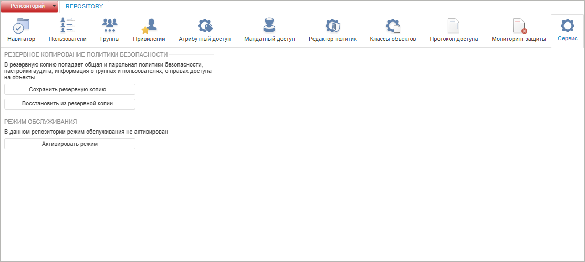
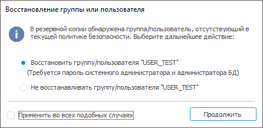
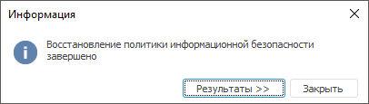
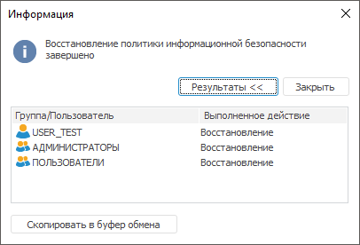

# Сервисное обслуживание репозитория

Сервисное обслуживание репозитория
-

# Сервисное обслуживание репозитория

	Для выполнения каких-либо сервисных действий, направленных на сохранение
	 и обновление репозитория, предназначен раздел «Сервис».

	Примечание.
	 При [разделении
	 ролей](Editor_of_Politicy/Security_EditorPoliticy_Adm.htm) между администратором информационной безопасности и прикладным
	 администратором раздел «Сервис»
	 будет доступен только администратору информационной безопасности.

	Раздел «Сервис»:

		Веб-приложение
		 Настольное
		 приложение

			

			

## Резервное копирование политики безопасности

	Для сохранения политики безопасности, настроек аудита, информации
	 о группах и пользователях, о правах доступа на объекты, используется
	 резервное копирование и восстановление политики безопасности. Операции
	 по копированию и восстановлению политики безопасности протоколируются.

	Для сохранения резервной копии нажмите кнопку «Сохранить
	 резервную копию». Будет открыто стандартное окно для указания
	 имени и пути сохранения файла. По умолчанию имя формируется автоматически:
	 имя схемы [дата в формате, заданном на клиентском месте]. Резервный
	 файл сохраняется с расширением *.pppolicy.

	Для восстановления политики безопасности из резервной копии нажмите
	 кнопку «Восстановить из резервной
	 копии». Будет открыто стандартное окно выбора файла. Укажите
	 месторасположение файла политики безопасности (*.pppolicy).

	Примечание.
	 Резервное копирование и восстановление политики безопасности осуществляется
	 в рамках одного репозитория без возможности восстановления в другом
	 репозитории. Политика безопасности восстанавливается в том случае,
	 если текущая и восстанавливаемая версии различаются.

	В процессе восстановления политики безопасности восстанавливаются
	 пользователи/группы. В случае если в восстанавливаемой копии найден
	 пользователь или группа, которые отсутствуют в текущей версии политики
	 безопасности, то будет выдан запрос на восстановление (создание) этого
	 пользователя или группы:

	

		- выберите вариант «Восстановить»
		 и нажмите кнопку «Продолжить».
		 Для восстановления пользователя/группы будет [запрошен
		 пароль](UiNavObj.chm::/database/UiDb_database_authorization.htm) системного администратора и администратора
		 сервера БД;

		- выберите вариант «Не восстанавливать»
		 и нажмите кнопку «Продолжить».
		 Пользователь/группа не будут восстановлены;

		- установите флажок «Применить
		 во всех подобных случаях». Для всех добавляемых пользователей/групп
		 будет выполнено выбранное действие без дополнительных запросов.
		 По умолчанию флажок снят.

	После восстановления политики информационной безопасности выдаётся
	 запрос на обновление прав пользователей. Обновление прав пользователей
	 необходимо для корректной работы. При положительном ответе происходит
	 запуск механизма [обновления
	 прав пользователей](../03_Admin/Users/Admin_User_Update.htm). Окончание процесса сопровождается сообщением
	 о завершении восстановления политики безопасности:

	

	При нажатии на кнопку «Результаты»
	 отображаются/скрываются подробные результаты выполненных действий
	 над пользователями:

	

	Нажмите кнопку «Скопировать в буфер
	 обмена» для копирования информации из таблицы в буфер обмена.

## Режим обслуживания

	В режиме обслуживания выполняется установка обновлений, очистка
	 и обновление кеша сборок BI-сервера, а также различные действия, которые
	 должны выполняться в однопользовательском режиме и могут привести
	 к ошибкам при многопользовательской работе в репозитории.

	Управление режимом обслуживания доступно только в веб-приложении.
	 Для включения режима обслуживания нажмите кнопку «Активировать
	 режим». После подтверждения режим будет активирован. При активном
	 режиме обслуживания вход в репозиторий доступен только пользователям
	 с привилегией «[Вход в систему
	 в режиме обслуживания](Admin_Priv.htm#maintenancemode)». Для всех других пользователей будет генерироваться
	 ошибка подключения.

	Важно.
	 При включении режима обслуживания не происходит закрытие текущих открытых
	 соединений с репозиторием пользователей без привилегии «Вход в систему
	 в режиме обслуживания».

	Для выключения режима обслуживания нажмите кнопку «Деактивировать
	 режим».

См. также:

[Контроль
 целостности продукта и метаданных](Integrity_control.htm)

		Справочная
		 система на версию 10.9
		 от 18/08/2025,
		 © ООО «ФОРСАЙТ»,
