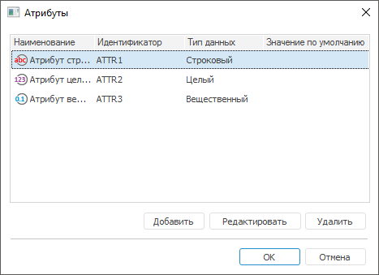

# Создание пользовательских атрибутов

Создание пользовательских атрибутов
-

# Создание пользовательских атрибутов

При использовании [атрибутного метода](Admin_ABAC.htm) разграничения
 доступа добавьте атрибуты [пользователям](../03_Admin/Users/Admin_Users.htm),
 [группам пользователей](../03_Admin/Groups/Admin_Groups.htm),
 [классам объектов](Admin_Object_Classes.htm), отдельным [типам объектов](Admin_PermSep_Attributes.htm), отдельным
 [объектам](UiNav.chm::/03_Objects/UiNav_Obj_BasicPropAttributes.htm)
 для дальнейшей проверки доступа пользователей к объектам и/или сегментам
 данных в структуре политики [атрибутного
 доступа](Admin_AttributeAccess.htm).

Примечание.
 Создание пользовательских атрибутов доступно только администратору с [привилегией](Admin_Priv.htm)
 «Изменение прав пользователей, раздача
 ролей, изменение политики», «Изменение
 метки безопасности и списка контроля доступа любого объекта». Каждый
 атрибут должен содержать уникальное наименование и идентификатор для исключения
 пересечений одинаковых атрибутов среди объектов и субъектов.

[Создание
 атрибутов для пользователей](javascript:TextPopup(this))

	Для добавления атрибутов пользователям перейдите в раздел «[Пользователи](../03_Admin/Users/Admin_Users.htm)»:

		- в веб-приложении нажмите кнопку
		  «Атрибуты»
		 на [панели
		 инструментов](../01_RunSecManager/Admin_Organizational_Starting.htm);

		- в настольном приложении выполните
		 команду «Пользователь > Атрибуты
		 пользователя» в [главном
		 меню](../01_RunSecManager/Admin_Organizational_Starting.htm).

	После выполнения действий будет открыто окно «Атрибуты»
	 для создания, редактирования, удаления атрибутов пользователей.

	Добавленные атрибуты содержатся в [свойствах](../03_Admin/Users/Admin_UserProp_Attributes.htm)
	 конкретного пользователя для возможности редактирования их значений.

[Создание
 атрибутов для групп пользователей](javascript:TextPopup(this))

	Для добавления атрибутов группам пользователей перейдите в раздел
	 «[Группы](../03_Admin/Groups/Admin_Groups.htm)»:

		- в веб-приложении нажмите кнопку
		  «Атрибуты»
		 на [панели
		 инструментов](../01_RunSecManager/Admin_Organizational_Starting.htm);

		- в настольном приложении выполните
		 команду «Группа > Атрибуты
		 групп» в [главном
		 меню](../01_RunSecManager/Admin_Organizational_Starting.htm).

	После выполнения действий будет открыто окно «Атрибуты»
	 для создания, редактирования, удаления атрибутов групп пользователей.

	Добавленные атрибуты содержатся в [свойствах](../03_Admin/Groups/Admin_GroupProp_Attributes.htm.htm)
	 конкретной группы пользователей для возможности редактирования их
	 значений.

[Создание
 атрибутов для объектов](javascript:TextPopup(this))

	Добавление атрибутов доступно классам объектов и отдельному [типу
	 объектов](Admin_PermSep_Attributes.htm).

	Атрибуты добавляются классам объектов, затем отдельному типу объектов.
	 После добавления пользовательских атрибутов в [свойствах](UiNav.chm::/03_Objects/UiNav_Obj_BasicPropAttributes.htm)
	 объекта будут содержаться атрибуты классов объектов и типа объекта
	 для возможности редактирования их значений.

	Для добавления атрибутов классам объектов перейдите в раздел «[Классы
	 объектов](Admin_Object_Classes.htm)»:

		- в веб-приложении нажмите кнопку
		  «Атрибуты»
		 на [панели
		 инструментов](../01_RunSecManager/Admin_Organizational_Starting.htm);

		- в настольном приложении выполните
		 команду «Классы объектов >
		 Атрибуты классов» в [главном
		 меню](../01_RunSecManager/Admin_Organizational_Starting.htm).

	После выполнения действий будет открыто окно «Атрибуты»
	 для создания, редактирования, удаления атрибутов классов объектов.
	 Добавленные атрибуты будут содержаться в [свойствах
	 объектов](UiNav.chm::/03_Objects/UiNav_Obj_BasicPropAttributes.htm) для изменения значений.

	Для добавления атрибутов выбранному типу объектов в разделе «[Классы
	 объектов](Admin_Object_Classes.htm)»:

		- в веб-приложении используйте вкладку «[Атрибуты](Admin_PermSep_Attributes.htm)» на боковой
		 панели «Свойства»;

		- в настольном приложении используйте вкладку «[Атрибуты](Admin_PermSep_Attributes.htm)» в окне
		 «[Параметры
		 управления доступом](../03_Admin/Admin_AdminObjects.htm)».

	После выполнения действий создайте, отредактируйте или удалите атрибуты
	 отдельного типа объектов аналогично действиям в окне «Атрибуты»
	 для классов объектов.

	Для получения подробной информации обратитесь к разделу «[Добавление
	 атрибутов отдельным типам объектов](Admin_PermSep_Attributes.htm)».

Примечание.
 Атрибуты соответствуют только тем разделам, в которых они были добавлены.

Окно «Атрибуты»:

В таблице указаны все содержащиеся атрибуты с определенными свойствами.

[Добавление
 атрибута](javascript:TextPopup(this))

	Для добавления нового атрибута нажмите кнопку «Добавить».
	 Будет открыто окно «Свойства атрибута»:

	

	Задайте свойства атрибута: наименование, идентификатор, тип данных,
	 значение по умолчанию.

[Редактирование
 атрибута](javascript:TextPopup(this))

	Для редактирования существующего атрибута:

		- Выделите в списке необходимый атрибут.

		- Нажмите кнопку «Редактировать».

	После выполнения действий будет открыто окно «[Свойства атрибута](Creating_attributes.htm#properties_attr)»
	 с заданными свойствами для изменений.

	Примечание.
	 При редактировании доступны поля «Наименование»
	 и «Значение по умолчанию».

[Удаление
 атрибута](javascript:TextPopup(this))

	Для удаление существующего атрибута:

		- Выделите в списке необходимый атрибут.

		- Нажмите кнопку «Удалить».

	После выполнения действий атрибут будет удален из списка.

Заданные значения атрибутам используйте для дальнейшей проверки доступа
 к отдельным типам объектов в [свойствах](Admin_AttributeAccess.htm#properties)
 элементов атрибутного доступа: [цель](Target.htm), [условие](Creating_conditions.htm).

См. также:

[Настройка
 атрибутного метода](Admin_ABAC.htm) | [Цель проверки контроля доступа](Target.htm)

		Справочная
		 система на версию 10.9
		 от 18/08/2025,
		 © ООО «ФОРСАЙТ»,
