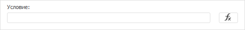
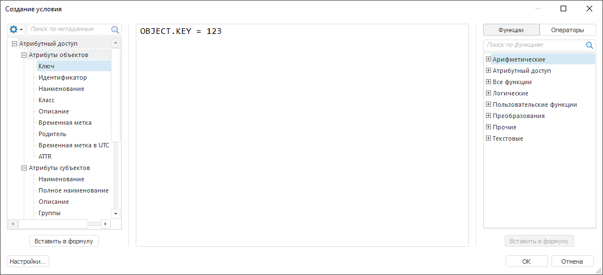
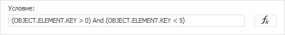

# Создание дополнительного условия проверки доступа

Создание дополнительного условия проверки доступа
-

# Создание дополнительного условия проверки доступа

При использовании [атрибутного метода](Admin_ABAC.htm) разграничения
 доступа в каждом из [правил](Admin_AttributeAccess.htm#rule)
 политики можно задать дополнительное условие проверки доступа. Выполнение
 дополнительного условия зависит от результата выполнения [цели
 проверки контроля доступа](Target.htm) и учитывается при определении [эффекта](Admin_AttributeAccess.htm#properties)
 правила.

Для создания дополнительного условия проверки доступа:

	- Выберите [правило](Admin_AttributeAccess.htm#rule).
	 После выполнения действия будут отображены [свойства](Admin_AttributeAccess.htm#properties)
	 правила.

Дополнительное условие проверки доступа содержится
 в поле «Условие»:

		- в веб-приложении на боковой панели «[Свойства](Admin_AttributeAccess.htm)»;

		- в настольном приложении в правой части окна менеджера безопасности.

	- Нажмите кнопку . После выполнения действия
	 будет открыто окно «Создание условия»:

	- Задайте дополнительное условие проверки доступа в виде логического
	 выражения. Для формирования выражения используйте атрибуты ([операнды](UiNav.chm::/GUI/UFE/Operands.htm)),
	 [функции](UiNav.chm::/GUI/UFE/Operators.htm)
	 и [операторы](UiNav.chm::/GUI/UFE/Operators.htm).

Для получения подробной информации обратитесь
 к разделу «[Создание
 формул и выражений](UiNav.chm::/GUI/ExpressionEditor.htm)».

	- Нажмите кнопку «ОК».

После выполнения действий будет задано дополнительное условие проверки
 доступа, результат которого учитывается при определении [эффекта](Admin_AttributeAccess.htm#properties)
 правила. Заданное выражение будет отображаться в поле «Условие».

Для редактирования дополнительного условия проверки доступа:

	- используйте поле «Условие».
	 Редактирование выражения выполняется вручную;

Примечание.
 Если выражение задано неверно, то поле будет обведено красным цветом.

	- используйте окно «Создание
	 условия». Редактирование выражения выполняется аналогично созданию.

После выполнения действий выражение будет изменено в поле «Условие»
 и в окне «Создание условия».

## Доступные атрибуты

Для формирования выражения доступны системные и [пользовательские
 атрибуты](Creating_attributes.htm), которые содержатся в [атрибутном
 доступе](Admin_AttributeAccess.htm).

Системные атрибуты, для которых можно получить значение на основе информации,
 хранящейся в системе, делятся на группы:

[Атрибуты
 объектов](javascript:TextPopup(this))

	Атрибуты, содержащиеся в объектах:

			 Атрибут
			 Описание
			 Тип данных

			 OBJECT.KEY

			 Ключ. Ключ объекта.
			 Целый

			 OBJECT.ID
			 Идентификатор.
			 Идентификатор объекта.
			 Строковый

			 OBJECT.NAME
			 Наименование. Наименование
			 объекта.
			 Строковый

			 OBJECT.CLASS
			 Класс. [Тип объекта](KeSom.chm::/Enums/MetabaseObjectClass.htm).
			 Целый

			 OBJECT.DESCRIPTION
			 Описание. Описание
			 объекта.
			 Строковый

			 OBJECT.TIMESTAMP
			 Временная метка.
			 Дата и время изменения объекта.
			 Дата

			 OBJECT.PARENT
			 Родитель. Родитель
			 объекта. Задается с указанием свойства атрибута объекта, например,
			 «OBJECT.PARENT.ID».
			 В зависимости от типа данных свойства атрибута

			 OBJECT.UTC_TIMESTAMP
			 Временная метка в UTC.
			 Дата и время в UTC.
			 Дата

			 OBJECT.<идентификатор
			 атрибута>
			 Пользовательский атрибут. [Атрибуты](Creating_attributes.htm#object_classes),
			 добавленные для объектов.
			 В зависимости от типа данных значений добавленного атрибута

[Атрибуты
 субъектов](javascript:TextPopup(this))

	Атрибуты пользователей или групп пользователей:

			 Атрибут
			 Описание
			 Тип данных

			 SUBJECT.NAME

			 Наименование.
			 Наименование пользователя.
			 Строковый

			 SUBJECT.FULL_NAME
			 Полное наименование.
			 Полное наименование пользователя.
			 Строковый

			 SUBJECT.DESCRIPTION
			 Описание. Описание
			 пользователя.
			 Строковый

			 SUBJECT.GROUPS
			 Группы. Список
			 групп пользователей, в которых состоит пользователь.
			Примечание.
			 Атрибут используется только для формирования дополнительного
			 условия.

			 IABACAttributeInstances

			 SUBJECT.SID
			 Идентификатор безопасности.
			 SID пользователя.
			 Строковый

			 SUBJECT.ISUSER
			 Пользователь.
			 Определяет субъект безопасности:

				- True. В
				 качестве субъекта выступает пользователь;

				- False. В
				 качестве субъекта выступает группа пользователей.

			 Логический

			 SUBJECT.ISADMIN
			 Администратор.
			 Возвращает признак соответствия пользователя прикладному администратору
			 репозитория:

				- True. Пользователь
				 является прикладным администратором платформы;

				- False. Пользователь
				 не является прикладным администратором платформы.

			 Логический

			 SUBJECT.<идентификатор
			 атрибута>
			 Пользовательский атрибут. [Атрибуты](Creating_attributes.htm),
			 добавленные для пользователей и групп пользователей.
			 В зависимости от типа данных значений добавленного атрибута

[Атрибуты
 среды окружения](javascript:TextPopup(this))

	Атрибуты рабочей станции, текущей даты и времени:

			 Атрибут
			 Описание
			 Тип данных

			 OPERATION

			 Операция. Операция
			 над объектом.
			 Целый

			 DATE
			 Текущая дата.
			 Дата

			 TIME
			 Текущее время.
			 Дата

			 DATE_TIME
			 Текущее время и дата.
			 Дата

			 UTC_DATE
			 Текущая дата в UTC.
			 Дата

			 UTC_TIME
			 Текущее время в UTC.
			 Дата

			 UTC_DATE_TIME
			 Текущее время и дата в
			 UTC.
			 Дата

### Особенности атрибута элемента справочника
 НСИ

Для разграничения прав доступа на элементы справочника НСИ используется
 атрибут объекта в виде «OBJECT.ELEMENT.<идентификатор
 атрибута>». Идентификаторы атрибута элемента содержатся на вкладке
 «[Атрибуты](UiNavObj.chm::/reference_book/Master_RDS_reference_book/Attributes.htm)» при
 открытии справочник НСИ на [редактирование](UiNavObj.chm::/reference_book/Work/Work_Dictionary.htm#edit).

Примечание.
 Атрибут элемента задается только в дополнительном условии правила. При
 формировании условия могут использоваться только [системные](UiNavObj.chm::/reference_book/Master_RDS_reference_book/Attributes.htm)
 и [обычные](UiNavObj.chm::/reference_book/Master_RDS_reference_book/Attributes/Attribute.htm)
 атрибуты, не имеющие множественных значений.

Если элементы справочника НСИ имеют [иерархию](UiNavObj.chm::/reference_book/Master_RDS_reference_book/base_settings.htm#hierarchy),
 то при разграничении прав доступа на дочерние элементы необходимо исключить
 родительский элемент в дополнительном условии проверки доступа. Исключение
 родительского элемента задается с помощью атрибута элемента KEY в виде
 условия сравнения «OBJECT.ELEMENT.KEY > <ключ
 родительского элемента>».

Например, справочник НСИ содержит родительский элемент с ключом 0 и
 семь дочерних элементов с ключами 1,2,3,4,5,6,7. При запрете доступа к
 дочерним элементам, ключ которых меньше 5, в условии должно учитываться
 исключение родительского элемента с ключом 0:

После выполнения условия будет доступен родительский элемент, в котором
 содержатся дочерние элементы с ключами 5,6,7. Дочерние элементы с ключами
 1,2,3,4 будут недоступны.

Для разграничения прав доступа на элементы справочников НСИ обратитесь
 к разделу «[Права доступа
 на элементы справочников НСИ](../03_Admin/Admin_ElementAccess.htm#abac)».

## Основные функции

Для формирования выражения используются следующие категории [системных функций](UiNav.chm::/GUI/Expression_editor_func.htm):

[Арифметические](javascript:TextPopup(this))

	Доступные функции:

		- [Abs](MathLib.chm::/Interface/IMath/IMath.Abs.htm).
		 Возвращает абсолютное значение (модуль) вещественного числа;

		- [AbsI](MathLib.chm::/Interface/IMath/IMath.AbsI.htm).
		 Возвращает абсолютное значение (модуль) целого числа;

		- [Average](MathLib.chm::/Interface/IMath/IMath.Average.htm).
		 Возвращает среднее арифметическое массива вещественных чисел;

		- [AverageI](MathLib.chm::/Interface/IMath/IMath.AverageI.htm).
		 Возвращает среднее арифметическое массива целых чисел;

		- [Cos](MathLib.chm::/Interface/IMath/IMath.Cos.htm).
		 Возвращает косинус заданного угла;

		- [Exp](MathLib.chm::/Interface/IMath/IMath.Exp.htm).
		 Возвращает результат возведения числа «e» в указанную степень;

		- [Floor](MathLib.chm::/Interface/IMath/IMath.Floor.htm).
		 Возвращает результат округления вещественного числа до кратного
		 числа заданной точности с недостатком;

		- [FloorI](MathLib.chm::/Interface/IMath/IMath.FloorI.htm).
		 Возвращает результат округления целого числа до кратного числа
		 заданной точности с недостатком;

		- [Int](MathLib.chm::/Interface/IMath/IMath.Int.htm).
		 Возвращает результат округления указанного числа до ближайшего
		 меньшего целого;

		- [Ln](MathLib.chm::/Interface/IMath/IMath.Ln.htm).
		 Возвращает натуральный логарифм заданного числа;

		- [Log](MathLib.chm::/Interface/IMath/IMath.Log.htm).
		 Возвращает логарифм числа по заданному основанию;

		- [Log10](MathLib.chm::/Interface/IMath/IMath.Log10.htm).
		 Возвращает десятичный логарифм заданного числа;

		- [Max](MathLib.chm::/Interface/IMath/IMath.Max.htm).
		 Возвращает наибольшее значение из заданного массива вещественных
		 чисел;

		- [MaxI](MathLib.chm::/Interface/IMath/IMath.MaxI.htm).
		 Возвращает наибольшее значение из заданного массива целых чисел;

		- [Min](MathLib.chm::/Interface/IMath/IMath.Min.htm).
		 Возвращает наименьшее значение из заданного массива вещественных
		 чисел;

		- [MinI](MathLib.chm::/Interface/IMath/IMath.MinI.htm).
		 Возвращает наименьшее значение из заданного массива целых чисел;

		- [Power](MathLib.chm::/Interface/IMath/IMath.Power.htm).
		 Возвращает результат возведения вещественного числа в вещественную
		 степень;

		- [PowerI](MathLib.chm::/Interface/IMath/IMath.PowerI.htm).
		 Возвращает результат возведения целого числа в целую степень;

		- [Rand](MathLib.chm::/Interface/IMath/IMath.Rand.htm).
		 Возвращает равномерно распределённое случайное число из диапазона
		 [0, 1];

		- [RandBetween](MathLib.chm::/Interface/IMath/IMath.RandBetween.htm).
		 Возвращает случайное вещественное число между двумя заданными
		 числами;

		- [Round](MathLib.chm::/Interface/IMath/IMath.Round.htm).
		 Возвращает результат округления числа до указанного количества
		 десятичных разрядов;

		- [RoundDown](MathLib.chm::/Interface/IMath/IMath.RoundDown.htm).
		 Возвращает результат округления числа до ближайшего меньшего по
		 модулю значения;

		- [RoundUp](MathLib.chm::/Interface/IMath/IMath.RoundUp.htm).
		 Возвращает результат округления числа до ближайшего большего по
		 модулю значения;

		- [Sin](MathLib.chm::/Interface/IMath/IMath.Sin.htm).
		 Возвращает синус заданного угла;

		- [Sqrt](MathLib.chm::/Interface/IMath/IMath.Sqrt.htm).
		 Возвращает квадратный корень из заданного числа;

		- [Tan](MathLib.chm::/Interface/IMath/IMath.Tan.htm).
		 Возвращает тангенс заданного угла;

		- [Trunc](MathLib.chm::/Interface/IMath/IMath.Trunc.htm).
		 Возвращает результат усеченного числа до указанного количества
		 десятичных разрядов.

[Атрибутный
 доступ](javascript:TextPopup(this))

	Доступные функции:

		- [Count](UiNav.chm::/GUI/Function/ABAC/Func_ABAC_Count.htm).
		 Возвращает количество значений в массиве [пользовательского
		 атрибута](Creating_attributes.htm) субъекта или объекта, а также количество групп, в
		 которых состоит пользователь;

		- [FindAttr](UiNav.chm::/GUI/Function/ABAC/Func_ABAC_FindAttr.htm).
		 Осуществляет поиск атрибута по указанному свойству в списке групп,
		 в которых состоит пользователь, и возвращает значение заданного
		 свойства найденного атрибута;

		- [Interseca](UiNav.chm::/GUI/Function/ABAC/Func_ABAC_Interseca.htm).
		 Осуществляет поиск общих значений сравниваемых аргументов и возвращает
		 значение True или False;

		- [Intersecc](UiNav.chm::/GUI/Function/ABAC/Func_ABAC_Intersecc.htm).
		 Осуществляет поиск общих значений сравниваемых аргументов по указанному
		 свойству атрибута и возвращает значение True
		 или False;

		- [Is_Empty](UiNav.chm::/GUI/Function/ABAC/Func_ABAC_Is_Empty.htm).
		 Определяет, является ли значение [пользовательского
		 атрибута](Creating_attributes.htm) субъекта или объекта пустым, и возвращает значение
		 True или False.

[Все
 функции](javascript:TextPopup(this))

	Категория содержит список функций всех категорий.

[Логические](javascript:TextPopup(this))

	Доступные функции:

		- [Sign](MathLib.chm::/Interface/IMath/IMath.Sign.htm).
		 Возвращает знак перед заданным вещественным числом;

		- [SignI](MathLib.chm::/Interface/IMath/IMath.SignI.htm).
		 Возвращает знак перед заданным целым числом.

[Преобразования](javascript:TextPopup(this))

	Доступные функции:

		- [Sum](MathLib.chm::/Interface/IMath/IMath.Sum.htm).
		 Возвращает сумму элементов указанного массива вещественных чисел;

		- [SumI](MathLib.chm::/Interface/IMath/IMath.SumI.htm).
		 Возвращает сумму элементов указанного массива целых чисел;

		- [SumSq](MathLib.chm::/Interface/IMath/IMath.SumSq.htm).
		 Возвращает сумму квадратов элементов указанного массива вещественных
		 чисел.

[Прочие](javascript:TextPopup(this))

	Доступная функция:

		- [Pi](MathLib.chm::/Interface/IMath/IMath.Pi.htm).
		 Возвращает математическую константу «Пи» (3,14159265358979) с
		 точностью до 14-ого знака после запятой.

[Текстовые](javascript:TextPopup(this))

	Доступные функции:

		- [ASCII](UiNav.chm::/GUI/Function/Text/Func_Text_ASCII.htm). Возвращает
		 код в ASCII для первого символа указанной строки;

		- [Chr](UiNav.chm::/GUI/Function/Text/Func_Text_Chr.htm).
		 Возвращает символ, соответствующий указанному ASCII-коду;

		- [Contains](UiNav.chm::/GUI/Function/Text/Func_Text_Contains.htm).
		 Возвращает признак наличия искомой подстроки в исходной строке;

		- [EndsWith_](UiNav.chm::/GUI/Function/Text/Func_Text_EndsWith.htm).
		 Возвращает признак того, что исходная строка оканчивается искомой
		 подстрокой;

		- [Find](UiNav.chm::/GUI/Function/Text/Func_Text_Find.htm).
		 Возвращает индекс позиции подстроки в строке;

		- [Left](UiNav.chm::/GUI/Function/Text/Func_Text_Left.htm).
		 Возвращает указанное количество символов с левого края строки;

		- [Length_](UiNav.chm::/GUI/Function/Text/Func_Text_Length.htm).
		 Возвращает количество символов в указанной строке;

		- [Max_](UiNav.chm::/GUI/Function/Text/Func_Text_Max_.htm).
		 Возвращает максимум из двух строк, используя посимвольное сравнение;

		- [Mid](UiNav.chm::/GUI/Function/Text/Func_Text_Mid.htm).
		 Возвращает подстроку указанной длины и начинающуюся с указанной
		 позиции исходной строки;

		- [Min_](UiNav.chm::/GUI/Function/Text/Func_Text_Min_.htm).
		 Возвращает минимум из двух строк, используя посимвольное сравнение;

		- [Replace](UiNav.chm::/GUI/Function/Text/Func_Text_Replace.htm).
		 Возвращает строку, в которой все вхождения указанной подстроки
		 заменены на указанную строку;

		- [Right](UiNav.chm::/GUI/Function/Text/Func_Text_Right.htm).
		 Возвращает указанное количество символов с правого края строки;

		- [Space](UiNav.chm::/GUI/Function/Text/Func_Text_Space.htm).
		 Возвращает строку, состоящую из указанного количества пробелов;

		- [StartsWith_](UiNav.chm::/GUI/Function/Text/Func_Text_StartsWith.htm).
		 Возвращает признак того, что исходная строка начинается с искомой
		 подстроки;

		- [ToLower](UiNav.chm::/GUI/Function/Text/Func_Text_ToLower.htm).
		 Возвращает указанную строку, преобразованную в нижний регистр;

		- [ToUpper](UiNav.chm::/GUI/Function/Text/Func_Text_ToUpper.htm).
		 Возвращает указанную строку, преобразованную в верхний регистр;

		- [Trim](UiNav.chm::/GUI/Function/Text/Func_Text_Trim.htm).
		 Возвращает строку с удаленными пробелами в начале и конце;

		- [TrimEnd](UiNav.chm::/GUI/Function/Text/Func_Text_TrimEnd.htm).
		 Возвращает строку с удаленными пробелами в конце строки;

		- [TrimStart](UiNav.chm::/GUI/Function/Text/Func_Text_TrimStart.htm).
		 Возвращает строку с удаленными пробелами в начале строки.

[Пользовательские
 функции](javascript:TextPopup(this))

	Категория содержит список [подключенных
	 функций](UiNav.chm::/GUI/ExpressionEditor_UserFunc.htm).

Примечание.
 Категория доступна только в настольном приложении, если в редактор выражения
 были подключены пользовательские функции. Для получения подробной информации
 обратитесь к разделу «[Подключение
 пользовательских функций](UiNav.chm::/GUI/ExpressionEditor_UserFunc.htm)».

См. также:

[Настройка
 атрибутного метода](Admin_ABAC.htm) | [Добавление
 правил и политик проверки доступа](Admin_AttributeAccess.htm)

		Справочная
		 система на версию 10.9
		 от 18/08/2025,
		 © ООО «ФОРСАЙТ»,
